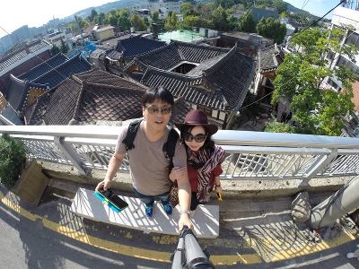

## 필자 소개

{width=50%}

* 이름 : 김동호
* 소속 : (주)대진디엠피 헬스케어사업부 개발파트장
* 업무내용 : 의료기기, 헬스케어 제품 개발
* 학력 : 서울 동국대학교 기계공학과 졸
* 경력 : [이력서](https://dymaxionkim.github.io/My_Slides/resume.pdf), [포트폴리오](https://dymaxionkim.github.io/My_Slides/portfolio.pdf)
* 관심분야 : 가장 역동적으로 혁신을 주도하고 있는 오픈소스 소프트웨어 생태계로부터, 새로운 방법론과 기술을 얻어 차세대 제조업의 새로운 돌파구를 찾아내는 것을 화두로 삼고 있습니다.
* 홈페이지 : http://dymaxionkim.github.io/
* E-Mail : Dymaxion.Kim@gmail.com
* HP : 010-2289-4826
