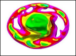

## 1. 머리글

본고는 오픈소스 유한요소해석 소프트웨어인 '엘머(Elmer)'를 따라하기식으로 구성하여, 빠른 시간내에 실제로 사용할 수 있도록 안내하고자 한다.

첫번째로 본 편에서는, 엘머(Elmer)에 대한 소개와 기본적인 작동 원리를 설명한다.

아울러, 공학용 오픈소스 소프트웨어의 의미에 대해서 나름대로 제시해 본다.

마지막으로 독학에 도움이 될 수 있는, 엘머 관련 온라인 참고 자료들을 소개한다.

## 2. 엘머(Elmer) 소개

|엘머의 스플래쉬 이미지|
|:---------------------------------------:|
||

### (1) 엘머 개요
엘머는 핀란드 국립 CSC연구소에서 만들고 유지보수하고 있는, L/GPL 라이센스로 제공되는 오픈소스 다중물리 시뮬레이션 소프트웨어이다.  (CSC연구소는 공공 슈퍼컴퓨터 서비스를 제공하는 한국과학기술정보연구원(KISTI)과 비교할 수 있을 것 같다.)

다중물리(Multi-Physics) 해석에 주안점을 두고 있기 때문에, 상업용 소프트웨어로는 COMSOL과 같은 제품과 비교대상이 될 수 있을 것 같다.  즉 구조해석,열해석 뿐만 아니라, 다양한 물리학 방정식을 제공해서 유체, 전자기장, 파동 뿐만 아니라 심지어 양자역학이나 기타 특수한 경우에 적합한 물리법칙을 적용해서 해석이 가능하며, 이런 여러 물리법칙을 하나의 시스템에 조합해서 연성 해석하는 것도 가능하다.

전처리 과정에서, 해석자 입력 파일(Solver Input File) 작성에 사용되는 문법이 다른 소프트웨어에 비해 상당히 단순하고 간략하기 때문에, 학습하기도 비교적 용이한 편이다.  아울러, 해석자 입력 파일 작성을 쉽게 도와주는 그래픽 사용자 인터페이스 도구(ElmerGUI)도 제공되기 때문에, 비록 기능이 단순하기는 해도 필요한 만큼의 편리성은 충분히 얻을 수 있다.

계산결과를 가시화(Visualization)하기 위해, 과학기술계에서 표준적으로 사용하는 VTK 파일 형식으로 직접 출력이 가능하다.  VTK 형식의 데이타를 얻을 수 있기 때문에, 이를 지원하는 다양한 후처리기 소프트웨어를 자유롭게 선택해서 사용하거나, 다양한 과학기술용 스크립트 언어로 자료를 처리하기에도 매우 좋다.

아울러, 개발된 이력이 오래 되었기 때문에(1995년부터), 품질이 매우 안정되어 있는 편이다.  미성숙한 오픈소스 소프트웨어들 중에 흔히 보이는 불안정성이나 심각한 버그는 엘머에서 거의 보기 힘들다.  뿐만 아니라, 현재도 매우 활발하게 업데이트가 계속 이루어지고 있어, 활발하게 살아있는 프로젝트이다.  CSC연구소에 엘머 전담팀이 계속 살아있고, 개발 초창기부터 참여한 핵심 개발자들이 지금도 매우 빈번하게 성실한 개선을 진행하고 있다. (Github.com의 ElmerFEM 소스코드 메인 브랜치의 이력을 보면, 2017년 1~7월말 동안 약 300회의 커밋이 이루어졌다.  눈에 확 띄는 큰 변화는 대부분 아니지만, 단단한 메인 개발팀이 활발하고 안정적이라는 점은 오픈소스에서 매우 중요하다.)

원래 엘머 프로젝트는, CSC연구소가 보유한 슈퍼컴퓨터에서 운용하기 위한 목적으로 시작되었기 때문에, MPI라이브러리를 이용한 전형적인 대규모 병렬연산에 적합하다.  뿐만 아니라, 당연히 PC 수준의 소수의 CPU코어를 가진 컴퓨터에서도 문제없이 잘 동작한다.  즉 보유한 컴퓨팅 자원(CPU코어와 메모리)만 제공된다면 이론적으로 무제한의 확장이 가능하다.

### (2) 기타
여담으로, 엘머(Elmer)라는 이름의 유래는 데이빗 맥키(David Mckee)의 동화책에 나오는, 의인화된 다양한 색깔의 조각천을 모아서 만든 코끼리 인형의 이름이다.  유럽권에서 잘 알려진 캐릭터인 것 같은데, 엘머 화면에서 모델의 매쉬(Mesh)를 색깔별로 구분해서 보면 영락없이 비슷하게 보인다.

|조각천 코끼리 엘머|엘머의 모델 시현 상태|
|:---:|:---:|
|||

CSC연구소의 엘머 팀은 현재 페터 라박(Peter Råback, http://staff.csc.fi/raback/) 박사가 안정적으로 잘 운영해 주고 있는 것 같다.

## 3. 엘머의 구조와 작동방식
### (1) 구성

엘머는 기능을 분할한 몇 개의 독립적인 프로그램을 모아 놓은 것이다.  중요한 것은 다음과 같다.

|명칭|기능|비고|
|:---------|:-------------|:-----------------------------------|
|ElmerGUI|GUI 쉘|프로젝트 생성, 전처리, 계산명령, 후처리|
|ElmerSolver|해석자|sif 파일을 참조해서 계산 실시.  물리방정식 등은 외부 라이브러리를 동적으로 로드해서 작동한다.|
|ElmerGrid|매쉬 생성, 매쉬 파일 형식 변환, 매쉬 분할|자체 매쉬 생성 기능은, 간단한 정돈된 매쉬(Structured Mesh)만 만들어낼 수 있다.  매쉬 파일 형식 변환 기능을 이용하여, 외부에서 만들어진 매쉬를 엘머에서 인식할 수 있는 형식으로 변환할 수 있다.  매쉬 분할 기능은 다중 CPU코어로 모델을 분할하여 병렬연산을 적용할 때 사용한다.|
|MATC|수식계산기|sif 파일에 MATC 명령을 삽입해서 파라메트릭한 해석을 실시할 수 있다.|
|ElmerPost|후처리기|엘머 자체 출력 포멧인 .ep 파일을 볼 수 있는 오래된 후처리기이다.  이것 보다는 Praview와 같은 더 우수한 외부 후처리기를 사용하기를 권장한다.|

### (2) ElmerGUI

기본적으로 위의 프로그램들은 전부 커맨드명령으로 실행된다.  즉 ElmerGUI가 없어도 ElmerSolver 등 다른 프로그램들을 커맨드명령으로 전부 실행 가능하며, 모든 과정을 커맨드상에서 수행할 수 있다(Non-GUI).  이런 명령 실행시 옵션이나 설정파일을 지정해서 작동하게 되는데, 커맨드명령이 아무래도 초보자에게 부담스럽기 때문에 GUI 쉘이 필요하게 된다.

그래서 제공된 것이 ElmerGUI이며, 이것을 이용해서 일반적인 명령이나 작업을 대부분 완료할 수 있도록 해 놓았다.  뿐만 아니라, ElmerGUI 자체적으로 Netgen 라이브러리를 내장하여 기본적인 매쉬 생성 기능도 있고, ElmerVTK 후처리기도 내장하여 ElmerPost를 대체하기도 한다.  다만 이런 부가기능은 아주 기본적인 기능만 있기 때문에, 전처리(매쉬생성 및 경계면 구분 등) 및 후처리(가시화 및 데이타분석)는 더 강력한 외부 프로그램을 이용하기를 권장한다.

ElmerGUI를 이용해서 가장 효과를 볼 수 있는 것은, sif(Solver Input File) 파일을 쉽게 생성하도록 메뉴나 팝업창을 제공해 주는 것이다.  사용자가 일일이 모든 문법을 모르더라도, ElmerGUI상에서 옵션과 파라미터를 지정해 주면 자동적으로 작성된 파일을 얻을 수 있다.

본고에서는 가급적 ElmerGUI의 활용성을 극대화하여 문제를 해결할 수 있도록 안내하려고 한다.  ElmerGUI를 사용한 입문단계를 지나 점점 익숙해지면, 나중에는 ElmerGUI를 벗어버리고 전부 스크립트화하여 자동화된 해석작업을 백그라운드에서 수행되도록 하거나 하는 등 더욱 다양한 응용이 가능해질 것이다.

### (3) 수치 해법

엘머를 구성한 기반이 되는 라이브러리들은 수치해석계에서 오랫동안 검증된 전통적인 포트란 코드들을 주로 이용한다.  기본적으로 다음과 같은 미분방정식 해법들을 제공한다.  사용자는 문제 특성과 자신의 상황에 맞게 골라서 선택할 수 있다.

|구분|방식|종류|설명|
|:---------|:---------|:---------|:-------------------------|
|Linear System|Direct Method|Banded|가장 전통적인 LAPACK 라이브러리 사용|
|                     |                    |Umfpack|희소행렬 해결에 적합한 Multifrontal LU Factorization 알고리즘이 적용된 라이브러리|
|                     |                    |MUMPS|희소행렬 해결시 병렬연산으로 고속화한 라이브러리.  라이센스가 GPL이 아니라서 배포본에는 포함되어 있지 않으므로, 사용하려면 MUMPS 소스코드를 추가해서 직접 다시 빌드해야 한다.|
|                     |Iterative Method|BiCGStab|BiConjugate Gradient STABilized method.  비대칭 행렬을 반복적으로 연산하여 해결하는 알고리즘.|
|                     |                        |BiCGStabl|BiCGStab(L).  수렴성이 좀 더 보완된 것.|
|                     |                        |TFQMR|희소행렬을 반복적으로 연산하여 해결하는 알고리즘.|
|                     |                        |GCR|Conjugate Residual method.  선형시스템의 반복적 해법.|
|                     |                        |CGS|Conjugate Gradient Squared method.  비대칭 선형시스템의 반복적 해법.|
|                     |                        |CG|Conjugate Gradient method.  특정 선형시스템의 반복적 해법.|
|                     |                        |GMRES|Generalized Minimal RESidual method.  비대칭 행렬의 반복적 해법.| 
|                     |MultiGrid Method|Jacobi|Jacobi iterative method.  대각성 행렬의 병렬 해결 알고리즘.|
|                     |                         |CG|CG의 병렬 해결.|
|                     |                         |BiCGStab|BiCGStab의 병렬 해결.|
|Nonlinear System|Newton||Newton's method.  비선형 방정식의 해법.|
|Parallel|HYPRE||미국 로렌스-리버모어 연구소에서 개발한 진보된 선형시스템 병렬 해법 알고리즘.  배포본에는 포함되어 있지 않으므로, 사용하려면 HYPRE 소스코드를 추가해서 직접 다시 빌드해야 한다.|
|Adaptive|General|||
|             |Refinement||해석결과를 토대로 피드백해서 매쉬 밀도를 업데이트하는 기법|
|Multigrid|General|||
|             |Refinement||매쉬 밀도 업데이트시 병렬로 진행|

경험적으로, PC급에서는 케이스에 따라 Umfpack 또는 BiCGStab를 주로 사용하게 되는 것 같다.  예를 들어, 온도(Temperature)라는 스칼라 값에 관심을 가지고, 간단한 푸리에 열전도 방정식을 푸는 열전도 해석의 경우, 희소행렬로 볼 수 있기 때문에 Umfpack으로 빠르게 연산을 끝내기가 용이한 것 같다.  응력(Stress) 해석의 경우도 형상이 비교적 단순할 경우에는 성공 확률이 높다.  대신 메모리 사용량이 많아지기 때문에, 컴퓨터 자원에 충분한 메모리가 확보되어 있는지 확인할 필요가 있다.  BiCGStab은 반복적으로 수렴(Convergence) 오차를 줄여가는 방식이므로, 수렴이 잘 안되는 케이스라면 반복회수에 따라 계산시간이 굉장히 길어질 수도 있다.  하지만 수렴에 성공할 확률은 Umfpack보다 훨씬 높고, 메모리 사용량은 훨씬 작기 때문에 메모리가 부족한 컴퓨터에서는 계산시간이 오래 걸리는 것을 각오하고 이것을 선택하는 쪽이 나을 것이다.  그리고 매쉬를 분할해서 병렬적으로 BiCGStab을 계산시키는 방식으로 계산시간을 단축시킬 수 있다.  컴퓨팅 자원이 풍부해서 병렬연산을 대규모로 할 수 있는 환경이라면 MUMPS, HYPRE를 포함해서 빌드한 다음 사용하는 것이 좋을 것이다.  필요할 경우 Pardiso와 같은 상용 라이브러리를 엘머에 연결시켜 빌드한 후 사용하는 것도 가능하다고 한다.

일반적으로는 이런 여러가지 수치해법들을 다 알 필요는 전혀 없고, ElmerGUI상에 디폴트로 설정되어 있는 BiCGStab만 사용해도 충분하다.

### (4) 제공되는 물리방정식
* 다양한 물리현상들을 해석할 수 있는 방정식들이 엘머에 구현되어 기본적으로 제공된다.

|구분|물리방정식|설명|
|:---------|:-------------|:-----------------------------------|
|일반미분모델| Divergence | 발산 |
|| Flux and Gradient | 유속 및 그래디언트 |
|| Model PDE |편미분방정식 모델|
|구조해석| Elastic Plates | 2차원 평면 물체의 선형탄성해석 |
|| Linear elasticity | 선형 탄성 해석 |
|| Nonlinear elasticity |비선형 탄성 해석|
|열전달| Heat Equation | 열전달 방정식 |
|| Static Current Conduction |전기저항체에 전류가 흐를때의 줄(Joule) 발열 현상|
|유체역학| Advection Diffusion Equation | 이류확산방정식 |
|| Free Surface | 자유 표면 |
|| K-Epsilon | RANS K-Epsilon 난류 모델 |
|| Navier-Stokes |나비에-스톡스 방정식|
|| Poisson-Boltzmann equation |푸아송-볼츠만 방정식 (미세 유동)|
|| Reynolds Equation |레이놀즈 방정식|
|| Richards Equation |리챠즈 방정식 (다공질 내부 유동)|
|| SST K-Omega |SST K-Omega 난류모델|
|| Vorticity | 와도(渦度,소용돌이)|
|전자기학| Electrostatics | 정전기학 |
|| MgDyn | 동적 자기장 해석 |
|| MgDynPost |동적 자기장 해석 결과 후처리|
|| MgDyn2D | 2차원 동적 자기장 해석 |
|| MgDyn2DHarmonic | 2차원 동적 자기장의 하모닉 응답 해석 |
|| MgDyn2DPost |2차원 동적 자기장 해석 결과 후처리|
|| Mesh Update |매쉬 업데이트|
|파동| Helmholtz Equation | 헬름홀츠 방정식 |
|| Vector Helmholtz Equation |벡터 헬름홀츠 방정식|
|| Vector Helmholtz Post Process |벡터 헬름홀츠 방정식 결과 후처리|
|데이타출력| Result Output |출력 데이타 포멧 설정|
|| SaveLine |1차원 데이타 출력|
|| SaveScalars |스칼라 데이타 출력|

* 이상 소개된 것 말고도, Non-GUI에서 이용가능한 추가적인 것들이 더 숨어있으며, 필요할 경우 간단한 포트란 코드를 작성하여 새로운 방정식을 구현하고 곧바로 해석에 적용하는 것도 가능하다.

## 4. 엘머의 실무 활용성과 한계

* 엘머가 다른 소프트웨어보다 유리한 부분도 있고, 부족한 부분도 있다.

### (1) 기능적 제한
엘머에서 기본적으로 제공되는 물리 방정식들은 간략하게 기술되어 있기 때문에, 수렴 오류를 회피하는 테크닉이나 각종 옵션들이 대체로 적은 편이다.  따라서 이러한 각각의 해석자들(Solvers)은, 각 물리현상에 집중한 전문적인 전용 해석툴보다 기능적으로 뒤떨어지는 경우가 많다.

* 예를 들어, 엘머에서 제공되는 유체역학 관련 물리방정식들을 이용하여 유체동역학 해석이 충분히 가능하지만, 다른 전문적인 전산유체역학 소프트웨어들이 달성한 수준과는 거리가 있다.  특히 일반적으로 사용되는 유한체적법 대신 유한요소법을 사용하고 있다는 것을 염두에 둘 필요가 있다.  극단적인 압축성, 연소, 대규모 LES 난류유동 해석을 하기에는 적합하지 않다.  대신, 다중물리 해석능력을 이용하여 다른 물리현상과 연계하여 문제에 대한 결과를 얻어내기가 용이하고, 전체적인 문제해결 시간을 크게 단축시키는데 유리하다.
* 이런 특성을 이용하여, 엘머에서 고체(Solid Body) 부분의 물리학을 해석하고, 유체(Liquid) 부분은 OpenFOAM에서 해석하도록 하여 일종의 협업을 시키는 경우도 있다.  이런 식으로 고체와 유체 다접촉부 노드의 물리정보를 서로 교환하도록 할 수도 있다,.
* 구조해석의 경우, 접촉(Contact) 해석 능력은 엘머에게 있지만 수렴성이 좋지 않고 전문적인 구조해석툴에서 일반적으로 사용하는 패널티, 라그랑지 기법과는 조금 다른 방식으로 구현되어 있는 것 처럼 보인다.  때문에 실무적으로 사용할 수준의 신뢰성과 안정성은 아직 확보되어 있지 않고, 단지 '접촉 해석도 되긴 된다'는 정도로 생각된다.  따라서 다중물체의 접촉 문제는 다른 구조해석툴의 도움을 받는 것이 더 유리하다.
* 비선형 좌굴(Nonlinear Buckling) 해석능력은 기본적으로 들어있지 않다.  특수하게 추가적인 해석자를 적용할 경우 가능한 경우가 있다.
* 파괴(XFEM) 해석능력은 현재 없다.
* 다물체 강체 동역학(Explicit Dynamics) 해석 능력은 없다.
* 레이트레이싱(Ray-Tracing) 해석 능력은 없다.

### (2) 실무 적합성
엘머를 실무에서 사용할 경우, 다음과 같은 경우에 대체로 적합할 것으로 생각된다.

* 단일 물체 선형 구조해석 : 실무 구조해석 문제의 70% 이상은 이 범위에서 다룰 수 있다고 생각된다.  스트레스 및 고유모드나 선형 좌굴 문제. 하모닉 응답 문제를 다루기에 좋다.
* 다물체 열전달 해석, 열과 구조의 연성 해석
* 주파수 영역에서 다루는 음향해석 (물체가 진동할 때 주변에 음파가 퍼져나가는 현상 등)
* 모델 형상이 단순한 대신, 요소의 개수가 매우 많은 고해상도 매쉬를 해석할 때 (막대한 계산량이 필요할 때)
* 간단한 유체동역학 문제 해석 (층류유동, RANS 난류모델)
* 범용 해석툴에서 다루지 못하는 특수한 문제나 특이한 물리현상을 해석해야 할 때
* 기타 계속 발전시켜나갈 여지가 많다.

## 5. 오픈소스 엔지니어링의 의미

왜 굳이 어렵고 골치아픈 오픈소스 소프트웨어를 사용하는지 의문이 들 수도 있다.  특히 프로페셔널한 실무 개발 상황에서는, 프로젝트 위험관리에 문제가 없도록 소프트웨어의 높은 생산성과 신뢰성이 무엇보다 중요한데, 오픈소스 소프트웨어는 현실적으로 이러한 조건이 잘 충족되지 않는 경우가 많은 것도 사실이다.  특히 대부분의 경우, 문제가 발생했을 때 상업용 소프트웨어와 달리 제대로 된 기술지원을 기대하기도 어렵고 대부분 독학 또는 커뮤니티 활동으로 해결해 나가야 한다.

하지만, 이러한 낮은 생산성과 진입장벽에도 불구하고 오픈소스 소프트웨어가 가지는 몇가지 중요한 의미가 있다고 생각된다.

### (1) 비용절감
 프리랜서 엔지니어, 소규모 팀으로 구성된 스타트업, 자본력이 약한 소기업 엔지니어들은 현실적으로 상업용 엔지니어링 소프트웨어의 높은 라이센스 비용을 감당할 수 없다.  이런 상황에서는 프리/오픈소스 소프트웨어를 사용하는 것만이 유일한 방법이다.

### (2) 학습효과
 오픈소스 공학해석 소프트웨어를 사용하면서 공학해석이론에 대한 이해도를 증진시키는데 큰 도움이 된다.  사용방법을 익히다 보면 자연스럽게 유한요소해석과 물리학이론을 이해하지 않으면 안되기 때문이다.  이를 통해, 추후에 상업용 소프트웨어 제품을 사용할 기회가 생겼을때도 매우 쉽게 적응할 수 있다.

### (3) 커스터마이제이션의 자유
상업용 소프트웨어는 핵심 기술과 이론이 충분히 공개되지 않은 경우가 많은데, 오픈소스의 경우에는 모든 부분을 들여다 보고 장악할 수 있다.  능력이 된다면 원하는대로 소스코드를 고칠 수도 있고, 필요할 경우에는 제공되지 않는 물리학법칙을 스스로 만들어 적용해서 해석을 실시해 볼 수도 있다.  자신의 업무에 딱 맞게 커스터마이제이션하기도 매우 용이하다.  소스코드를 고쳐서 튜닝하거나, 또는 약간의 스크립트를 이용해 정형화된 해석업무를 완전히 자동화하는데도 아무 제약이 없다.

### (4) PC부터 HPC까지 어떤 시스템에도 대응이 용이
지금은 비록 자신의 PC에서 소규모 수치해석을 하지만, 나중에 슈퍼컴퓨터(HPC)를 사용할 기회가 생겼을 때도 곧바로 적응할 수 있다.  운영체제가 같고(슈퍼컴퓨터의 대부분은 리눅스OS), 오픈소스 소프트웨어는 CPU 코어 개수에 따른 라이센스 비용 증가의 부담이 전혀 없이, 원하는 환경에 최적화하여 사용 가능하기 때문이다.

### (5) 공학계의 트랜드에 동참 : 명실상부한 제조업 4.0
공학해석 분야에서, 기존에는 상용 소프트웨어들이 지배적인 역할을 했으나, 유럽을 중심으로 오픈소스로 이행하는 움직임이 강하게 나타나고 있다.  CFD 분야에서 OpenFOAM이 성공적으로 대세가 된 것을 보아도 그렇다.  CAE컴퓨팅 자원을 클라우드 서비스로 제공하는 업체들이 다수 나타나고 있고, 다수가 오픈소스 코드를 해석자(Solver)로 제공한다.  자신이 속한 조직의 규모가 성장하여, 고성능컴퓨터(HPC)를 도입할 가능성이 있다면 역시 오픈소스 코드를 처음부터 고려하는 것이 좋을지도 모른다.

### (6) 시장에 긍정적 영향
오픈소스 공학해석 소프트웨어가 기존의 상업용 소프트웨어와 반드시 적대적인 관계라는 통념도 제고해 볼 필요가 있다.  초창기에 저비용으로 오픈소스를 활용하다가, 성공사례를 만든 후 생산성을 향상시킬 수 있도록 상업용 코드를 도입하는 계기가 될 수도 있다.  또 세계적으로 상업용 공학해석 소프트웨어 시장은 연평균 10% 이상 급성장하고 있기 때문에, 오픈소스의 출현이 반드시 상업용 시장을 침해한다는 통념이 사실인지 여부도 증명되고 있지 않다.  오히려 불법 복제 소프트웨어의 범람을 막아주고, 사용자의 법의식(Legal Mind)을 고취시켜주며, 더 많은 잠재고객군을 형성하는데 도움이 될 수도 있다.  오픈소스 사용자는 상업용 소프트웨어에도 아주 쉽게 적응할 수 있기 때문이다.  아울러, 오픈소스 해석툴을 활용한 엔지니어링 서비스 사업자들이 더 많이 증가하여 전반적인 엔지니어링 서비스 시장의 성장을 견인하기도 한다고 보인다.  즉 적대적 관계라기 보다는 상호보완적 관계로 이해하는 것이 더 사실에 부합해 보이며, 오픈소스 코드의 사용자는 상업용 소프트웨어의 강력한 잠재고객인 것이다.

## 5. 관련 자료를 더 얻으려면?
### (1) 엘머 공식 자료
 - CSC연구소 엘머 홈페이지 : https://www.csc.fi/web/elmer
 - 독립된 엘머 홈페이지 : http://www.elmerfem.org/
 - 엘머 관련 도큐먼트, 최신 빌드, 추가 유틸리티들 : http://www.nic.funet.fi/pub/sci/physics/elmer/
 - 엘머 포럼 : http://www.elmerfem.org/forum/index.php
 - 깃허브 엘머 소스코드 : https://github.com/ElmerCSC/elmerfem

### (2) 제3의 자료들
 - 공식 유튜브 채널 : https://www.youtube.com/channel/UCZvPRczyoO9PwU2nfiQy2uA
 - Ben Qui 채널 : https://www.youtube.com/channel/UCMcP1V6o9MfDyJSp2te6xkA
 - calculix09 채널 : https://www.youtube.com/channel/UCiAhHLXtYGcQC9eZIzd_COg
 - 일본인 네티즌 Freeplanet 홈페이지(프록시접속) : http://freeplanets.ship.jp/
 - Engineering Desktop Studies : http://e.flyingclips.com/

### (3) 필자의 개인 연습 자료들
 - 유튜브 채널 : https://www.youtube.com/channel/UCFiY-7XHuvE6tNbF35qRcFA
 - 깃허브 엘머 예제 모음 : https://dymaxionkim.github.io/ElmerFEM_Examples/

