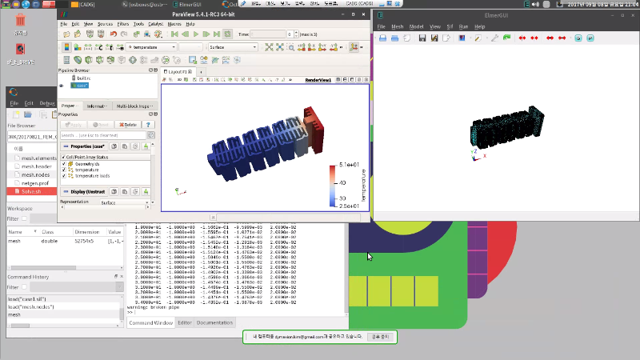

## 1. 개요

* 본 편에서는, 엘머 및 관련된 오픈소스 유틸리티들을 설치하고 환경을 갖추는 방법을 기술한다.
* 다음편부터는 이렇게 구축된 환경에서 쉬운 것 부터 하나씩 실제 문제해결을 할 수 있도록 준비한다.


## 2. 운영환경
* 본고에서는, 사용자의 PC에서 사용하는 것을 상정하고 설명하기로 한다.  특히 다음과 같은 환경을 기준으로 하였다.

|항목|내용|특기사항|
|:----------|:-----------------------|:----------------------------------------|
|운영체제|Lubuntu 16.04 64bit|윈도PC 상의 버츄얼박스(VirtualBox) 가상머신|

* 루분투(Lubuntu) 16.04를 선택한 이유는, 윈도에서보다 리눅스 환경에서 엘머의 능력을 모두 사용하기가 좋고, 특히 우분투 계열 배포판에서의 편리성을 얻을 수 있으며, 데스크탑 환경은 해석을 위해 가용한 메모리를 가장 많이 아낄 수 있는 가벼운 것으로 LXDE를 선정한 것이다.  운영체제는 반드시 64비트 사양이어야 한다.

* 가장 신속하게 가상머신을 활용하고 싶다면, http://www.osboxes.org/ 사이트에서 Lubuntu 16.04 배포판이 이미 설치되어 있는 가상머신 파일을 직접 다운로드 받아서, 버츄얼박스에서 불러들여 사용하면 된다.

* 버츄얼박스와 같은 가상머신에서 운영할 경우, 사용자가 주력으로 사용하는 윈도OS 환경과의 파일교환이 쉬워지고 PC의 자원을 끝까지 끌어내어 사용할 수 있기 때문에, 입문단계에서 편리하게 사용하기에 좋다.  물론 해석의 규모가 커져서 더 많은 컴퓨팅 자원이 필요하게 된다면, 전용 PC를 따로 꾸며서 사용해도 좋다.


|버츄얼박스|우분투|루분투|
|:---------------:|:---------------:|:---------------:|
||||


* 가상머신이든 실제 PC이든 간에, 필요한 컴퓨팅 자원은 다음과 같다.
 - CPU : AMD64 호환 (64비트), 최소 코어 2개 이상
 - RAM : 최소 2GB, 권장 4GB 이상, 다중코어 병렬 연산에 대비하려면 8GB 이상
 - HDD : 최소 10GB, 권장 20GB 이상
 - Graphic : 최소 3D 가속기능 불필요, 권장 INTEL 내장그래픽카드 또는 NVIDIA 그래픽카드


## 3. 엘머 설치


### (1) 이미 빌드된 배포판을 설치할 경우

* 가상머신 리눅스를 최초 부팅하고 로그인한 후, 터미널을 열어서 다음 명령으로 시스템을 최신으로 업데이트하자.

```bash
$ sudo apt update
$ sudo apt upgrade
```

* 우분투에서 기본적으로 제공하는 원격 소프트웨어 저장소에서 이미 엘머를 제공하고 있으나, 계속적인 엘머의 업데이트를 따라가지는 못하기 때문에, 항상 최신버전으로 유지할 수 있도록 CSC연구소 엘머 개발팀에서 직접 제공하는 저장소를 추가적으로 등록하자.

```bash
$ sudo apt-add-repository ppa:elmer-csc-ubuntu/elmer-csc-ppa
```

* 이제 아래와 같이 2개의 명령으로 간단히 엘머를 설치한다.

```bash
$ sudo apt update
$ sudo apt install elmerfem-csc
```

* 엘머 패키지가 제공하는 물리학 공식들을 전부 ElmerGUI에서 로드할 수 있도록 다음 명령도 추가로 넣어주자.

```bash
$ sudo cp /usr/share/ElmerGUI/edf-extra/*.xml /usr/share/ElmerGUI/edf/
```

* 혹시 환경변수(경로설정등) 문제로 작동에 이상이 있을지도 모르기 때문에, 사용하는 터미널에서 실행시 문제가 없도록 다음과 같이 조치해 두자.  우선 터미널에서 다음 명령으로 bash 환경설정파일을 편집기로 연다.

```bash
$ nano ~/.bashrc
```

* 이후 편집기에서 끝부분에 다음 구문을 추가해 주고, 저장하고 빠져나온다.

```cpp
ELMERGUI_HOME=/usr/share/ElmerGUI
ELMERSOLVER_HOME=/usr/share/elmersolver
ELMERLIB=/usr/lib/elmersolver
LD_LIBRARY_PATH=$LD_LIBRARY_PATH:$ELMERLIB:$ELMERSOLVER_HOME/lib
```

* 터미널을 종료했다가 다시 실행한 후, 이제부터 다음 명령으로 간단히 ElmerGUI를 실행할 수 있다.

```bash
$ ElmerGUI
```

* 터미널에서 뿐만 아니라, 보통의 GUI앱 처럼 데스크탑에서 실행아이콘을 더블클릭해서 실행할 수 있도록 할 수도 있다.  
* 우선 `Start_Elmer.sh`라는 이름으로 직접 실행할 수 있는 쉘스크립트를, 보통의 사용자 어플리케이션 실행파일을 모아두는 장소인 `/usr/bin/`안에 만든다.  이 장소는 기본적으로 경로(path)가 잡혀있기 때문에, 어디서나 명령어만 치면 실행 가능하다.  엘머를 실행하기 전에 미리 필요한 경로를 강제로 잡아주는 것이다.

```bash
$ sudo nano /usr/bin/Start_Elmer.sh
```

해 주고 다음 내용을 써 넣어서 저장한다(Ctrl+o).

```bash
#!/bin/bash
export ELMERGUI_HOME=/usr/share/ElmerGUI
export ELMERSOLVER_HOME=/usr/share/elmersolver
export ELMERLIB=/usr/lib/elmersolver
export LD_LIBRARY_PATH=$LD_LIBRARY_PATH:$ELMERLIB:$ELMERSOLVER_HOME/lib
/usr/bin/ElmerGUI
```

* 그 다음, 만들어진 쉘스크립트를 아무나 실행할 수 있도록 속성을 준다.

```bash
$ sudo chmod o+x /usr/bin/Start_Elmer.sh
```

* 이제, 데스크탑 실행용 아이콘 그림파일을 받아서 적절한 장소에 배치한다.

```bash
$ sudo mkdir /usr/share/ElmerGUI/icons
$ sudo wget -O /usr/share/ElmerGUI/icons/Mesh3D.png https://raw.githubusercontent.com/tehnick/elmerfem/master/ElmerGUI/Application/icons/Mesh3D.png
```

* 이제 데스크탑 등록 파일(.desktop)을 만든다.

```bash
$ sudo nano /usr/share/applications/ElmerGUI.desktop
```

해 주고 다음 내용을 써 넣어서 저장한다(Ctrl+o).

```bash
[Desktop Entry]
Encoding=UTF-8
Name=Elmer
Comment=Elmer FEA software
Exec=/usr/bin/Start_Elmer.sh
Icon=/usr/share/ElmerGUI/icons/Mesh3D.png
StartupNotify=true
Terminal=false
Type=Application
Categories=Education;Math;Science
```

* 이제 ElmerGUI를 일반적인 데스크탑 프로그램처럼 아이콘으로 실행시킬 수 있고, 또 터미널로 직접 다른 엘머 명령들도 실행시킬 수도 있게 되었다.


### (2) 소스코드를 받아서 직접 컴파일해서 설치할 경우

* 만일 현재의 운영체제가 우분투 리눅스가 아니라 데비안 등 다른 배포판이라면, CSC연구소에서 직접 저장소를 제공해 주지 않기 때문에, 설치 및 최신버전을 계속 유지하려면 직접 소스코드를 컴파일해서 갱신해 나갈 수 있다.
* 또는 CSC연구소의 빌드가 아니라 다른 기능들을 추가한 커스텀 버전의 엘머가 필요할 경우에도 컴파일해야 할 것이다.
* 여기서는 가장 기본적인 컴파일 방법을 설명한다.  cmake를 이용하여 모듈별로 간단히 빌드할 수 있도록 버전관리가 잘 되고 있기 때문에, 빌드작업 자체는 상당히 쉽다.
* 먼저 다음과 같이 의존성있는 것들을 설치해 주자. (이 중에 버전이 맞지 않아 연결하기가 곤란한 것들도 있을 수 있으나, 기본적인 기능들은 살릴 수 있다.)

```bash
$ sudo apt install automake gcc g++ gfortran cmake cmake-qt-gui
$ sudo apt install libopenmpi-dev mpi-default-dev mpi-default-bin libscotchmetis-dev
$ sudo apt install libreadline-dev libncurses5-dev libx11-dev tk-dev tcl-dev \
libfreetype6-dev libftgl-dev libgl1-mesa-dev libglu1-mesa-dev
$ sudo apt install libblas-dev liblapack-dev libhypre-dev libsuitesparse-dev libarpack2-dev r-base-core
$ sudo apt install liboce-modeling-dev
$ sudo apt install qt-sdk
```

* 엘머 소스코드 확보

```bash
$ mkdir ~/github
$ cd ~/github
$ git clone https://www.github.com/ElmerCSC/elmerfem
$ mkdir elmer-build
```

* cmake-gui 실행 및 설정

```bash
$ cmake-gui
```

* 설정창이 뜨면, 경로 및 옵션 등을 적절히 선택해 준다.  일단 기본적으로, 다음의 옵션들을 체크하는 것에는 문제가 없을 것이다.

```cpp
WITH_ELMERGUI
WITH_MATC
WITH_MPI
```

* 나머지 옵션들은 관련된 소스코드를 추가해서 연결해 주거나, 또는 버전에 맞는 의존성이 추가적으로 충족되어야 한다.

* 옵션 체크 후 `configure`를 눌러서 의존성에 문제가 없는지 체크할 수 있다.  의존성 경로를 찾아내는데 실패할 경우 빨간색 줄이 생기며, 이것을 다 없도록 해 줘야 한다.

* 문제없는 것이 확인되면, `Generate`해 준다.

* 2코어로 빌드 실행 및 설치 (물론 자신의 상황에 맞게 CPU코어 개수를 조절해 주면 된다.)

```bash
$ cd ~/github/elmer-build
$ sudo make -j2 install
```

* 이렇게 하면 자동적으로 빌드가 되고 나서 시스템에 설치가 된다.

* 실행파일 경로 추가 : 우선 터미널 bash쉘 설정을 편집할 수 있도록 텍스트 편집기를 다음과 같이 실행한다.

```bash
$ nano ~/.bashrc
```

* 마지막 부분에 다음 구문을 추가해 준다.

```cpp
# Elmer
export PATH="/home/사용자홈/elmer/bin/:$PATH"
```

* 이제 터미널을 재시작한 후, `ElmerGUI` 명령을 쳐서 실행이 되는지 확인해 보자.

* 이상 소개한 기본적인 빌드 절차대로 할 경우, `WITH_OCC` 옵션이 제외되었기 때문에 STEP 3D 모델링 파일을 직접 읽어들이는 능력이 없고, `WITH_VTK` 옵션이 제외되었기 때문에 ElmerGUI에 내장된 ElmerVTK 후처리기가 실행되지 않을 것이다. 이러한 옵션들까지 모두 빌드하기 위해서는 해당 소스코드를 붙여서 함께 빌드해야 한다는 점에 유의한다.


## 4. Gmsh 설치


* 홈페이지 : http://gmsh.info/
* 해석을 효율적으로 하기 위해, 계산량을 줄이려는 목적으로 2차원 매쉬를 활용할 때가 있다.  2차원 매쉬를 효과적으로 생성하기에 적합한 대표적인 오픈소스로 Gmsh가 있으며, 이것을 설치해서 활용하도록 하자.  다음 명령으로 간단히 설치할 수 있다. (최신버전을 설치하고 싶다면 홈페이지에서 직접 다운로드 받아 압축을 풀고, 들어있는 gmsh 실행파일을 사용하면 된다.)

```bash
$ sudo apt install gmsh
```

* Gmsh를 사용하는 가장 큰 이유는, 형상을 모델링하는 명령이 텍스트 기반으로 되어 있어, GUI와 텍스트편집기를 이용하여 geo 파일을 효과적으로 편집할 수 있는 독특한 방식 때문이다.  텍스트 geo 파일을 적절히 편집하면 물체의 형상과 크기 등을 원하는대로 파라메트릭하게 조정할 수 있기 때문에, 최적설계 등을 위해 형상 파라미터를 반복적으로 변경해 가면서 해석하도록 자동화하기에 매우 유리하다.

* Gmsh도 물론 3D STEP 파일을 직접 읽어들일 수는 있으나, 자잘한 오류나 기능부족 때문에 권장할 만 하지는 않다.  또한 STEP 파일로부터 다중물체(Multi-Bodies)를 인식하거나 저장(Export)하는 기능이 아직 구현되어 있지 않다. 따라서, 일반적으로 geo 파일을 편집하고 전용 매쉬 포멧인 msh 파일을 생성해 주는 용도로 주로 사용한다.  3D의 경우에는 다중물체를 생성했을 때 엘머에서 인식되도록 하기가 어렵기 때문에(제대로 구현되어 있지 않음), 보통은 2D로 간소화한 모델을 만들어내어 사용할 때 이용한다.

* gmsh의 매쉬 포멧인 `.msh` 파일은 많은 매쉬 관련 소프트되어들이 기본적으로 지원해 주기 때문에, 다양한 유한요소해석 소프트웨어간의 데이타 변환시에도 중간(Neutral) 포멧으로 사용하기에도 유용하다.
* 본 강좌에서는 Gmsh의 구체적인 사용방법을 별도로 설명하지는 않는다.  다만 인터넷상에 매우 많은 정보와 튜토리얼들이 있기 때문에 쉽고 빠르게 사용법을 익히는데 전혀 문제가 없을 것이다.


## 5. Salome Platform 설치


* 홈페이지 : http://www.salome-platform.org/
* 3차원 형상의 매쉬를 생성하기에 적합한 오픈소스 중에서 가장 발전된 것이다.  특히 엘머에서 다물체(Multi-Bodies) 매쉬를 생성할 때는 현재 이것 외에 대안이 없다.
* 웹브라우저로 홈페이지의 `DOWNLOADS` 카테고리에서 압축파일을 다운로드 받는다.  외부 의존성에 구애받지 않으려면 `Binaries for officially supported Linux platforms` 중에 ` Linux Ubuntu 16.04 64-bits` 판본을 다운로드 받는 것이 좋겠다.  설치는 홈페이지의 설명대로 따라하면 된다.

* Gmsh에서 3D 다중물체 매쉬를 만들어서 제공하기가 곤란하므로, 살로메(Salome)를 이용하여 이 부분을 해결할 수 있다.
* 살로메에서 unv 포멧의 매쉬파일을 생성해 내고, 이것을 ElmerGrid 유틸리티를 사용하여 엘머 전용 매쉬 포멧으로 변환 후 사용하는 방식을 취한다.
* 살로메의 3D 그래픽 퍼포먼스가 썩 좋지는 않다.  때문에 지나치게 복잡한 3D 형상을 전처리 작업에 상당한 인내심을 요구하게 되므로, 가급적 단순한 형상을 사용하도록 노력하는 것이 좋다.
* 아울러, 살로메 자체 Python 스크립트 기능을 사용하여, 모델링과 전처리 작업의 자동화도 가능하다는 점을 염두에 둔다.
* 본 강좌에서는 살로메의 구체적인 사용방법을 자세하게 설명하지는 않는다.  다만 역시 인터넷상에 매우 많은 정보와 튜토리얼들이 있기 때문에 쉽고 빠르게 사용법을 익히는데 전혀 문제가 없을 것이다.  아울러, 입문 단계에서 쉽게 사용법을 익히고, 빠르고 효과적으로 전처리작업을 수행하기 위한 기본적인 기능의 사용방법은 본 강좌에서 필요에 따라 조금씩 설명하도록 한다.


## 6. Paraview 설치


* 홈페이지 : https://www.paraview.org/
* 오픈소스 후처리기 중에서 가장 품질이 좋은 것으로 볼 수 있을 것 같다.
* Salome Platform 안에 Paraview가 이미 내장되어 있으므로, 굳이 별도 설치할 필요까지는 없으나, 최신버전을 사용하고 싶다면 따로 설치해서 사용해도 무방하다.  홈페이지에서 `Download Latest Release`를 찾아 들어가서 리눅스용 압축파일을 받아서 풀면 된다.
* 또는 웹브라우저를 사용하지 않고 다음 터미널 명령으로 직접 다운로드 및 설치를 하는 것이 더 간편하다.

```bash
$ cd ~
$ wget \ "https://www.paraview.org/paraview-downloads/ \
download.php?submit=Download&version=v5.4&type=binary&os=linux64& \
downloadFile=ParaView-5.4.1-RC3-Qt5-OpenGL2-MPI-Linux-64bit.tar.gz"
$ mkdir ParaView
$ tar -xzf ParaView-5.4.1-RC3-Qt5-OpenGL2-MPI-Linux-64bit.tar.gz -C ParaView
```

* 파라뷰(Paraview)는 최근에 특히 아주 빠르게 업데이트가 되고 있는 강력한 후처리기이다.  특히 슈퍼컴퓨터 기반에서 엄청난 대용량의 데이타를 가시화하기 위한 기반기술들이 잘 갖추어져 있기 때문에, 확장성도 좋다.
* Python 스크립트를 이용한 자동화, 커스터마이제이션도 가능하다.
* 스크립트까지 활용하지 않더라도, 기본적으로 제공되는 GUI 후처리 도구들도 상당히 훌륭하다.
* 역시 본 강좌에서는 파라뷰의 사용법을 별도로 자세히 설명하지는 않는다.  다만 필요에 따라 약간의 사용법들을 소개하도록 하겠다.


## 7. GNU Octave 설치


* 홈페이지 : https://www.gnu.org/software/octave/
* 공학도에게 친숙한 매틀랩(Matlab)은 라이센스 문제로 아무나 사용하기가 어렵다.  대신 매틀랩과 호환성이 높은 GNU Octave를 설치해서, 자료분석이나 진행과정을 자동화하는데 사용하기가 좋다.
* 다음과 같은 명령어로 최신버전을 계속 받을 수 있는 저장소를 등록하고 간단하게 설치하고 실행해 보자.

```bash
$ sudo add-apt-repository ppa:octave/stable
$ sudo apt update
$ sudo apt install octave
$ octave
```

* 전문적인 코딩 경험이 없는 초심자의 경우, GNU Octave가 가장 진입장벽이 낮다고 사료된다.
* 특정 해석 주제에 대한 단순 반복 작업, 간단한 시퀀스에 따라 동작하는 매크로 역할을 맡기기에도 좋다.
* 물론 다른 훌륭한 스크립트 언어들도 수없이 많으므로 자신의 상황에 맞게 선택하고 응용해 나가면 좋을 것으로 생각된다.


## 8. 기타 권장할 만한 것들
* FreeCAD : 리눅스 상에서 3D CAD 모델을 간단히 그리기 좋다.
* Scientific Python : 방대하고 성숙된 과학기술 계산용 도구들이 제공된다.  다만 Python 언어를 익혀서 사용해야 하므로 매틀랩에 익숙한 사용자에게는 약간 진입장벽이 있다.
* Julia Lang : Octave는 매틀랩과 호환성이 높지만, 대량의 데이타를 처리할 때는 속도가 느려서 문제가 될 수 있다.  이때 Julia Lang은 좋은 대안이 된다고 생각된다.  과학기술용 스크립트 언어 중에서 가장 처리속도가 빠른 편에 속하고, 완전한 오픈소스이며, 최신 소프트웨어 공학이 많이 적용된 젊은 언어이다.  매틀랩 문법과 완전히 호환되지는 않으나, 거의 유사하게 사용하는 것도 가능하다.  장기적인 비젼을 생각한다면 좋은 선택이 될 것이라고 본다.
* Jupyter Notebook : 웹서비스형 대화식 개발환경(REPL)으로, Python을 기반으로 하지만 Octave, Julia Lang 및 기타 수십가지의 언어에 모두 대응한다.  노트북(Notebook) 형태로 웹브라우저상에서 아주 효율적으로 간략한 코딩, 결과 가시화, 도큐멘테이션까지 한꺼번에 쉽게 가능해진다.
* 엘머 이외에도 Calculix, Z88 Aurora, Code_Aster, OpenFoam, SU2 등 잘 성숙한 다른 유한요소해석 소프트웨어들도 배합해서 문제를 해결해 나가면 좋을 것이다.
* 본편에서 소개한 엔지니어링 환경 구축을 가장 신속하고 편하게 할 수 있도록, 필자가 만든 일괄작업 설치 레시피를 다음 주소에 업로드 해 놓았으므로, 그곳의 설명대로 따라해도 좋다.

> https://github.com/dymaxionkim/Elmer_Examples_for_CADG

* 위 주소에서 권장하는 것은, osboxes 가상머신에 쉘스크립트로 자동환경설정이 되도록 하는 방식인데, 앞서 설명한 엘머 및 기타 필요한 유틸리티들의 설치와 필요한 시스템 환경이 자동으로 잡히도록 셋팅해 놓았고, 설명서도 기재해 두었다.
* 설치된 가상머신 리눅스 데스크탑은 다음과 같은 상태로 사용할 수 있게 된다.




## 9. 맺음말

* 전통적으로 유닉스계열 오픈소스 코드들은, 소스코드 배포 후 그것을 사용자가 받아서 직접 컴파일하고 설치하는 방식이 표준적인 방법이었다.  하지만 유닉스 계열 운영체제를 능수능란하게 다루지 못하는 사람들에게는 상당히 높은 진입장벽이 된 것도 사실이다.
* 그래서, 이미 빌드된 배포본을 온라인으로 간단한 명령만으로 편리하게 다운로드받아 자동으로 설치가 될 수 있도록 하는 체제가 발달하게 되었는데, 대표적으로 데비안 리눅스 계열의 apt 설치관리자 명령이 그것이다.  실제로 성공적인 오픈소스 공학용 소프트웨어의 대다수는 apt 설치관리자로 최신버전을 받아서 설치할 수 있도록 원격저장소를 운영해 주고 있다.  우리는 이러한 오픈소스 생태계의 혜택을 최대한 누려서, 간단한 몇 개의 명령과 약간의 설정만으로 실제 필요한 도구들을 간단하게 준비할 수 있었다.
