## 1. 개요

상,하편으로 나누어 엘머를 이용하여 다음 3가지 케이스를 따라해 보기로 한다.
본편인 상편에서는 전처리 과정을 중심으로 설명하고, 이어지는 하편에서는 다음 3가지 조건을 차례대로 적용하여 해석을 실시해 본다.

 (1) 별도의 외력 없이 중력만 인가하여 자중에 의한 스트레스와 변형량을 본다.
 (2) 이후 외력을 추가한 선형정적해석을 시도해 본다.
 (3)그 다음, MATC를 이용하여 파라메트릭하게 외력의 위치와 강도를 변화시켜 가면서 스캐닝(Scanning)한 결과를 얻어보고, 이것을 애니메이션화해 본다.

## 2. 준비

### (1) 해석 조건 계획

* 첫번째로, 중력하에서 자중에 의한 변형량과 스트레스를 본다.
* 두번째로, 추가로 외력을 줘서 변형량과 스트레스를 본다.
* 세번째로, 외력의 크기를 변화시켜가면서 스캐닝(Scanning)한 결과를 본다.

### (2) 필요한 소프트웨어

* FreeCAD
* Salome
* Elmer
* Paraview

### (3) 3D 모델 준비

* 해석 주제는, 재미있게 해 보기 위해 '신라시대 종(鐘)의 구조해석'으로 해 보기로 하자.
* 본 예제에서는 프리캐드(FreeCAD)를 이용하여 종의 기본적인 형태를 모델링하여 보았다.  (프리캐드 사용방법에 관한 설명은 생략한다.)
* 본 예제의 관련 파일들은 모두 깃허브에서 다운로드 받을 수 있다.
  https://github.com/dymaxionkim/Elmer_Examples_for_CADG

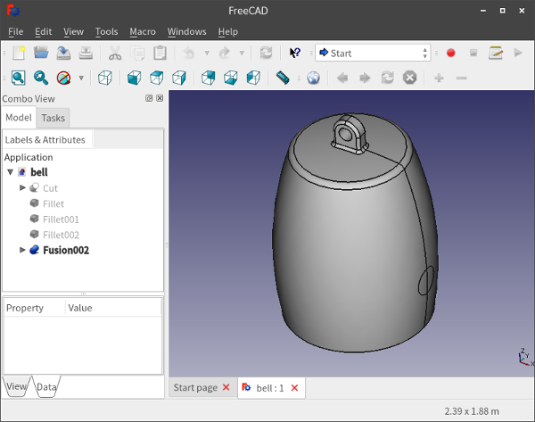{width=50%}

* 경계조건(Boundary Conditions) 지정을 용이하게 하기 위해, 일부 면(Surface)은 패치가 구분되도록 모델링하였다.
* FreeCAD 이외의 다른 모델러를 사용해도 상관이 없을 것이다.
* 모델링한 후 원본을 저장하고 나서, 매쉬 생성을 위해 중립 포멧인 brep으로도 저장(Export)한다.

### (4) 전처리 (매쉬생성)

#### 1) 살로메를 이용한 전처리 작업의 개요

* 살로메(Salome)는 모델링,전처리,후처리 기능을 모두 담고 있고 또 다양한 옵션을 가지고 있기 때문에 메뉴가 굉장히 많아서 처음 실행해 보면 무엇부터 해야 할지 좀 막막할 수도 있다.  그러나 실제로 자주 사용하는 기능들은 몇가지 되지 않기 때문에, 기본적인 사용법만 숙지해 두면 별다른 부담없이 사용하는데 문제가 없을 것 같다.
* 여기서는, 앞서 저장해 둔 brep 파일을 읽어들인 후, 각 면을 그룹화해 주고, 매쉬를 생성한 후, 매쉬 그룹도 승계받고 나서 엘머로 넘겨줄 수 있는 포멧의 매쉬 파일로 출력하는 절차를 진행한다.

#### 2) 살로메 최초 실행 및 Geometry 모드 작업

* 일단 살로메를 실행해 보자.

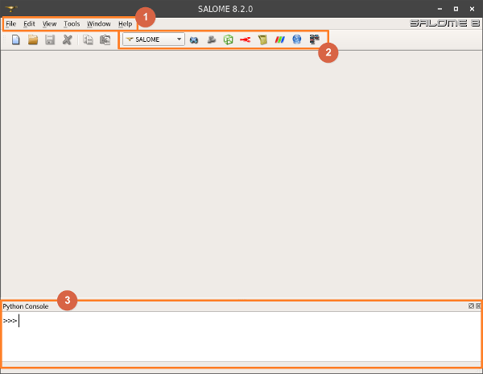{width=50%}

* 위 그림에서 1번은 기본 메뉴 영역이다.  2번에서 모드선택 영역이다.  3번은 파이썬(Python) 명령창이다.  파이썬 명령창을 나타나지 않게 하려면, 1번 메뉴에서 `View - Windows - Python Console`로 찾아들어가서 체크해제하면 된다.
* 이제 2번 모드선택에서, `Geometry` 모드로 바꾼다.  그러면 `Active module` 팝업창이 뜨는데, 기존에 아무런 살로메 파일이 없기 때문에, `New`를 선택해서 새로운 파일을 생성하자.  이제 `Geometry` 모드가 되었고, 관련된 메뉴와 화면구성이 추가된다. 메뉴에서 `File - Import - BREP`을 선택하고 앞서 만들어둔 brep 파일을 찾아서 불러들이자.

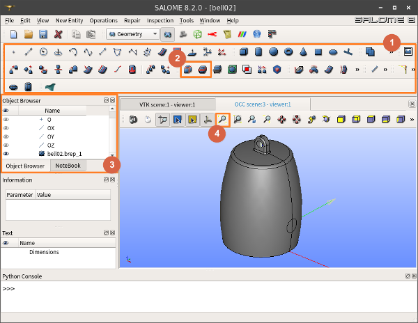{width=50%}

* 위 그림에서 1번 영역의 아이콘들은 대부분 모델링 작업을 위한 도구들이다.  살로메에서 직접 모델링하는 것은 굉장히 불편하므로 여기서는 사용하지 않는다.  다만, 그 중에 2번 영역의 2개의 아이콘은 추후에 사용할 기회가 있을 것이다.  여러개의 부품(Bodies)로 이루어진 다물체로 쪼갤 때 사용할 것이다.
* 3번 트리(Tree) 영역은 작업하면서 만들어지는 피쳐(Features)를 표시해 준다.  좌측의 눈동자 모양을 토클링해서 해당 피쳐를 보였다 숨겼다 할 수 있다.  현재 화면을 보면, `bell02.brep.1`이라는 솔리드 형상이 들어와 있는 것을 알 수 있고, 그것이 현재 보이고 있는 상태이다.
* 4번의 돋보기 아이콘은, 최초 모델을 불러들였을 때 너무 작아서 잘 안보일 경우가 많기 때문에, 자동 줌(Zoom)을 해 준다.  따라서 자주 누르게 될 것이다.
* 솔리드 형상을 보면, 1개의 부품(Body)로 이루어져 있고, 표면은 여러개의 서피스 패치로 구분되어 있다.  각 패치를 적절히 묶어서 그룹화 해 두면 편할 것이다.
* 상단 메뉴에서 `New Entity - Group - Create Group`을 선택하면, 그룹정의를 할 수 있는 도구창이 뜬다.

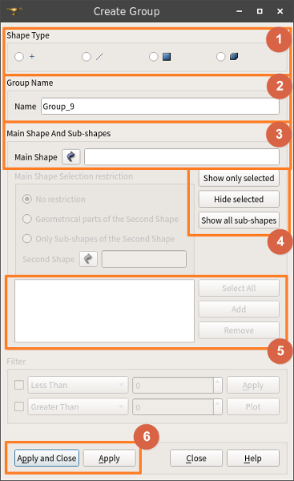{width=20%}

* 위 그림에서 1번은 그룹의 형태(Shape Type)를 골라주는 것이다.  예컨데 부품(Body) 그룹을 만들고 싶다면 맨 우측의 것을 체크하면 된다.  면(Surface) 그룹을 만들고 싶다면 우측에서 두 번째의 것을 체크하면 된다.
* 2번은 그룹의 이름을 쓰면 된다.  편의상 자동으로 명명되는 이름을 그대로 사용하자.
* 3번은 어떤 모델을 모태로 하여 그룹요소를 가져올 것이냐를 고르는 것이다.  선택아이콘을 눌러서 활성화한 다음, 화면이나 트리에서 조금전에 불러들여온 솔리드 모델을 눌러서 선택하면 된다.
* 4번은 선택을 여러개 할 때 조금 편하게 해 주기 위한 도구이다.
* 그룹에 넣을 요소들을 `Shift`키를 누른 상태에서 마우스 왼쪽 버튼으로 해당 요소들을 하나씩 눌러주면서 여러개를 선택해 간다.  다 선택하고 나서 `Add` 버튼을 누르면 좌측 빈 칸에 선택된 그룹 요소들의 번호가 표기된다.  잘못 선택된 것이 있다면 제거할 요소 번호를 선택한 후 `Remove`해 주면 된다.  추가할 요소들이 많을 경우에는, 여러번으로 나누어 `Add`를 해 줘도 상관없다.
* 그룹을 하나만 만들 것이 아니고, 여러개 만들어갈 경우에는, 맨 아래 6번 영역의 `Apply` 버튼을 눌러준다.  그러면 앞서 설정한 그룹이 좌측 트리에 등록이 되면서, 새로운 그룹을 입력할 수 있는 상태가 된다.  이런식으로 계속 새로운 그룹을 등록해 간다.
* 마지막 그룹 등록까지 완료하면, `Apply and Close` 버튼을 눌러준다.  그러면 그룹 입력을 완료하면서 `Create Group` 창이 닫힌다.
* 본 예제에서 그룹화 작업을 한 예는 아래의 그림과 같다.  8개의 그룹이 만들어져 있음을 트리에서 확인할 수 있고, 그 중에 보이도록 되어 있는 마지막 것만 현재 화면상에 보인다.

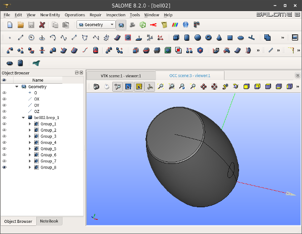{width=50%}

* 상단 메뉴에서 `File - Save As`를 선택해서 여기까지 작업한 자료를 살로메 전용의 hdf 포멧으로 중간 저장해 준다.

#### 3) Mesh 모드 작업

* 이제 모델과 그룹의 준비는 끝났다.  이것을 매쉬로 생성해 내면 된다.  상단 모드선택 영역에서 모드를 `Mesh`로 바꿔준다.  그러면 이제 새로운 아이콘과 화면배치로 전환될 것이다.

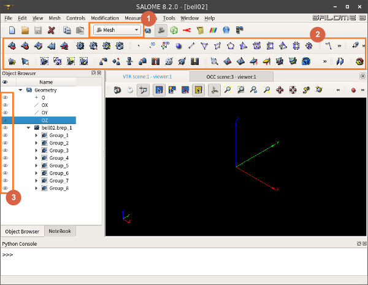{width=50%}

* 위 그림에서 1번으로 `Mesh`로 모드를 변경했다.  그에 따라 2번 영역에 매쉬를 조작할 수 있는 각종 아이콘들이 나타난다.  3번 부분을 보면 Geometry에서 작업한 피쳐들이 전부 보이지 않는 상태로 되어 있고, 따라서 화면에 아무런 모델도 보이지 않는 것을 확인할 수 있다.

* 이제 새로운 매쉬 피쳐를 만들어 나가도록 하자.  상단 메뉴에서 `Mesh - Create Mesh`를 선택하면 매쉬를 생성하는 팝업창이 뜬다.

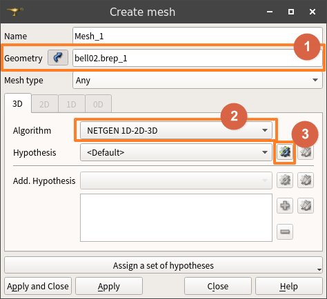{width=20%}

* 위 그림에서 1번에 매쉬를 생성하고자 하는 Geometry를 선택해 준다.
* 2번에서는 매쉬를 생성할 수 있는 방법을 선택해 준다.  여러가지 중에서 `Netgen 1D-2D-3D`가 일단은 가장 무난하다.
* 이후 생성 옵션을 주기 위해 3번을 누르고 `NETGEN 3D Parameters`를 선택한다.  그러면 설정창이 뜬다.

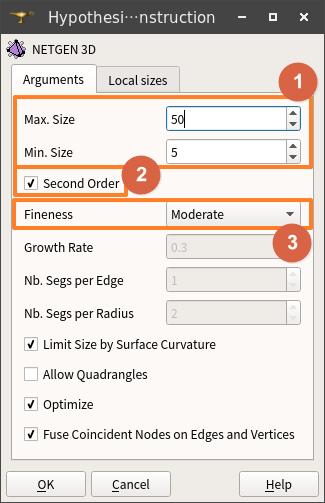{width=20%}

* 위 그림에서 1번에는 엘리먼트의 사이즈 범위를 넣어준다.  모델의 크기나 세부 형상 부분의 치수 등을 고려해서 적절하게 넣어준다.
* 구조해석을 할 경우에는 2번과 같이 `Second Order`는 반드시 체크해 준다.  각 매쉬 엘리먼트의 각변의 가운데에 절점을 하나씩 더 추가하는 것이다.  해석결과의 정확도를 높이고, 구조물이 'Stuck'되는 현상을 방지해서 엉뚱한 값이 나오는 것을 줄여준다.
* 3번의 `Fineness`는, 정해준 엘리먼트 사이즈 범위 내에서 엘리먼트의 사이즈가 점차 성장해 가는 비율을 결정하는 것이다.  일단은 기본 상태로 두었다.
* 설정이 완료되면 `OK`를 눌러 빠져나온다.  그리고 `Create Mesh` 팝업창도 `Apply and Close`를 눌러 빠져나온다.

{width=20%}

* 그러면 트리 영역에 `Mesh`피쳐가 생성되어 있음을 볼 수 있다.  이 안의 `Hypotheses` 및 `Algorithms`에 금방 설정한 사항들이 피쳐로서 들어있음도 확인할 수 있다.  수정하고 싶으면 해당 피쳐의 컨텍스트메뉴(마우스 오른쪽 버튼을 누르면 나오는 메뉴)에서 `Edit Hypothesis`를 선택하고 수정하면 된다.
* 그리고 `Mesh_1` 피쳐 안에는, 그 위에서 설정된 `Hypotheses` 및 `Algorithms`를 상속받아 `Mesh_1`에 적용되었음이 보인다.
* 현재까지는 Geometry 중에서 Body 하나만 들어와 있는 상태이며, 먼저 Geometry 모드에서 만들어둔 그룹들은 아직 `Mesh_1`로 상속되어 있지는 않다.  따라서 이제 그룹을 가져오는 작업을 하자.
* 상단 메뉴에서 `Mesh - Create Groups from Geometry`를 선택한다.  그러면 아래와 같은 팝업창이 나타난다.

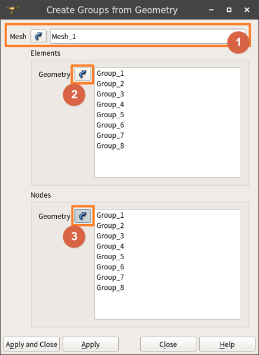{width=20%}

* 위 그림에서, 1번 영역에는 그룹을 적용할 매쉬를 선택해 넣어준다.
* 2번은 Geometry에서 Elements를 가져오기 위한 것이다.  `Shift`키를 누른 상태에서, 원하는 복수의 Geometry 그룹들을 한꺼번에 선택한 후, 2번 버튼을 누르면 전부 다 일괄 등록된다.
* 그 다음, 그대로 3번 버튼을 누르면 위의 2번에서 선택된 것들이 전부 Node로도 들어오게 된다.  나중에 경계조건을 지정할 때의 면(Surface)는, 실제로는 해당 면에 있는 절점(Nodes)이므로, 반드시 이렇게 등록해 주어야 할 필요가 있다.
* 전부 다 등록되었으면, `Apply and Close` 버튼을 눌러 팝업창을 닫는다.  그러면 트리 영역에 금방 등록했던 그룹들이, `Mesh_1`안에 `Groups od Nodes` 및 `Groups of Faces`로 등록되어 있음을 확인할 수 있다.
* 이제 매쉬를 생성하기 전에 필요한 작업은 다 마쳤다.  이제 매쉬 생성 작업을 실행시키면 된다.  

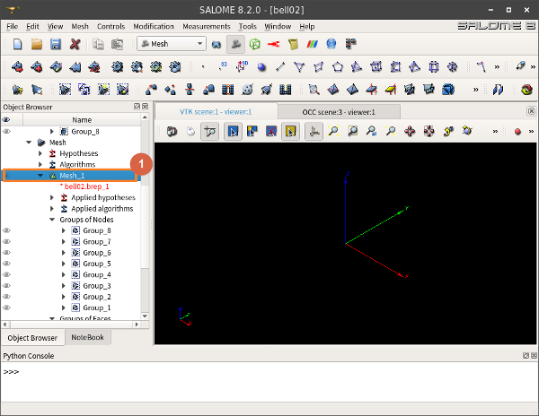{width=50%}

* 위 그림에서, 금방 모든 셋팅을 마친 1번 피쳐 즉 `Mesh_1`의 컨텍스트메뉴(마우스 오른쪽 버튼을 누르면 나오는 메뉴)에서 `Compute`를 누르면, 매쉬 생성 작업을 시작하게 된다.  조금 기다리면 매쉬 생성이 완료되고, 매쉬에 관한 정보를 알려주는 창이 뜬다.
* 만일 조건이 맞지 않아 매쉬 생성에 실패할 경우, 어떤 부분에서 에러가 났는지를 알려주는 창이 대신 뜨게 된다.  이때는 `Hypotheses`의 파라미터를 조정하여 좀 더 잘 생성될 수 있도록 조건을 맞춘 후, 다시 생성을 실행하면 된다.
* 매쉬가 성공적으로 생성된 후, 아래와 같이 상태를 확인해 보자.

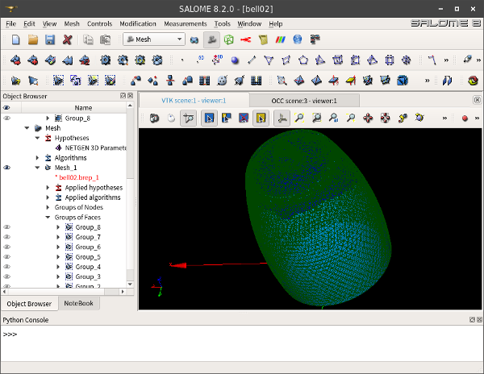{width=50%}

* 상단 메뉴에서 `File - Save`를 선택해서 여기까지 작업한 자료를 저장해 둔다.
* 생성된 매쉬는, ElmerGUI에서 직접 읽어들일 수 있는 unv 포멧으로 출력(Export) 한다.  (현재 시점에서는 unv 포멧만이 유일하게 큰 문제없이 가능한 것 같다.)
* 금방 매쉬 생성이 된 `Mesh_1`의 컨텍스트메뉴(마우스 오른쪽 버튼을 누르면 나오는 메뉴)에서 `Export - UNV file`를 누르고, 위치와 파일명을 정해주고 저장하면 된다.
* 이상 살로메에서 필요한 전처리 작업을 완료하였다.  살로메를 종료하자.

## 3. ElmerGUI 둘러보기 및 매쉬파일 읽어들이기

* 우선 ElmerGUI를 실행시켜 보면, 아래와 같은 매우 심플한 GUI 창이 뜬다.

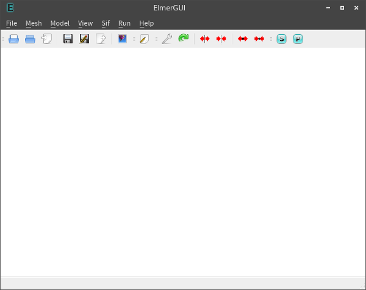{width=50%}

* 상단 메뉴에 모든 기능들이 들어있고, 그 바로 밑의 아이콘들은 그중 몇가지를 내놓은 것이다.  자주 사용하는 메뉴들의 기능을 요약해 보면 다음과 같다.

|상단메뉴    |세부메뉴    |설명                                                |
|:----------:|:----------:|:---------------------------------------------------|
|File        |Open        |Step,Brep등의 솔리드 파일 또는 gms,unv등의 외부 매쉬 파일을 직접 읽어들인다.  솔리드 파일을 불러올 경우에는 ElmerGUI가 자동적으로 내부의 Netgen으로 매쉬작업을 진행한다.|
|            |Load Mesh   |엘머 전용 매쉬파일을 읽어들인다.  엘머의 매쉬파일은 4개의 파일로 나뉘어 구성되어 있기 때문에, 그 파일들이 들어있는 디렉토리를 찾아주면 된다.|
|            |Load Project|ElmerGUI 작업 디렉토리를 선택해 주면 된다.  물론 그 장소에는 엘머 프로젝트 파일(egproject.xml 등)이 있어야 한다.|
|            |Save Project|ElmerGUI의 현재 작업 상태를 그대로 선택해 준 디렉토리에 프로젝트로 저장한다.  자동적으로 프로젝트 관련 파일들이 생성된다.|
|Mesh        |Divide surface|ElmerGUI상에서 면을 분할할 수 있다.  각도 조건으로만 분할하기 때문에 기능은 제한적이지만, 살로메에서 그룹작업을 잘못했을 경우에도 ElmerGUI상에서 어느정도는 수정할 수 있다.|
|            |Unify surface|복수개의 면을 하나로 합치는 것이다.|
|Model       |Setup       |해석의 기본 조건을 설정한다.|
|            |Equation    |해석에 사용되는 물리방정식과 해법을 설정한다.|
|            |Material    |재료의 물성치를 설정한다.|
|            |Body force  |Body에 적용되는 물리량(내력,가속도,발열등) 설정|
|            |Initial condition|초기조건 설정|
|            |Boundary condition|경계조건 설정|
|            |Set body properties|체크하고 바디를 더블클릭해서 선택한 후, 위에서 설정한 조건들을 선택된 바디에 적용할 수 있다.|
|            |Set boundary properties|체크하고 면을 더블클릭해서 선택한 후, 위에서 설정한 조건들을 선택된 면에 적용할 수 있다.|
|            |Summary     |모델에 관한 정보 보기|
|View        |...         |각종 보기 설정|
|Sif         |Generate    |Model 메뉴에서 설정한 사항들을 sif 파일로 생성한다.|
|            |Edit        |생성된 sif 파일을 편집기로 열어본다.  Generate를 다시 하면 편집한 내용은 다 날아가기 때문에 ElmerGUI 기반으로 작업할 경우, 에디터를 사용한 임의 편집은 안 하는 것이 좋다.|
|Run         |Parallel settings|해석시 병렬 연산 설정|
|            |Start solver|해석 계산 시작|
|            |Show convergence|계산의 수렴을 그래프로 보여준다.|

* 이제 메뉴에서 `File - Open`한 후, 살로메에서 생성해 두었던 unv 매쉬 파일을 선택하여 불러들인다.
* 잘 불러들여져서 화면에 매쉬모델이 뜨면, 임의의 면을 더블클릭해서, 원래 살로메에서 구분해 두었던 그룹별로 면들이 잘 분할되어 있는지 확인해 보자.

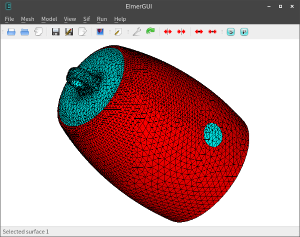{width=50%}

* 이후, 메뉴에서 `File - Save project`를 해 주면, unv 파일이 위치한 장소에 다음과 같은 파일들이 생성되는 것을 확인할 수 있다.

|파일이름|설명|
|:--------------------|:-------------------------------------------------------|
|case.sif             |해석 인풋 파일(Simulation Input File)|
|egproject.xml        |프로젝트 파일(ElmerGUI는 이 파일을 보고 각종 설정 등을 로드함)|
|ELMERSOLVER_STARTINFO|ElmerSolver가 실행될 때 참고하는 사항
|mesh.boundary        |엘머 전용 매쉬 파일 (그룹별로 구분된 경계면 정보들)|
|mesh.element         |엘머 전용 매쉬 파일 (그룹별로 구분된 바디를 구성하는 요소 정보들)|
|mesh.header          |엘머 전용 매쉬 파일 (매쉬에 관한 기본 정보)|
|mesh.nodes           |엘머 전용 매쉬 파일 (모든 절점들의 좌표 정보)|

* 이제 엘머를 종료해 보자.

## 4. 맺음말

이상 3D CAD, 살로메, 엘머로 이어지는 전처리 과정을 설명하였다.
다음의 하편에서 실제 해석을 수행해 보기로 하자.
