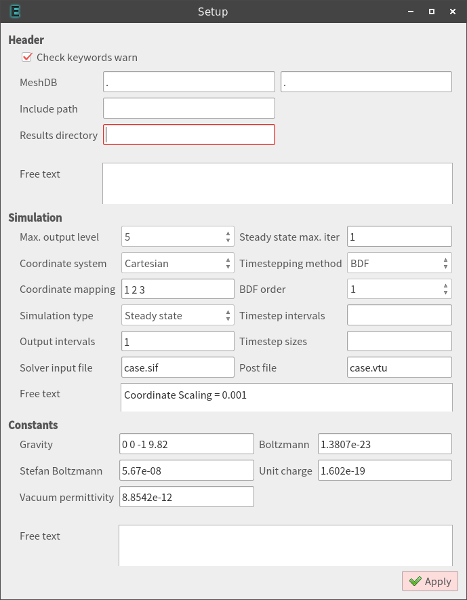
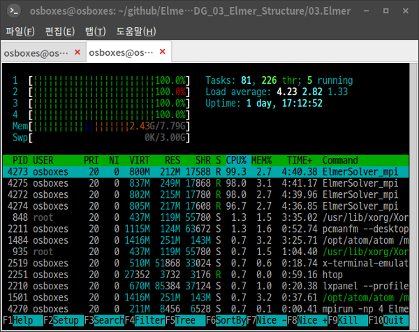

## 1. 개요

상,하편으로 나누어 엘머를 이용하여 다음 3가지 케이스를 따라해 보기로 한다.
지난 상편에서 진행한 전처리에 이어서, 본 하편에서는 다음 3가지 조건을 차례대로 적용하여 해석을 실시해 본다.

 (1) 별도의 외력 없이 중력만 인가하여 자중에 의한 스트레스와 변형량을 본다.
 (2) 이후 외력을 추가한 선형정적해석을 시도해 본다.
 (3)그 다음, MATC를 이용하여 파라메트릭하게 외력의 위치와 강도를 변화시켜 가면서 스캐닝(Scanning)한 결과를 얻어보고, 이것을 애니메이션화해 본다.


## 2. 자중에 의한 변형과 스트레스 해석

* 다시 엘머를 시작하고, `File - Load project`를 하고 직전에 작업하던 디렉토리로 가서 `Open`하면 원래 작업하던 상태 그대로 로딩되는 것을 확인할 수 있다.
* 이제 시뮬레이션 인풋 조건들을 지정해 줘 보자.

### (1) `Model - Setup`

{width=20% hight=20%}

* `Header` 카테고리의 항목들은 다음과 같은 의미를 가지고 있다.

|항목명|내용|
|:-------------------|:--------------------------------------------------------|
|MeshDB              |항목이 2개 보이는데, 앞의 것은 상위 디렉토리이고 뒤의 것은 하위 디렉토리명을 넣는 것이다.  즉 `./mesh`일 경우에, 앞에 `.`을 넣고 뒤에 `mesh`라고 따로 써넣는다. 본 예제에서는 그냥 현재 디렉토리(`.`)에 있으므로 둘 다 `.`,`.`으로 되어 있다.|
|Include Path        |특정 계산을 위해 만들어진 별도 라이브러리가 있을 경우, Include 시킬 경로를 써 넣어줄 수 있다.  본 예제에서는 사용하지 않는다.|
|Result directory    |계산 결과 파일들이 저장될 장소이다.  아무것도 없으면 그냥 현재 디렉토리에 저장된다.|

`MeshDB`, `Include Path`, `Result directory`는 원래 그대로 둔다.  매쉬파일들은 당연히 현재 작업 디렉토리에 있으므로 `.`으로 되어 있고, 결과 파일의 출력 장소도 별도 지정되지 않았으므로 현재 디렉토리에 저장될 것이다.
* `Free text` 부분은 임의의 주석이나 추가 명령들을 직접 써넣어 줄 수 있는 곳이다.  주석을 넣을 때는 앞에 `!`를 넣어주면 된다.
* `Simulation` 카테고리에서의 항목들은 대략 다음과 같은 의미를 가지고 있다.

|항목명|내용|
|:-------------------|:--------------------------------------------------------|
|Max. output level   |계산 진행 도중, 텍스트로 출력되는 메시지를 얼마나 자세하게 할 것인지 정하는 것이다.  1을 주면 메시지가 최소화되고, 10을 주면 온갖 정보들이 수다스럽게 출력된다.  그냥 기본값 5 정도면 충분하다.|
|Coordinate system   |좌표계를 고를 수 있다.  일반적인 `Cartesian` 뿐만 아니라, `Axi Symmetric`, `Cylindric Symmetric`도 선택할 수 있다.|
|Coordinate Mapping  |위에서 선택해 준 좌표계의 축 번호를 정해준다.  `Cartesian`좌표계일때 `1 2 3`이라면, `x y z`로 대응된다.|
|Simulation type     |`Steady state`, `Transient`, `Scanning` 중 택일 가능하다.  `Transient`는 시간에 대한 변화를 보고자 할 때 선택한다.  `Scanning`은 시간이 아닌 다른 변수, 예컨데 외력을 특정 함수나 테이블을 이용하여 여러 케이스별로 줘 보고 싶을 때 하나씩 전부 다 계산해서 결과를 내놓는 것이다.|
|Output intervals    |`Transient`,`Scanning` 해석일 때, 예컨데 100개의 결과를 계산했는데 전부 다 저장하면 용량이 너무 커지니까 1번씩 걸러서 저장하고 싶다면 2를 넣으면 된다.  모든 결과를 다 저장하려면 디폴트값이 1로 한다.|
|Solver input file   |현재 설정하고 있는 내용이 저장될, 시뮬레이션 인풋 파일(sif)의 파일 이름을 정해준다.  여러가지의 조건으로 다양하게 해석해 보고자 한다면, 기본값인 `case.sif` 말고 다른 이름으로 지정하면 될 것이다.|
|Steady state max. iter|Steady state 해석을 할 때만 유효한 변수이다.  이때 하나의 샷(Shot)만 얻어내고자 할 때는 1로 해 주면 된다.  만일 여러개의 샷을 얻어내고자 할 때는, 예컨데 여기에 10을 넣어주고 아래의 `Free text`란에 ` Steady State Min Iterations = 5`를 해 주면, 결과 파일이 단계별로 5개 생긴다.  이를 이용해 Steady state 해석을 하고서 손쉽게 애니메이션을 만들어낼 수도 있다.|
|Timestepping method |`Transient` 해석시 사용되는 적분알고리즘을 선택하는 것이다.  일단 기본값인 `BDF`(Backward Differentiation Formula)만 선택되도록 되어 있다.|
|BDF order           |BDF 알고리즘의 차수를 설정한다.  기본값은 가장 단순한 1차로 지정되어 있고, 차수를 높여갈 수록 정밀도는 더 높아질 것이다.  이론상 최고값은 6 정도로 두는 것이 맞을 것이다.|
|Timestep intervals  |`Transient` 해석시 전체 시간을 정해준다.  10초 동안의 변화를 계산하고 싶다면 10을 넣어주면 된다.|
|Timestep size       |`Transient` 해석시 몇 초 간격으로 끊어주는지 정해준다.  0.1초 간격으로 계산하고 싶다면 0.1을 넣어주면 된다.|
|Post file           |결과 파일의 이름을 넣어준다.  확장자는 `.ep`와 `.vtu` 중에 선택할 수 있다.  `.ep` 포멧은 ElmerGUI에 내장된 ElmerPost 및 ElmerVTK에서 읽어서 가시화할 때 사용하고, `.vtu` 포멧은 Paraview 등 표준 VTK 포멧을 지원하는 후처리기로 가시화할 때 사용하면 된다.|
|Free text           |Simulation 카테고리 안의 이곳에 기본 조건을 추가할 수 있다.  본 예제에서는 `Coordinate Scaling = 0.001`을 써 넣어 주었다. 이것은 불러들인 매쉬파일은 원래 CAD에서 그린 mm 단위의 형상을, 강제로 0.001배 해서 m 단위로 스케일링(단위변환)을 해 준 것이다.  엘머는 기본적으로 단위계가 따로 정해져 있지는 않으나, ElmerGUI에서 기본으로 제공하는 상수 및 물성치들이 모두 MKS단위계로 맞추어져 있기 때문에 길이 단위는 m(미터)로 맞추는 것이 편하다.|

* `Constants` 카테고리는 기본적인 물리상수들을 써준다.  기본 제공된 것 이외의 다른 물리상수나 변수를 추가해 주려면, 이 카테고리의 `Free text`란에 넣어주면 된다.  단, 이때 그냥 `Diameter = 0.2`와 같이 쓰면 안되고, `$Diameter = 0.2`와 같이 변수명 앞에 `$`기호를 써줘야 엘머가 정상적으로 인식한다.
* 특히 `Gravity`는 중력가속도임을 쉽게 알 수 있는데, 여기서 기본값은 `0 -1 0 9.82`로 표기되어 있어 y축 아래쪽 방향으로 중력이 작용한다고 되어 있다.  중력 방향이 -z축으로 가정하고 모델링 되어 있었다면 `0 0 -1 9.82`로 변경해 주면 될 것이다.
* 이상 본 예제에서는 위 그림과 같이 정의해 둔다.


### (2) `Model - Equation`

* `Add`해서 새로운 Equation을 정의해 주자.

{width=20% hight=20%}

* 30여개의 탭으로 다양한 물리방정식(Equation)이 제공된다.  본 예제에서는 위 그림과 같이, `Linear elasticity`만 `Active` 체크해서 활성화 시킨다.  아울러 옵션으로 스트레스 계산도 활성화해 준다.
* `Apply to bodies:` 항목에는 현재 모델에서 구분된 물체(Body)가 표시된다.  본 예제에서는 1개의 물체만 있기 때문에 혼동될 염려가 없으므로 직접 체크해 준다.
* `Edit Solver Settings`에서는 물리방정식을 푸는 해석자에 관한 옵션들이 들어있다.  눌러서 들어가 보자.

{width=20% hight=20%}

* 첫번째 탭인 `Solver specific options`에서 위 그림과 같이 필요한 기능만 체크해 준다.  본 예제에서는 `Calculate loads`를 체크해서 외력을 관한 정보를 결과에 포함시키고, `Calculate stresses`로 응력도 결과에 포함시키는 것으로 한다.  그리고 `Displacement mesh`로 변형까지 결과에 포함시키자.

{width=20% hight=20%}

* 그리고 `Linear system` 탭에서 `Method`를 Umfpack Direct Solver로 선택해 주었다.  이것으로 계산이 잘 된다면 디폴트였던 BiCGStab Iterative Solver보다 훨씬 빠르게 계산을 마칠 수 있을 것이다.


### (3) `Model - Material`

* `Add`해서 새로운 Material을 정의해 주자.

{width=20% hight=20%}
{width=20% hight=20%}

* `Material library`에 들어있는 기본적인 것을 선택해도 되지만, 여기서는 청동(Bronze) 소재의 물성을 사용해보고 싶다.  위 그림과 같이 그에 해당하는 구조해석을 위한 물성치를 넣어준다.
* 정의된 재료의 물성치를 적용할 물체(Body)도 체크해 준다.


### (4) `Model - Body force`

* 여기서는, 물체(Body)에 적용되는 힘을 넣어준다.

{width=20% hight=20%}

* 본 예제의 해석 목표는 자중에 의한 응력을 알아보는 것이므로, 중력가속도(Gravity)와 밀도(Density)를 곱해준다.  물론 -z축 방향이므로, z축에 해당하는 `Force 3`란에 기입하고 마이너스(-)부호를 넣는다.  아울러, 곱셈 수식을 엘머가 인식해서 적용할 수 있도록 `$`기호도 앞에 넣어주는 것을 잊지 않는다.
* 정의된 Body Force가 적용할 물체(Body)도 체크해 준다.


### (5) `Model - Initial condition`

* 본 예제는 Steady state 해석이므로, 초기조건(Initial condition)은 불필요하기 때문에 생략한다.


### (6) `Model - Boundary condition`

* 경계조건은, 모델의 고리 부분을 고정했다고 가정하고 그 부위의 변위를 0으로 만들어주기 위해 하나 설정해 준다.

{width=20% hight=20%}

* x,y,z 모두 변위를 0으로 해서 고정하였다.
* `Apply to boundaries:` 부분은 체크하지 않고 일단 보류한다.  이유는 물체(Body)의 경우와는 달리, 경계면이 여러가지 많이 있기 때문에 어느 번호가 고정하기를 원하는 경계면인지 알 수 없기 때문이다.


### (7) `Model - Set body properties`

* 물체(Body)는 이미 모두 선택되었기 때문에 생략한다.


### (8) `Model - Set boundary properties`

* 경계면(Boundary)를 선택하기 위해 이 메뉴를 눌러서 체크해 준다.
* 이후 그래픽 화면에서, 아래의 그림에서 붉은 부분의 경계면을 더블클릭해서 선택해 준다.

{width=50% hight=50%}

* 팝업창이 뜨면, 조금 전에 설정해 둔 경계조건을 선택해서 Apply해 주면 적용이 된다.
* 이제 `Model` 메뉴에서 필요한 설정은 모두 끝났다.


### (9) `Sif - Generate`

* 이 메뉴를 누르면, 앞서 `Model`에서 설정된 사항들을 적용하여 시뮬레이션 인풋 파일이 생성된다.
* `Sif - Generate`로 생성된 내용을 확인해 보자.
* 생성된 내용을 프로젝트로 갱신 저장하기 위해, `File - Save project`를 해 준다.


### (10) `Run - Start solver`

* 이 메뉴를 누르면 곧바로 계산이 시작된다.  메시지창과 수렴 그래프창이 뜨는데, 현재는 Direct solver로 계산하기 때문에 수렴 그래프창은 별 의미가 없다.
* 계산이 완료되면, 결과파일인 `case.vtu`가 생성되었음을 알 수 있다.


### (11) Paraview 후처리

* 이제 Paraview 프로그램을 실행하고, `case.vtu` 파일을 불러들여 본다.
* 좌측 `Properties` 탭의 `Apply` 버튼을 누르면 형상이 화면에 나타난다.

{width=50% hight=50%}

* 그리고 위 그림에 표시된 부분에서 `vonmises`등을 선택해서 확인해 본다.
* Von Mises 응력의 경우, 최고값(Max)이 `7.7e+06`으로 나온다.  현재 MKS단위계로 맞추어져 있으므로, 단위는 당연히 [kgf/m^2]일 것이다.  일반적으로 사용하는 단위로 환산하면, 75.511205[MPa]이 된다.
* Paraview의 좀 더 자세한 사용법은 추후에 알아보자.
* 이상 자중에 의한 응력을 해석해서 확인해 보았다.


## 3. 외력에 의한 변형과 스트레스 해석

* 앞선 예제에서는, 경계조건에서 별도의 외력을 주지 않았다.  여기에 외력을 추가해 보자.
* 이번에는 ElmerGUI를 이용하지 않고, 직접 sif 파일을 편집하고, 커맨드라인 상에서 ElmerSolver를 직접 실행시켜보자.
* 터미널에서, 앞선 예제에서 작업하던 프로젝트 디렉토리로 간다.  이후 다음과 같이 명령해 보자.

```bash
$ cp ./case.sif ./case2.sif
```

* 그리고 적당한 텍스트 편집기로 `case2.sif` 파일을 열어서, 내용을 편집한다.  기존의 내용은 그대로 두고, 맨 아래에 다음 내용만 추가해 보자.  즉 경계조건을 하나 더 추가하는 것이다.

```cpp
!!!!!!!!!!!!!!!!!!!!!!!!!!!!!!!!!!!!
! New Boundary condition
Boundary Condition 2
  Target Boundaries(1) = 6
  Name = "Force"
  Force 1 = -10000
  Force 2 = 0
  Force 3 = 0
End
```

* 경계조건(Boundary Condition)의 지정번호는 기존의 1 다음 번호인 2로 했다.  지정 경계면은 6번 면이다.  이 번호는 ElmerGUI 상에서 미리 확인해 두면 된다(원하는 경계면을 더블클릭하면, GUI화면 하단에 메시지로 번호가 표기된다).  이름은 `Force`로 임의로 정했다.  그리고 -x 방향으로 10000[N]의 힘이 가해지도록 했다.  이때 힘의 방향을 정하기 위해서는 ElmerGUI에서 `Compass`를 보이도록 해서 참고하면 된다.
* 그리고, 내용 맨 윗 부분의 `Simulation` 카테고리에서 다음과 같이 출력 파일 이름에 관한 내용도 수정해 준다.

```cpp
Solver Input File = case2.sif
Post File = case2.vtu
```

* 내용을 다 이해하고 적용했으면, 저장한다.
* 이제 계산을 아래와 같이 실행하고 완료될 때 까지 메시지를 보면서 기다려 보자.  ElmerGUI 없이 터미널에서 바로 계산을 시키니까 불필요한 메모리 낭비도 없어서 좋다.

```bash
$ ElmerSolver case2.sif
```

* 계산 도중 시스템의 자원 상황을 확인해 보려면, 새로운 터미널을 열어서 `top` 또는 `htop` 같은 명령을 사용해 보자.  CPU나 메모리 점유율, 프로세스의 현재 상황 등을 볼 수 있다.  (현재 Umfpack을 사용하고 있는데, 1개의 CPU 코어만 100%에 도달하는 것을 볼 수 있다.  즉 멀티코어 CPU에는 C로 짜여진 Umfpack은 대응하지 못한다.)
* 계산이 완료되면, `case20001.vtu` 파일이 생성된 것을 확인할 수 있다.  Paraview로 이 파일을 읽어들여보고, 가시화 해 보자.

{width=50% hight=50%}

* 위 그림과 같이 범위(Range)를 수동으로 조절해서 가시화되는 등고선을 더 뚜렷하게 만들어 볼 수 있다.

{width=50% hight=50%}

* 위 그림에서는 1번 버튼을 눌러서 WrapByVector를 추가하고, Scale Factor를 500배로 키워서, 응력에 의한 변형을 과장해서 보여주도록 하였다.

{width=50% hight=50%}

* 위 그림에서는 1번 메뉴 `View - Animation View`를 체크해서, 2번의 팝업이 나타나도록 한 후, WrapByVector1을 추가(+)한 후 시간에 따라 Scale Factor가 변하도록 해서 애니메이션을 만든 것이다.  메뉴 상단의 플레이 버튼을 누르면 애니메이션을 볼 수 있고, `File - Save Animation`으로 동영상 파일로 저장할 수 있다.


## 4. 외력의 크기를 변화시켜 스캐닝

* 이번에는 `Force 1 = -10000`로 그냥 상수로 주었던 것을, 임의의 함수로 시간별로 변화시켜 보고, 그것을 `Transient` 시뮬레이션 조건으로 시간에 따른 변화를 보도록 해 보자.  우선 아래와 같이 새로운 sif 파일을 또 만들자.

```bash
$ cp ./case2.sif ./case3.sif
```

* 그리고 적당한 텍스트 편집기로 열어서, `Simulation` 카테고리의 조건을 아래와 같이 바꿔서 대체하자.

```cpp
Simulation
  Max Output Level = 10
  Coordinate System = Cartesian
  Coordinate Mapping(3) = 1 2 3
  Simulation Type = Transient   ! Not Steady state, But Transient
  Steady State Max Iterations = 1
  Output Intervals = 1
  Timestepping Method = BDF
  BDF Order = 1
  Timestep intervals = 10       ! 1 second (0.1 seconds by 10 shots)
  Timestep sizes = 0.1          ! 0.1 second intervals
  Solver Input File = case3.sif ! Change sif file name
  Post File = case3.vtu         ! Change output file name
  Coordinate Scaling = 0.001    ! Change units from milimeter to meter
End
```

* 그리고, `Boundary Condition 2`도 아래와 같이 변경해서 대체하자.

```cpp
!!!!!!!!!!!!!!!!!!!!!!!!!!!!!!!!!!!!
! New Boundary Condition
Boundary Condition 2
  Target Boundaries(1) = 6
  Name = "Force"
  Force 1 = Variable time
            Real MATC "-10000*sin(tx*3.14159/10)"
  Force 2 = 0
  Force 3 = 0
End
```

* 위에서 `Force 1` 부분이 바뀌었다.  즉 시간(tx)를 파라미터로 사용하고, 그 시간의 증가에 따라 Sine 곡선으로 배율 -10000배까지 1/2주기만큼 변화시키는 함수를 써 넣은 것이다.

* 또 `Transient` 시뮬레이션이기 때문에 초기조건(Initial condition)도 추가해 주자.

```cpp
!!!!!!!!!!!!!!!!!!!!!!!!!!!!!!!!!!!!
! New Initial Condition
Initial Condition 1
  Name = "InitialCondition 1"
  Displacement 3 = 0
  Displacement 2 = 0
  Displacement 1 = 0
End
```

* 이 상태로 계산을 시키면, 계산은 되기는 하지만 10번의 계산을 반복해야 하므로 10배의 계산시간이 소요된다.  너무 지루하기 때문에 멀티코어 CPU의 성능을 끌어내기위해 병렬연산을 하도록 추가적인 작업을 좀 해 주자.
* 방법은 매쉬를 연산시킬 CPU 코어 개수만큼 쪼개는 것이다.  매쉬를 쪼개는 작업은 ElmerGrid에서 METIS 라이브러리를 활용해서 해 준다.  4개의 가용한 CPU 코어가 있다면, 다음 명령과 같이 4개로 쪼개고 디렉토리 경로를 맞추어준다.

```bash
$ ElmerGrid 2 2 ./Partition -metis 4
$ mv ./Partition/partitioning.4 ./partitioning.4
$ rm -r Partition
```

* 또, Umfpack은 METIS를 사용한 분할 계산에 적합하지 않기 때문에(실패한다), BiCGStab으로 솔버를 바꾸기 위해 `case3.sif`파일에서 `Solver 1` 카테고리를 아래와 같은 내용으로 대체한다.

```cpp
Solver 1
  Equation = Linear elasticity
  Calculate Stresses = True
  Calculate Loads = True
  Procedure = "StressSolve" "StressSolver"
  Variable = -dofs 3 Displacement
  Exec Solver = Always
  Stabilize = True
  Bubbles = False
  Lumped Mass Matrix = False
  Optimize Bandwidth = True
  Steady State Convergence Tolerance = 1.0e-5
  Nonlinear System Convergence Tolerance = 1.0e-7
  Nonlinear System Max Iterations = 20
  Nonlinear System Newton After Iterations = 3
  Nonlinear System Newton After Tolerance = 1.0e-3
  Nonlinear System Relaxation Factor = 1
  !!!!!!!!!!!!!!!!!!!!!!!!!!!!!!!!!!!!!!!!!!!!!!!!!!!!!!!!!!!!!!!!!!!!!!!!!
  ! Actual Linear Solver Setting
  Linear System Solver = Iterative         ! Change from Direct to Iterative method
  Linear System Direct Method = BiCGStab   ! Change from Umfpack to BiCGStab algorithm
  Linear System Max Iterations = 500       ! Parameters for BiCGStab
  Linear System Convergence Tolerance = 1.0e-7 ! More wide convergence tolerance than 1e-10
  BiCGstabl polynomial degree = 2
  Linear System Preconditioning = Diagonal
  Linear System ILUT Tolerance = 1.0e-3
  Linear System Abort Not Converged = False
  Linear System Residual Output = 1
  Linear System Precondition Recompute = 1
End
```

* 그리고 텍스트 편집기로 `ELMERSOLVER_STARTINFO`의 내용을 아래와 같이 수정해 주자(ElmerSolver_mpi 실행시 이곳의 정보를 자동으로 참조하도록 되어 있다).

```cpp
case3.sif
```

* 이제 여러개로 쪼개진 매쉬들의 접합부 노드간에 메시지를 주고받으면서 연성(Connection) 될 수 있도록 MPI 연산을 시킨다.  아래와 같이 `mpirun` 명령으로 4개의 CPU코어를 사용하도록 옵션을 줘서 실행시키면 된다.  계산량이 상당하므로 몇 시간 정도 소요될 것이다.

```bash
$ mpirun -np 4 ElmerSolver_mpi
```

* 실행 도중 다른 터미널로 `top` 또는 `htop`해서 CPU의 사용률을 보면, 4개의 CPU 코어가 100%에 달해서 총력을 기울이고 있음을 볼 수 있다.  이러한 분할 연산 전략은, 해석자(Solver)가 오래된 포트란 코드나 C코드로 개발되어 최신 멀티코어 연산에 대응하지 못할 경우, MPI를 이용하여 쪼개서 각각 계산을 시킴으로써 전체적으로 병렬연산을 하는 효과를 볼 수 있게 한다.  또한 리눅스OS는 현명하게도, 가용한 모든 4개의 CPU코어를 계산에 동원했음에도 불구하고, 이외의 다른 작업을 할때는 적절하게 자원을 배분해 주어 데스크탑 전체가 얼어붙거나 하는 일을 미연에 방지해 준다.

{width=20% hight=20%}

* 계산이 다 되면, 다음과 같이 4개씩 짝을 지워 10샷 즉 총 40개의 vtu파일과, 쪼개진 매쉬를 붙여주는 10개의 pvtu파일이 각 샷마다 생겨있음을 볼 수 있을 것이다.

```cpp
case30001.pvtu ... case30010.pvtu
case30001par0001.vtu case30002par0001.vtu case30003par0001.vtu case30004par0001.vtu
...
case30001par0010.vtu case30002par0010.vtu case30003par0010.vtu case30004par0010.vtu
```

* Paraview로 보면 `case..pvtu`로 표현되는 것이 보이는데, 이것은 10개의 샷으로 된 pvtu 파일을 모두 합쳐서 열어볼 수 있도록 된 것이다.  열어서 데이타를 가시화해 보자.  플레이 버튼을 누르면 각 샷 별로 넘어가면서 애니메이션화해서 보여질 것이다.
* 이상의 병렬연산 등 모든 작업은 사실 ElmerGUI 상에서도 가능한 수준이다.  다만 여기서는 GUI 없이 터미널 명령으로 사용하는 방법을 연습해 볼 수 있도록 설명해 보았다.


## 5. 맺음말

* 가장 기본적인 선형 정적 응력해석을 엘머에서 제공하는 몇 가지 방법으로 해 보았다.
* 본 편의 모델링 데이타는 다음 장소에서 다운로드 받으면 된다.

```
https://github.com/dymaxionkim/Elmer_Examples_for_CADG/tree/master/CADG_03_Elmer_Structure
```

* 본 예제를 통해 ElmerGUI를 중심으로 한 해석절차와 기본적인 기법을 습득할 수 있었다.


## 6. 참고 자료

* 성덕대왕신종의 부분명칭과 크기

> http://blog.daum.net/_blog/BlogTypeView.do?blogid=03Pdg&articleno=15960218

* 이장무, 新羅 鐘의 設計에 관한 연구, 학술원논문집 제55집 1호 (2016)

> http://www.nas.go.kr

* 김석현,이중혁, 등가 종 모델을 이용한 맥놀이 주기 조절법, 한국음향학회지 제31권 제8호 (2012)

> http://ocean.kisti.re.kr/downfile/volume/ask/GOHHBH/2012/v31n8/GOHHBH_2012_v31n8_561.pdf

* J.M.LEE, A STUDY ON THE VIBRATION CHARACTERISTICS OF A LARGE SIZE KOREAN BELL, Journal of Sound and Vibration (2002)

> http://sci-hub.bz/10.1006/jsvi.2002.5092
