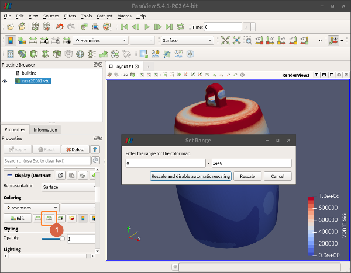
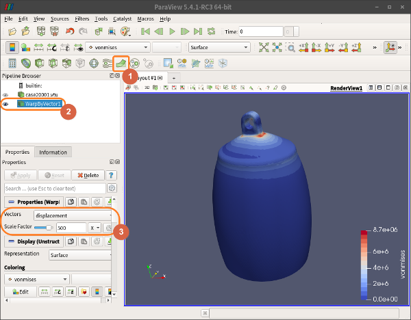
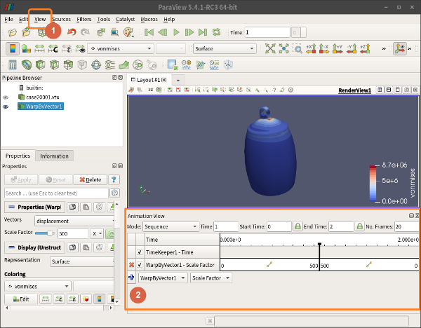
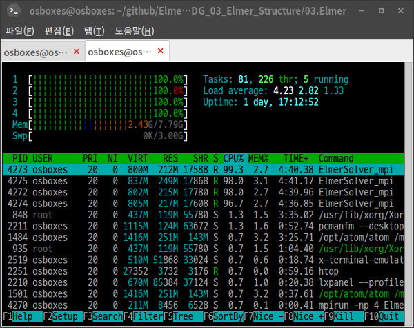

## 1. 개요

지난 중편에서 진행한 전처리에 이어서, 본 하편에서는 다음 조건을 차례대로 적용하여 해석을 실시해 본다.

 (1) 이후 외력을 추가한 선형정적해석을 시도해 본다.
 (2)그 다음, MATC를 이용하여 파라메트릭하게 외력의 위치와 강도를 변화시켜 가면서 스캐닝(Scanning)한 결과를 얻어보고, 이것을 애니메이션화해 본다.


## 2. 외력에 의한 변형과 스트레스 해석

* 앞선 예제에서는, 경계조건에서 별도의 외력을 주지 않았다.  여기에 외력을 추가해 보자.
* 이번에는 ElmerGUI를 이용하지 않고, 직접 sif 파일을 편집하고, 커맨드라인 상에서 ElmerSolver를 직접 실행시켜보자.
* 터미널에서, 앞선 예제에서 작업하던 프로젝트 디렉토리로 간다.  이후 다음과 같이 명령해 보자.

```bash
$ cp ./case.sif ./case2.sif
```

* 그리고 적당한 텍스트 편집기로 `case2.sif` 파일을 열어서, 내용을 편집한다.  기존의 내용은 그대로 두고, 맨 아래에 다음 내용만 추가해 보자.  즉 경계조건을 하나 더 추가하는 것이다.

```cpp
!!!!!!!!!!!!!!!!!!!!!!!!!!!!!!!!!!!!
! New Boundary condition
Boundary Condition 2
  Target Boundaries(1) = 6
  Name = "Force"
  Force 1 = -10000
  Force 2 = 0
  Force 3 = 0
End
```

* 경계조건(Boundary Condition)의 지정번호는 기존의 1 다음 번호인 2로 했다.  지정 경계면은 6번 면이다.  이 번호는 ElmerGUI 상에서 미리 확인해 두면 된다(원하는 경계면을 더블클릭하면, GUI화면 하단에 메시지로 번호가 표기된다).  이름은 `Force`로 임의로 정했다.  그리고 -x 방향으로 10000[N]의 힘이 가해지도록 했다.  이때 힘의 방향을 정하기 위해서는 ElmerGUI에서 `Compass`를 보이도록 해서 참고하면 된다.
* 그리고, 내용 맨 윗 부분의 `Simulation` 카테고리에서 다음과 같이 출력 파일 이름에 관한 내용도 수정해 준다.

```cpp
Solver Input File = case2.sif
Post File = case2.vtu
```

* 내용을 다 이해하고 적용했으면, 저장한다.
* 이제 계산을 아래와 같이 실행하고 완료될 때 까지 메시지를 보면서 기다려 보자.  ElmerGUI 없이 터미널에서 바로 계산을 시키니까 불필요한 메모리 낭비도 없어서 좋다.

```bash
$ ElmerSolver case2.sif
```

* 계산 도중 시스템의 자원 상황을 확인해 보려면, 새로운 터미널을 열어서 `top` 또는 `htop` 같은 명령을 사용해 보자.  CPU나 메모리 점유율, 프로세스의 현재 상황 등을 볼 수 있다.  (현재 Umfpack을 사용하고 있는데, 1개의 CPU 코어만 100%에 도달하는 것을 볼 수 있다.  즉 멀티코어 CPU에는 C로 짜여진 Umfpack은 대응하지 못한다.)
* 계산이 완료되면, `case20001.vtu` 파일이 생성된 것을 확인할 수 있다.  Paraview로 이 파일을 읽어들여보고, 가시화 해 보자.

{width=50% hight=50%}

* 위 그림과 같이 범위(Range)를 수동으로 조절해서 가시화되는 등고선을 더 뚜렷하게 만들어 볼 수 있다.

{width=50% hight=50%}

* 위 그림에서는 1번 버튼을 눌러서 WrapByVector를 추가하고, Scale Factor를 500배로 키워서, 응력에 의한 변형을 과장해서 보여주도록 하였다.

{width=50% hight=50%}

* 위 그림에서는 1번 메뉴 `View - Animation View`를 체크해서, 2번의 팝업이 나타나도록 한 후, WrapByVector1을 추가(+)한 후 시간에 따라 Scale Factor가 변하도록 해서 애니메이션을 만든 것이다.  메뉴 상단의 플레이 버튼을 누르면 애니메이션을 볼 수 있고, `File - Save Animation`으로 동영상 파일로 저장할 수 있다.


## 3. 외력의 크기를 변화시켜 스캐닝

* 이번에는 `Force 1 = -10000`로 그냥 상수로 주었던 것을, 임의의 함수로 시간별로 변화시켜 보고, 그것을 `Transient` 시뮬레이션 조건으로 시간에 따른 변화를 보도록 해 보자.  우선 아래와 같이 새로운 sif 파일을 또 만들자.

```bash
$ cp ./case2.sif ./case3.sif
```

* 그리고 적당한 텍스트 편집기로 열어서, `Simulation` 카테고리의 조건을 아래와 같이 바꿔서 대체하자.

```cpp
Simulation
  Max Output Level = 10
  Coordinate System = Cartesian
  Coordinate Mapping(3) = 1 2 3
  Simulation Type = Transient   ! Not Steady state, But Transient
  Steady State Max Iterations = 1
  Output Intervals = 1
  Timestepping Method = BDF
  BDF Order = 1
  Timestep intervals = 10       ! 1 second (0.1 seconds by 10 shots)
  Timestep sizes = 0.1          ! 0.1 second intervals
  Solver Input File = case3.sif ! Change sif file name
  Post File = case3.vtu         ! Change output file name
  Coordinate Scaling = 0.001    ! Change units from milimeter to meter
End
```

* 그리고, `Boundary Condition 2`도 아래와 같이 변경해서 대체하자.

```cpp
!!!!!!!!!!!!!!!!!!!!!!!!!!!!!!!!!!!!
! New Boundary Condition
Boundary Condition 2
  Target Boundaries(1) = 6
  Name = "Force"
  Force 1 = Variable time
            Real MATC "-10000*sin(tx*3.14159/10)"
  Force 2 = 0
  Force 3 = 0
End
```

* 위에서 `Force 1` 부분이 바뀌었다.  즉 시간(tx)를 파라미터로 사용하고, 그 시간의 증가에 따라 Sine 곡선으로 배율 -10000배까지 1/2주기만큼 변화시키는 함수를 써 넣은 것이다.

* 또 `Transient` 시뮬레이션이기 때문에 초기조건(Initial condition)도 추가해 주자.

```cpp
!!!!!!!!!!!!!!!!!!!!!!!!!!!!!!!!!!!!
! New Initial Condition
Initial Condition 1
  Name = "InitialCondition 1"
  Displacement 3 = 0
  Displacement 2 = 0
  Displacement 1 = 0
End
```

* 이 상태로 계산을 시키면, 계산은 되기는 하지만 10번의 계산을 반복해야 하므로 10배의 계산시간이 소요된다.  너무 지루하기 때문에 멀티코어 CPU의 성능을 끌어내기위해 병렬연산을 하도록 추가적인 작업을 좀 해 주자.
* 방법은 매쉬를 연산시킬 CPU 코어 개수만큼 쪼개는 것이다.  매쉬를 쪼개는 작업은 ElmerGrid에서 METIS 라이브러리를 활용해서 해 준다.  4개의 가용한 CPU 코어가 있다면, 다음 명령과 같이 4개로 쪼개고 디렉토리 경로를 맞추어준다.

```bash
$ ElmerGrid 2 2 ./Partition -metis 4
$ mv ./Partition/partitioning.4 ./partitioning.4
$ rm -r Partition
```

* 또, Umfpack은 METIS를 사용한 분할 계산에 적합하지 않기 때문에(실패한다), BiCGStab으로 솔버를 바꾸기 위해 `case3.sif`파일에서 `Solver 1` 카테고리를 아래와 같은 내용으로 대체한다.

```cpp
Solver 1
  Equation = Linear elasticity
  Calculate Stresses = True
  Calculate Loads = True
  Procedure = "StressSolve" "StressSolver"
  Variable = -dofs 3 Displacement
  Exec Solver = Always
  Stabilize = True
  Bubbles = False
  Lumped Mass Matrix = False
  Optimize Bandwidth = True
  Steady State Convergence Tolerance = 1.0e-5
  Nonlinear System Convergence Tolerance = 1.0e-7
  Nonlinear System Max Iterations = 20
  Nonlinear System Newton After Iterations = 3
  Nonlinear System Newton After Tolerance = 1.0e-3
  Nonlinear System Relaxation Factor = 1
  !!!!!!!!!!!!!!!!!!!!!!!!!!!!!!!!!!!!!!!!!!!!!!!!!!!!!!!!!!!!!!!!!!!!!!!!!
  ! Actual Linear Solver Setting
  Linear System Solver = Iterative         ! Change from Direct to Iterative method
  Linear System Direct Method = BiCGStab   ! Change from Umfpack to BiCGStab algorithm
  Linear System Max Iterations = 500       ! Parameters for BiCGStab
  Linear System Convergence Tolerance = 1.0e-7 ! More wide convergence tolerance than 1e-10
  BiCGstabl polynomial degree = 2
  Linear System Preconditioning = Diagonal
  Linear System ILUT Tolerance = 1.0e-3
  Linear System Abort Not Converged = False
  Linear System Residual Output = 1
  Linear System Precondition Recompute = 1
End
```

* 그리고 텍스트 편집기로 `ELMERSOLVER_STARTINFO`의 내용을 아래와 같이 수정해 주자(ElmerSolver_mpi 실행시 이곳의 정보를 자동으로 참조하도록 되어 있다).

```cpp
case3.sif
```

* 이제 여러개로 쪼개진 매쉬들의 접합부 노드간에 메시지를 주고받으면서 연성(Connection) 될 수 있도록 MPI 연산을 시킨다.  아래와 같이 `mpirun` 명령으로 4개의 CPU코어를 사용하도록 옵션을 줘서 실행시키면 된다.  계산량이 상당하므로 몇 시간 정도 소요될 것이다.

```bash
$ mpirun -np 4 ElmerSolver_mpi
```

* 실행 도중 다른 터미널로 `top` 또는 `htop`해서 CPU의 사용률을 보면, 4개의 CPU 코어가 100%에 달해서 총력을 기울이고 있음을 볼 수 있다.  이러한 분할 연산 전략은, 해석자(Solver)가 오래된 포트란 코드나 C코드로 개발되어 최신 멀티코어 연산에 대응하지 못할 경우, MPI를 이용하여 쪼개서 각각 계산을 시킴으로써 전체적으로 병렬연산을 하는 효과를 볼 수 있게 한다.  또한 리눅스OS는 현명하게도, 가용한 모든 4개의 CPU코어를 계산에 동원했음에도 불구하고, 이외의 다른 작업을 할때는 적절하게 자원을 배분해 주어 데스크탑 전체가 얼어붙거나 하는 일을 미연에 방지해 준다.

{width=20% hight=20%}

* 계산이 다 되면, 다음과 같이 4개씩 짝을 지워 10샷 즉 총 40개의 vtu파일과, 쪼개진 매쉬를 붙여주는 10개의 pvtu파일이 각 샷마다 생겨있음을 볼 수 있을 것이다.

```cpp
case30001.pvtu ... case30010.pvtu
case30001par0001.vtu case30002par0001.vtu case30003par0001.vtu case30004par0001.vtu
...
case30001par0010.vtu case30002par0010.vtu case30003par0010.vtu case30004par0010.vtu
```

* Paraview로 보면 `case..pvtu`로 표현되는 것이 보이는데, 이것은 10개의 샷으로 된 pvtu 파일을 모두 합쳐서 열어볼 수 있도록 된 것이다.  열어서 데이타를 가시화해 보자.  플레이 버튼을 누르면 각 샷 별로 넘어가면서 애니메이션화해서 보여질 것이다.
* 이상의 병렬연산 등 모든 작업은 사실 ElmerGUI 상에서도 가능한 수준이다.  다만 여기서는 GUI 없이 터미널 명령으로 사용하는 방법을 연습해 볼 수 있도록 설명해 보았다.


## 4. 맺음말

* 가장 기본적인 선형 정적 응력해석을 엘머에서 제공하는 몇 가지 방법으로 해 보았다.
* 본 편의 모델링 데이타는 다음 장소에서 다운로드 받으면 된다.

```
https://github.com/dymaxionkim/Elmer_Examples_for_CADG/tree/master/CADG_03_Elmer_Structure
```

* 본 예제를 통해 ElmerGUI를 중심으로 한 구조해석절차와 기본적인 기법을 습득할 수 있었다.


## 5. 참고사항

* 최근 정부 출연으로 'HPC 이노베이션 허브'가 경기도 성남에서 개소하였는데, PC보다 훨씬 우수한 컴퓨팅 자원을 무료로 활용할 수 있다.  엘머를 이곳의 HPC에 간단하게 설치하고 사이즈가 큰 문제에서 다수의 연산코어를 병렬 연산시키는 것이 가능하므로, 문제를 해결할 때 도움이 될 수 있다고 생각된다.  홈페이지 주소는 http://openhpc.or.kr 이며, 온라인으로 예약하고 문의 및 확인전화를 하면 된다.
* 시험삼아 이곳을 이용해 본 사용기는 이곳( https://github.com/dymaxionkim/HPC_Innovation_Hub )에 써 두었으므로, 관심있는 분은 참고가 되시기를 바란다.
