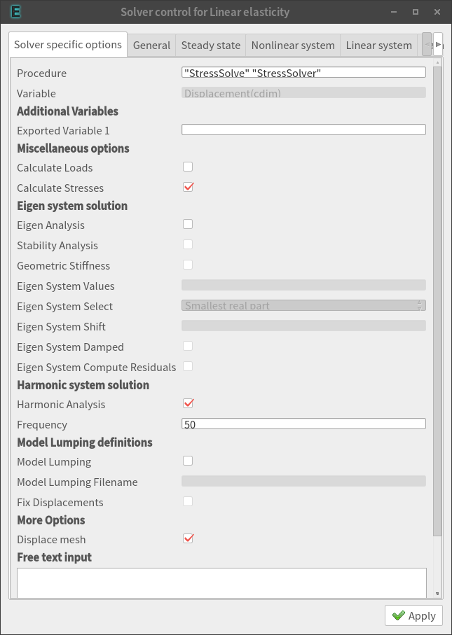

## 1. 개요

* 본편에서는, 지난 시간과 동일한 신라종(Bell) 형상 매쉬와 `Linear Elasticity` 물리방정식을 적용하여, 물체의 동적인 거동 부분을 해석해 본다.
* 먼저 감쇠가 고려되지 않은 기본적인 시간영역에서의 동적응답을 얻어내 보고, 이후 상수 감쇠계수 및 선형 감쇠계수모델을 각각 적용해서 거동을 비교해 본다.
* 아울러 고유모드 해석도 해 보고, 특정 주파수로 물체에 강제진동을 줬을 때의 주파수영역 응답을 알아내 보는 하모닉 해석도 해 본다.


## 2. 무감쇠 동적응답 (CASE1)

### (1) 먼저 고려해 볼 사항들
* 본 해석 방법은, 초기조건에서 물체 자체를 약간 잡아당겼다가 탁하고 놓도록 해서 일종의 충격을 주는 효과를 노리는 것이다.
* 일단 시간영역에서의 응답을 보는 것이 목표이므로, 시뮬레이션 조건은 `Transient`로 해 주고, 물체의 재질과 형상 및 사이즈 등을 고려하여 어느정도 주파수대의 진동에 관심이 있는지를 먼저 결정한다.  본 예제의 경우에는 1kHz(0.001초) 정도로 잘라보도록 하고, 100회 동안 추적하여 총 0.1초의 응답을 들여다보려고 한다.
* 감쇠(Damping)는 여기서 무시된다.  따라서 무한하게 계속 출렁댈 것이다.

### (2) `case1.sif` 작성
* 지난시간을 통해 ElmerGUI의 사용방법을 습득하였다면, 이를 이용해서 충분히 작성할 수 있을 것이다.
* 핵심은 아래의 설정 부분이다.  `Damping coefficient`, `Rayleigh Damping` 부분의 항목들이 전부 공란으로 비워져 있다.

{width=20%}

* 결과로 나온 `case1.sif` 파일은 아래와 같다.

```cpp
Header
  CHECK KEYWORDS Warn
  Mesh DB "." "."
  Include Path ""
  Results Directory "CASE1"     ! 결과파일이 저장되는 장소.  미리 동일한 이름의 디렉토리를 만들어 두어야 한다.
End

Simulation
  Max Output Level = 5
  Coordinate System = Cartesian
  Coordinate Mapping(3) = 1 2 3
  Simulation Type = Transient     ! 해석조건은 Transient로 해서 시간에 따른 거동을 보려고 한다.
  Steady State Max Iterations = 1
  Output Intervals = 1
  Timestepping Method = BDF
  BDF Order = 1
  Timestep intervals = 100     ! 100번의 샷을 얻어내고자 한다.
  Timestep Sizes = 0.001       ! 시간 간격은 0.001초
  Solver Input File = case1.sif     ! 인풋파일 이름을 정확히 설정하자.
  Post File = case1.vtu             ! 결과 파일 이름도 명확하게 하자.
Coordinate Scaling = 0.001     ! 원래의 매쉬모델의 길이단위가 밀리미터 였다면 미터 단위로 변환하는 것을 잊지 말자.
End

Constants
  Gravity(4) = 0 0 -1 9.82
  Stefan Boltzmann = 5.67e-08
  Permittivity of Vacuum = 8.8542e-12
  Boltzmann Constant = 1.3807e-23
  Unit Charge = 1.602e-19
End

Body 1
  Target Bodies(1) = 2
  Name = "Body 1"
  Equation = 1
  Material = 1
  Body Force = 1
  Initial condition = 1
End

Solver 1
  Equation = Linear elasticity
  Calculate Stresses = True
  Variable = -dofs 3 Displacement
  Procedure = "StressSolve" "StressSolver"
  Exec Solver = Always
  Stabilize = True
  Bubbles = False
  Lumped Mass Matrix = False
  Optimize Bandwidth = True
  Steady State Convergence Tolerance = 1.0e-5
  Nonlinear System Convergence Tolerance = 1.0e-7
  Nonlinear System Max Iterations = 20
  Nonlinear System Newton After Iterations = 3
  Nonlinear System Newton After Tolerance = 1.0e-3
  Nonlinear System Relaxation Factor = 1
  Linear System Solver = Iterative
  Linear System Iterative Method = BiCGStab     ! Transient 해석에서 가장 무난함.
  Linear System Max Iterations = 500
  Linear System Convergence Tolerance = 1.0e-5     ! 계산속도를 높이기 위해 정밀도를 좀 낮춰 주었음.
  BiCGstabl polynomial degree = 2
  Linear System Preconditioning = Diagonal
  Linear System ILUT Tolerance = 1.0e-3
  Linear System Abort Not Converged = False
  Linear System Residual Output = 1
  Linear System Precondition Recompute = 1
End

Equation 1
  Name = "Equation 1"
  Calculate Stresses = True
  Active Solvers(1) = 1
End

Material 1
  Name = "Bronze"
  Poisson ratio = 0.34
  Youngs modulus = 1.2236595E+10
  Porosity Model = Always saturated     ! 본 해석에서는 불필요함 (삭제해도 무방)
  Density = 8800
End

Body Force 1
  Name = "Gravitation"
  Stress Bodyforce 3 = $(-9.81*8800)     ! 중력에 의해 물체 전체에 자중이 걸리도록 한 것
End

Initial Condition 1
  Name = "InitialCondition 1"
  Displacement 1 = -0.005      ! 물체를 5mm 정도 살짝 당겨주고 시작하도록 함 (충격을 주는 효과)
End

Boundary Condition 1
  Target Boundaries(1) = 5
  Name = "Fix"
  Displacement 3 = 0
  Displacement 1 = 0
  Displacement 2 = 0
End
```

### (3) 시뮬레이션 계산 실행

* 계산을 실행하기 전에, 우선 병렬연산을 위해 다음 명령으로 매쉬를 분할하자.

```bash
$ ElmerGrid 2 2 ./Partition -metis 4
$ mv ./Partition/partitioning.4 ./partitioning.4
$ rm -r Partition
```

* 결과 파일을 담을 디렉토리도 만들자.

```bash
$ mkdir CASE1
```

* `case1.sif` 파일이 계산시 자동으로 로드 되도록 `ELMERSOLVER_STARTINFO` 파일에 다음 내용을 넣어준다.

```cpp
case1.sif
```

* 이제 병렬연산으로 계산을 실행하자.

```bash
$ mpirun -np 4 ElmerSolver_mpi
```

### (4) Paraview 후처리

* 이제 계산이 이상없이 다 종료되면, 파라뷰(Paraview)를 실행시켜, `CASE1` 디렉토리 안에 들어있는 결과파일을 불러들여 결과를 분석하면 된다.


## 3. 감쇠계수를 상수로 부여한 동적응답 (CASE2)

### (1) 먼저 고려해 볼 사항들
* 이번에는 감쇠를 적용해 보자.  여러가지 감쇠모델 중에서 가장 단순하게, 상수(Constant)로 감쇠계수(Damping Coefficient)를 설정해 준 후 그것을 적용해 보자.
* 다만, 여기서 적용해 보는 상수 감쇠계수는 실제 물리적 거동과의 오차가 큰 편이기 때문에, 실제 거동과 최대한 근사하게 일치시키기 위한 목적의 실무용으로 사용하기 전에 충분한 이론-실험적 검토를 해 볼 필요가 있다는 점을 염두에 두자.
* 감쇠계수가 매우 커지면 과감쇠가 되어 오버슈트 없이 곧바로 진동이 사그라들게 될 것이고, 감쇠계수를 줄여가면서 진동이 줄어드는 경향이 늦어지는 것을 확인할 수 있다.
* 일반적으로 감쇠계수값은 1e7 정도 되면 충분한 과감쇠 거동을 보이는 것 같다.  부족감쇠를 주려면 이보다 낮은 수치로 튜닝해 보는 것이 좋을 것이다.

### (2) `case2.sif` 작성

* 앞서 진행한 `case1.sif`에서, 아래와 같이 `Material` 카테고리에 `Damping` 변수값을 추가해 주면 된다. 그러면 재료에 감쇠 성질이 부여된다.  (ElmerGUI의 GUI상에서도 이 부분이 지원된다.)

* 핵심은 아래의 설정 부분이다.  `Damping coefficient`에 값을 넣어주었다.

{width=20%}


```cpp
Material 1
  Name = "Bronze"
  Poisson ratio = 0.34
  Youngs modulus = 1.2236595E+10
  Density = 8800
  ! Damping Coefficient (for Over-Damped Case)  
  Damping = 1e7
End
```

### (3) 시뮬레이션 계산 실행
* 매쉬는 이미 잘 분할되어 있으므로, 그 뒤부터 앞서 했던 것과 동일한 방법으로 병렬계산을 진행하면 된다.


### (4) Paraview 후처리
* 역시 앞서 했던 것과 동일한 방법으로 후처리를 진행할 수 있다.


## 4. 레일리 감쇠모델을 적용한 동적응답 (CASE4)

### (1) 먼저 고려해 볼 사항들
* 앞서 시도해 보았던 상수 감쇠계수보다 한 단계 더 나아가, 비례 감쇠계수 즉 레일리 감쇠모델(Rayleigh Damping)을 적용해 보자.
* 레일리 감쇠모델은, 단순히 감쇠계수를 단순 상수로 놓지 않고, 질량과 강성에 대해 각각의 감쇠계수를 줘서 합한 선형적 비례관계를 가진 감쇠계수를 사용하는 것이다.  물론 이 역시 단순화된 선형 감쇠 모델이기 때문에 실제와는 거리가 있겠지만, 비교적 근사화시키기에 좋으면서 동시에 단순하기 때문에 많이 사용되는 모델이라고 한다.
* 엘머의 `Linear elasticity` 해석자는 `Rayleigh alpha`를 질량에 대한 감쇠계수, `Rayleigh beta`를 강성에 대한 감쇠계수로 변수명을 정의해 놓았기 때문에 여기에 각각 감쇠계수를 넣어주고 사용하면 된다.
* 물론 정확한 감쇠계수값은 알기 어렵기 때문에, 실제의 물체의 거동을 계측해서 감쇠계수를 튜닝해서 사용하는 것이 가장 좋다.
* 일반적으로 감쇠계수값이 0.1을 넘어가면 과감쇠 거동을 보이는 것 같다.  감쇠율을 줄이려면 그보다 작은 수치를 사용하여 맞추는 것이 좋을 것으로 생각된다.

### (2) `case4.sif` 작성

* 앞서 진행한 `case2.sif`에서, 아래와 같이 `Material` 카테고리에 앞서 사용한 `Damping` 변수 대신, `Rayleigh Damping` 모델을 활성화 해 주고, 여기에 필요한 2가지 감쇠계수인 `Rayleigh alpha` 및 `Rayleigh beta`를 추가해 주면 된다. 그러면 레일리 감쇠모델이 적용된다.  이때, 에러를 방지하기 위해 `Logical`, `Real` 등 변수값의 형(Type)을 명확하게 표기해 주자.  (ElmerGUI의 GUI상에서도 이 부분이 지원되며, 이때는 이상의 유의사항들이 자동으로 적용된다.)

* 핵심은 아래의 설정 부분이다.  `Rayleigh Damping` 부분의 항목들을 설정해 주었다.

{width=20%}

```cpp
Material 1
  Name = "Bronze"
  Poisson ratio = 0.34
  Youngs modulus = 1.2236595E+10
  Density = 8800
  ! Rayleigh Damping (Type keywords(Logical,Real) must exist)
  Rayleigh Damping = Logical True
  Rayleigh alpha = Real 0.3
  Rayleigh beta = Real 0.3
End
```

### (3) 시뮬레이션 계산 실행
* 매쉬는 이미 잘 분할되어 있으므로, 그 뒤부터 앞서 했던 것과 동일한 방법으로 병렬계산을 진행하면 된다.

### (4) Paraview 후처리
* 역시 앞서 했던 것과 동일한 방법으로 후처리를 진행할 수 있다.

|무감쇠|상수감쇠|레일리 비례감쇠|
|:--------------------:|:--------------------:|:--------------------:|
|{width=20%}|{width=20%}|{width=20%}|

* 각 케이스에 대한 애니메이션도 만들어 활용할 수 있다. : https://youtu.be/V-G1MS2YAdk


## 5. 고유모드 해석 (CASE3)

### (1) 먼저 고려해 볼 사항들
* 고유모드 해석시에는 감쇠를 무시하기 때문에, 감쇠 관련 변수는 전부 배제한다.
* 아울러, 고유모드 해석은 시간영역이 아니라 주파수영역을 다루기 때문에, `Transient`가 아닌 `Steady state`로 시뮬레이션이 실시되어야 한다.
* 고유모드 계산은 대칭성 희소행렬(Symetric Sparse Matrix) 계산 분야이므로, 여기에 특화된 Direct Solver를 사용하는 것이 가장 적합하다.  예컨데 기본적으로 Umfpack, Banded 중에 하나를 적용하는 것이 좋겠다.  Iterative Solver인 BiCGStab은 고유모드 계산시에는 시간이 너무 오래 걸리기 때문에 매우 비효율적이다.
* 엘머 배포판에서 지원하는 Direct Solver인 Umfpack,Banded는 병렬연산에 대응하지 못하기 때문에, 부득이하게 분할된 매쉬를 이용한 병렬연산을 하기는 어렵다.  병렬연산으로 고유모드해석을 고속으로 하려면 별도로 MUMPS를 엘머에 붙여서 사용하여야 한다.
* 경계조건은, 아무런 구속을 주지 않고 물체를 완전히 공중에 붕 띄워놓고 해석을 실시하는 것도 가능하다.  다만, 본 케이스의 경우에는 중력에 의해 자중이 작용하는 조건이므로, 고리 부분의 변위를 0으로 구속시킨 것을 그대로 유지하기로 한다.
* 만일 아래위로 압축력이 작용하여 좌굴되도록 조건을 걸어준 상태에서 고유모드 해석을 실시하게 되면, 그대로 선형좌굴해석(Linear Buckling Analysis)이 된다.  예컨데, 잠수함 압력선체(Pressure hull)를 볼 경우에는, 모든 외벽면에 압력을 걸어줘서 심해에 가라앉은 상태를 만들어주고, 이 상태에서 고유모드해석을 실시하여 압력선체가 압궤되는 형상을 예측하는 선형좌굴해석을 해 볼 수 있다.  (본 예제에서는 선형좌굴해석은 생략하도록 한다.)

### (2) `case3.sif` 작성

* `Solver` 부분에서, 아래와 같이 `Eigen Analysis`를 활성화해 주고, `Eigen System Values` 변수로 몇차 모드까지 보겠는지를 기입해 주고, `Eigen System Select`로 나열순서를 정해준다.  `Smallest magnitude`로 해 줄 경우에는 작은 Magnitude 순서로 나오겠고, `Smallest real part`로 해 주면 실수부 즉 고유치가 낮은 순서대로 나열되기 때문에 우리가 일반적으로 말하는 1차,2차...모드로 부르는 것과 같이, 낮은 주파수부터 나열하여 나온다.  기타 몇가지 다른 변수들이 더 제공되는데, 여기서는 일단 생략하자.

* 핵심은 아래의 설정 부분이다.  `Eigen system solution` 부분의 항목들을 설정해 주었다.

{width=20%}

```cpp
Solver 1
  Equation = Linear elasticity
  Procedure = "StressSolve" "StressSolver"
  Variable = -dofs 3 Displacement
  Calculate Stresses = True
  ! EigenMode Analysis
  Eigen Analysis = True
  Eigen System Values = 10
  Eigen System Select = Smallest magnitude

  Exec Solver = Always
  Stabilize = True
  Bubbles = False
  Lumped Mass Matrix = False
  Optimize Bandwidth = True
  Steady State Convergence Tolerance = 1.0e-5
  Nonlinear System Convergence Tolerance = 1.0e-7
  Nonlinear System Max Iterations = 20
  Nonlinear System Newton After Iterations = 3
  Nonlinear System Newton After Tolerance = 1.0e-3
  Nonlinear System Relaxation Factor = 1
  ! Use Direct Solver
  Linear System Solver = Direct
  Linear System Direct Method = Umfpack
End
```

* 아울러, `Simulation Type`은 반드시 `Steady state`로 설정해 주는 것을 잊지 말자.


### (3) 시뮬레이션 계산 실행
* 이번에는 병렬계산을 사용하지 않을 것이므로, 아래와 같이 실행 명령을 대신하자.

```bash
$ ElmerSolver case3.sif
```

* 계산이 완료되면, 터미널 메시지 중에 각 고유모드별로 구해진 고유치 데이타가 나타나게 된다.  단, 이때의 고유치는 $\omega^2$을 의미한다.  $\omega$의 단위는 [rad/sec]이므로, 이를 [Hz]단위로 변환하여 파악할 필요가 있다는 점에 유의하자.  다음의 관계식으로 단위변환을 하면 된다.

$$
f = \frac{\sqrt{\omega^2}}{2\pi}
$$


### (4) Paraview 후처리
* 역시 앞서 했던 것과 동일한 방법으로 후처리를 진행할 수 있다.

|고유모드별 변위확인|출력자료 고유치 확인|고유진동수로 단위변환|
|:--------------------:|:--------------------:|:--------------------:|
|{width=20%}|{width=20%}|{width=20%}|

* 각 모드별로 변형 상태를 애니메이션화 하여 활용할 수 있다. : https://youtu.be/ig7p9yG2F8w


## 6. 하모닉 해석 (CASE5,CASE6)

### (1) 먼저 고려해 볼 사항들
* 하모닉 해석은, 특정 주파수의 강제진동을 물체에 줬을때 응답을 보는 것이다.  감쇠는 무시한다.
* `case5.sif`는 강제진동 주파수 50Hz를, `case6.sif`은 130Hz를 줘서 비교해 보자.
* 시뮬레이션 조건은 수렴 성공률을 높이기 위해 `BiCGStab`으로 선택하자.  대신 `case5.sif` 및 `case6.sif`를 동시에 계산을 시켜서 전체 시간을 단축시키는 전략을 택한다.

### (2) `case5.sif` 및 `case6.sif` 작성
* 핵심은 아래의 설정 부분이다.  `Harmonic system solution` 부분의 항목들을 설정해 주었다.

{width=20%}

* 또한, `BodyForce` 부분도 아래와 같이 설정을 추가해 주어야 한다.  강제진동을 주는 상황이기 때문에 강제진동의 강도(Magnitude)를 부여해 주는 것이다.  아래에서, 강도는 x축 방향으로 1로 주었다.  또 `text input`항목에 `Stress Bodyforce 1 im = Real 0.0`으로 하나 더 추가해 주었는데, 이는 실수(Real)로 강도를 준 `Stress Bodyforce 1`의 허수(Imagine) 부분을 추가해 준 것이다.  주파수영역에서의 계산이기 때문에 허수 부분을 반드시 명시적으로 명기해 주어야 하는 상황으로 보인다.

{width=20%}

### (3) 시뮬레이션 계산 실행
* 아래와 같이 명령을 연속적으로 주면 된다.  리눅스 터미널(bash)에서 `&` 기호는, 해당 명령을 백그라운드에서 수행하도록 하는 의미이다.  아울러, `>`기호를 사용해서 터미널로 표시되어야 하는 출력메시지들을 로그파일로 수집되도록 해 주자.

```bash
$ ElmerSolver case5.sif > case5.log &
$ ElmerSolver case6.sif > case6.log &
```

### (4) Paraview 후처리
* 역시 앞서 했던 것과 동일한 방법으로 후처리를 진행할 수 있다.

|CASE5(50Hz)|CASE6(130Hz)|
|:--------------------:|:--------------------:|
|{width=20%}|{width=20%}|


## 7. 맺음말
* 이상 엘머에서 해 볼 수 있는 동역학 관련 해석을 몇 가지 해 보았다.  시간영역에서 무감쇠,상수감쇠,비례감쇠로 각각 거동을 살펴보았고, 아울러 주파수영역에서의 고유모드해석과 하모닉해석도 해 보았다.  이런 해석에 필요한 인풋파일(sif)의 작성 요령도 습득했다.
* 엘머에서의 시간영역 동역학 해석은 기본적으로 내연적(Implicit) 방법에 기반하고 있고, 타임스텝별로 답을 찾아가는 외연적(Explicit) 해석은 아니기 때문에 계산효율이 그렇게 좋다는 보기 힘들지만, 올바른 파라미터를 사용해 수렴에 성공할 경우 높은 정확도를 보여줄 수 있다고 생각된다.
* 본편에서의 예제들은 다음 주소에서 데이타를 다운로드 받을 수 있다.

> https://github.com/dymaxionkim/Elmer_Examples_for_CADG/ \
> tree/master/CADG_04_Elmer_Dynamics/03.Elmer

## 참고자료

* 비례감쇄 설명 : http://nfx.co.kr/techpaper/keyword_view.asp?pg=&sk=&bid=&nCat=&nIndex=&sHtml=&idx=229

* 비례감쇄 이론 : http://www.kim2kie.com/cafeUpload/Databoard/files/320_03_01_damping_pro.pdf
