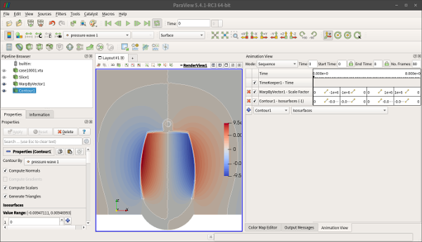

## 1. 개요
* 본편에서는, 신라종(Bell) 형상에 하모닉해석을 실시하여 진동을 발생시키고, 이것에 의해 발생한 음파가 주변의 공기에 어떻게 퍼져나가는지 가시화할 수 있도록 주변 공기 부분에 `Helmholtz Equation`을 추가 적용하여 해석해 본다.
* 따라서, 이전에 사용하던 단일 물체에 더하여, 공기 부분에 해당하는 물체를 하나 더 추가하여 2개의 물체(Bodies)로 구성된 매쉬를 사용하게 된다.
* 아울러 신라종 표면과 공기의 접촉면은 모두 절점(Node)가 공유되도록 하여, 자연스럽게 하모닉거동에 관한 물리량이 전달되도록 설정한다.
* 마지막으로, 단일 샷(Shot)으로 얻어진 결과데이타로, 파라뷰(Paraview)의 애니메이션 기능을 이용하여 동영상화해 본다.


## 2. 다물체 다물리 음향 해석 (하모닉+헬름홀츠)

### (1) 먼저 고려해 볼 사항들
* 하모닉 및 헬름홀츠 방정식은 주파수영역에서 해를 찾는 방식이므로, 시뮬레이션 조건은 `Transient`가 아닌 `Steady state`로 해야만 한다.
* 헬름홀츠 방정식에는 특정한 단일 입력주파수를 넣어줘야 한다.  따라서 여러 개의 입력주파수를 계산하기 위해, 여러개의 sif 파일을 만들어놓고 배치(Batch)작업방식으로 한꺼번에 여러 케이스를 계산시킨다면, 전체 계산시간을 단축시키는 효과를 얻을 수 있을 것이다.
* 주파수영역에서의 거동은 실수부(Real part) 및 허수부(Imagine part)로 나누어 표현되므로, 기존에 생략되어 있던 허수부가 필요한 부분을 보충해서 입력해 줄 필요가 있다.
* 강제진동을 줄 때, `BodyForce`로 흔들어주는 방향과 세기를 줄 수 있다.
* 일반적으로, 엘머를 이용한 하모닉해석에서는 중력 영향은 무시한다.  하나의 `BodyForce`에 중력 방향의 진동이 섞여들어가기 때문에 관심있는 진동응답을 파악하기 어렵게 되기 때문이다.

### (2) 3D CAD 모델링
* 본 예제에서는 프리캐드(FreeCAD)를 사용하여 보았다.

{width=50%}

* 매쉬생성시 지나치게 조밀한 부분을 없애기 위해, 신라종(Bell) 물체의 필렛(Fillet)형상은 전부 제거하였다.
* 아울러, 신라종 부근의 공기(Air) 영역을 표현하는 물체(Body)도 하나 추가하였다.
* 신라종과 공기의 간섭(Interference)은 일단 여기서 무시하였다.  CAD에서 불리언(Bollean) 작업을 해서 간섭을 배제해도 되지만, 본 예제에서는 좀 더 깔끔하게 하기 위해 살로메(Salome)에서 그 작업을 하는 것으로 해 보자.
* 살로메에서 읽어들일 수 있도록 출력(Export)하는 포멧은, BREP 대신 STEP으로 하자.  프리캐드에서는 BREP 포멧으로 출력하면 멀티바디 데이타를 내놓을 수 없고, STEP에서는 가능한 것으로 보인다.

### (3) 살로메(Salome) 전처리

* 살로메 실행 후, `Geometry` 모드로 들어가면서 `New` 파일을 생성하는 것으로 한다.
* 그리고 `File - Import - STEP` 메뉴 명령으로 앞서 만들어둔 STEP 파일을 읽어들인다.
* BREP 파일을 읽어들일 때와는 달리, STEP 파일을 읽어들일 때는 `Warning` 팝업창이 하나 뜬다.  단위변환을 하겠느냐는 요지의 질문인데, `Yes`를 선택하면 자동으로 밀리미터(mm)에서 미터(m)로 단위 스케일링이 된다.  이렇게 살로메에서 미리 사이즈 스케일링이 될 경우에는, 엘머에서 다시 `Coordinate Scaling = Real 0.001`구문을 넣어줄 필요가 없어진다.
* STEP 파일이 읽어들여지면, 트리(Tree)에 `ASSEMBLY` 피쳐가 새로 나타난다.  OCC scene viewer 영역에서 돋보기 모양 아이콘을 눌러서, 보기 사이즈를 조정하여 읽어들여진 형상을 확인하자.
* 현재 불러들여진 `ASSEMBLY` 피쳐는, 아직 물체(Body) 구분이 되어 있지 않은 상태이기 때문에 수동으로 잘라내 주어야 한다.  트리에서 `ASSEMBLY` 피쳐를 마우스로 눌러서 선택한 상태로 한 후, `New Entity - Explode` 메뉴 명령을 준다.  팝업창에서 `Main Object`가 `ASSEMBLY`로 잘 선택되어 있는지 확인한다.  그리고 `Sub-shapes Type`을 `Solid`로 선택한다.  읽어들여진 형상데이타에서 솔리드 기준으로 잘라내겠다는 의미이다.  이제 `Apply and Close`를 해 주고, 부품이 분할되었는지 확인하면 된다.  본 예제의 경우, `BELL02` 및 `AIR`라는 이름의 물체가 2개 나타나게 된다.
* 이 상태에서, 트리에서 `BELL02`, `AIR`를 둘 다 마우스로 선택하고(Ctrl 버튼을 누른 상태에서 모두 선택), `Operations - Boolean - Cut`해서 `BELL02`와의 간섭이 제거된 `AIR` 부분만 따로 떠내도록 한다.  이렇게 만들어진 피쳐를 실제 Air 영역으로 사용하는 것이다.  Cut이 잘 되었는지 확인하려면 `View - Display Mode - Wireframe`으로 보기 상태를 바꿔보면 된다.
* 이 상태에서, 트리에서 `BELL02`, `AIR`(금방 Cut해낸 것)를 둘 다 마우스로 선택하고(Ctrl 버튼을 누른 상태에서 모두 선택) `Operations - Partition` 명령을 준다.  새로 뜨는 팝업창에서, `Objects`에 2개의 Objects가 선택되어 있는지 확인하고(`2_objects`), `Tool Objects`는 공란으로 비워둔다.  `Resulting Type`은 `Solid`로 한다.  이제 `Apply and Close`를 해 주고, 새로운 파티션 피쳐가 생겼는지 확인한다.  이와 같이, 원래의 솔리드 피쳐를 그대로 이용하지 않고 굳이 새로운 파티션(Partition)을 만들어서 사용하는 이유는, 필요한 형상들 및 그룹들을 일괄적으로 하나의 매쉬로 오류없이 잘 묶어서 만들어내기 위해서이다.
* 이제 트리에서 새로 만든 `Partition_1` 피쳐를 마우스로 선택한 후, 다시 `New Entity - Explode` 메뉴 명령을 준다.  팝업창에서 `Main Object`가 `Partition_1`로 잘 선택되어 있는지 확인한다.  그리고 `Sub-shapes Type`을 `Solid`로 선택한다.  읽어들여진 형상데이타에서 솔리드 기준으로 잘라내겠다는 의미이다.  이제 `Apply and Close`를 해 주고, 부품이 분할되었는지 확인하면 된다.  그러면 2개의 솔리드 물체가 생성된 것을 볼 수 있을 것이다.
* 이제 그룹을 만들어주자.  `New Entity - Group - Create Group`을 해서 원하는대로 그룹 작업을 해 준다.  이때, 가급적 누락된 면이 없도록 모든 면과 솔리드를 그룹으로 구분해 주는 것이 좋다.  즉 어떤 그룹에도 포함되지 않은 면이 없도록 해 주자는 의미이다.  이유는 매쉬 생성후 unv 파일로 포멧 변환할 때 오류의 가능성을 없애기 위해서 모든 요소들을 명시적으로 그룹에 포함시키는 것이 안전하기 때문이다.
* 그룹 작업이 완료되었으면 `Geometry` 모드에서 할 일은 끝났다.  일단 현재까지의 상태를 hdf 파일로 저장하자.

{width=50%}

* 이제 `Mesh` 모드로 바꿔서 작업을 계속하자.
* 트리에서 `Partition_1`을 마우스로 선택한 상태에서, `Mesh - Create Mesh` 명령을 준다.  새로 뜨는 팝업창에서, 매쉬생성 알고리즘을 선택 가능한데, 여기서는 일단 가장 기본적인 `NETGEN 1D-2D-3D`를 선택한다.  그리고 `Hypothesis` 부분의 톱니바퀴 모양 아이콘을 누르고 `NETGEN 3D Parameters`를 선택한다.  그러면 매쉬 생성시의 옵션을 정해줄 수 있다.
* `Max. Size = 0.2`, `Min. Size = 0.005` 정도로 주고, `Second Order`는 체크해 주자.  `Fineness = Moderate`로 일단 두자.  이제 `OK`한다.  매쉬 생성 팝업창 역시 `Apply and Close`를 해서 완료한다.  그러면 트리 영역에서 `Mesh_1` 피쳐가 새로 생성된 것을 알 수 있다.
* `Mesh_1` 피쳐를 마우스로 선택한 상태에서, `Mesh - Create Goups from Geometry` 명령을 준다.  새로 뜨는 팝업창에서, `Geometry`의 선택아이콘(화살표모양)이 활성화된 상태에서 트리 영역의 `Partition_1`안에 미리 만들어둔 그룹들을 모두 선택한다(Shift 키를 누른 상태에서 마우스로 복수 선택).
* 그리고 아래의 `Nodes` 카테고리의 `Geometry` 선택아이콘(화살표모양)을 눌러서 절점들도 그룹으로 취급되도록 해 준다.  이제 `Apply and Close`를 해 주고, `Mesh_1` 안에 그룹들이 잘 들어왔는지 확인하면 된다.
* 이제 설정된 조건대로 매쉬를 생성하자.  트리에서 `Mesh_1`을 마우스로 선택한 상태에서, `Mesh - Compute` 해 준다.  그러면 계산이 시작되고, 완료되면 결과를 알려주는 팝업창이 뜬다.  에러가 있는지 여부를 확인하고, 에러가 있다면 조건을 바꿔서 다시 시도해 보도록 한다.

{width=50%}

* 현재까지의 상태를 일단 저장하고, 트리에서 `Mesh_1`을 선택한 상태에서 `File - Export - UNV File`을 해서 unv 파일도 생성해 준다.
* 이상 살로메에서 매쉬 생성 전처리 작업을 완료하였다.


### (4) `case1.sif` 작성

* 이제 ElmerGUI를 실행시키고, 앞서 만든 unv 파일을 불러들이자.

{width=50%}

* 설정해 둔 그룹들로 면들이 잘 구분되는지도 확인한다.
* 이제 sif 파일을 생성하는 작업을 시작한다.  `Model` 메뉴를 순서대로 따라가면 된다.
* `Model - Setup`에서 `Simulation Type = Srteady state`, `Solver Input File = case1.sif`로 해 주고, `Post file`은 공란으로 둔다.  원한다면 `Post file = case1.vtu`로 해도 된다.  단 이 경우에는, `Equation` 중에 `Result Output`은 활성화시킬 필요가 없다.  본 예제에서는 `Post file`을 공란으로 두고 대신 `Result Output`을 사용해서 몇 가지 옵션을 체크해 보려고 한다.
* `Constants` 카테고리의 `Free text`란에 `$f = 100`을 써 준다.  의미는, `f`라는 변수에 `100`을 저장하는 것이다.  `f` 변수는 본 시뮬레이션에서 가진주파수(Hz)로 사용할 것이다.  `$`기호는 변수나 수식 앞에 붙여줘서, 엘머가 이를 인식할 수 있도록 해 주는 것이다.  이와같이 엘머에서는 필요한 경우 임의의 변수를 만들어 사용하는 것이 가능하다.
* `Model - Equation - Add`를 3번 해서 3개의 Equations를 만들어낼 것이다.
* 먼저 `Result Output`을 체크해서 활성화시킨다.  이것을 사용하여 기왕 vtu 출력파일을 만들때 옵션을 줘서 좀 더 다듬을 수 있다.  `Single Precision = True`, `Output File Name = case1`, `Exec Solver = After Simulation`등을 준다.  `Single Precision`은 출력데이타의 유효숫자를 소수점 1자리로 일괄 제한함으로써, 전체 데이타의 사이즈를 줄이는 효과를 볼 수 있다.   `Exec Solver = After Simulation`는 시뮬레이션 계산이 완전히 끝난 후에 `Result Output`을 실행시켜서 출력파일을 생성한다는 의미이다.
* 그 다음, 새로  `Model - Equation - Add` 해서 `Equation 2`를 만든후, 여기서 `Linear elasticity`를 체크해서 활성화시킨다.  `Harmonic Analysis = True`, `Frequency = $f`로 해 주고, 해석자는 `Umfpack`으로 해 보자.
* 이번에는, 새로  `Model - Equation - Add` 해서 `Equation 3`를 만든후, 여기서 `Helmholtz Equation`를 체크해서 활성화시킨다.  이후 `Edit Solver Settings`를 눌러 들어가서, `Solver specific options` 탭의 `Free text input`란에 다음 내용을 써주자.

```cpp
Displacement Variable EigenMode = Integer 1
Frequency = $f
Nonlinear Update Exported Variables = Logical True
```

* 여기서 `Displacement Variable EigenMode = Integer 1`은, 1번 고유모드의 변형을 보겠다는 의미인데, 지금은 고유모드해석이 아니고 하모닉해석이기 때문에 관용적으로 1번 모드라고 써 주는 것이다.  엘머 자체가 이렇게 설계되어 있으므로 그냥 복사해 넣도록 하자.
* `Frequency = $f`는, 가진주파수를 헬름홀츠 방정식 계산에서도 적용할 수 있도록 부여해 주는 것이다.  앞서 `Linear elasticity`에서와 동일한 가진주파수를 적용해 준다.
* `Nonlinear Update Exported Variables`는, 노드상에서의 물리량을 교환할 때 선형 조건으로 업데이트되면 에러가 발생하기 때문에 비선형으로 명기해 준 것이다.  역시 관용적으로 해 준다고 보면 될 것 같다(엘머 내부적으로 이 이름의 변수가 True로 정의되어 있어야 동작하도록 되어 있는 것 같다).
* 이상 3개의 Equations를 각각 따로 만들었다.  이것 중에 실제 시뮬레이션에 사용되는 `Equation 2` 및 `Equation 3`을 알맞게 각각의 물체(Body)에 체크해서 적용하면 된다.  나머지 하나인 `Equation 1`은 `Result Output`인데, 이것은 특정한 물체(Body)를 지정하지 않는다.  `Equation 2` 및 `Equation 3`의 시뮬레이션이 완료된 후에 실행되면서 결과값들을 파일로 저장해 주는 동작을 하게 되는 것이다.
* 이제 `Model - Material - Add`를 2번 해서 2개의 Materials를 만들어낼 것이다.
* 첫번째는 `Bronze`로 이름을 짓고, 물성치는 이전에 사용했던 것을 그대로 똑같이 입력하자.  물론 신라종 물체도 체크해서 적용해 준다.
* 두번째는 `Material libraries`를 눌러서 `Air (Room Temperature)`를 골라서 쓰자.  단, `SST K-Omega`탭에서 `Turbulent Prandtl Number`항목의 값을 삭제해 준다(난류유동 해석이 아니므로 이 값이 남아있으면 에러가 발생한다.  다른 파라미터들은 상관이 없는데 유독 이 파라미터만 그렇다.  이유는 기본으로 제공되는 것이 아닌 추가적인 난류해석 모델이기 때문에, 엘머의 코어 코드에서 이 값을 미리 선언해 두지 않아서 그런 것 같다.).`
* 이제 신라종에 적용할 `Model - Body force`를 설정하자.  `Linear elasticity` 탭에서 `Force 1`에 값을 `1e2` 정도로 넣어준다.  즉 x축방향(1)으로 이정도의 세기로 아까 설정해 둔 주파수로 가진해 주겠다는 의미가 된다.  다만 `Force 1`에 실수부(Real part)만 표기되었으므로, 아래의 `Free text input`란에 `Stress Bodyforce 1 im = Real 0.0`라고 써줘서 허수부(Imagine part)로 명시적으로 써 주도록 하자.  만일 안 써주면 허수부가 누락되었다면서 에러가 난다.

{width=20%}

* 이제 `Model - Boundary condition`을 4번 해서 4개(fix,floor,open,interface)를 만들어낼 것이다.  앞서 구조해석과 동일하게 fix는 신라종을 메달아둔 고리 부분의 제로변위 구속조건을 주는 것이고, floor는 공기의 바닥면 조건이다.  open은 공기의 벽면과 윗면 부분이다.  interface는 신라종과 공기의 접촉면을 정의하는 것이다.
* fix 경계조건은 전회의 것과 동일하므로 설명 생략한다.
* floor 경계조건은 아래 그림과 같이 준다.  즉 해당 면의 임피던스를 0으로 두는 것이다.  그림과 같이 실수부만 써줘도 되나, 허수부 부분도 가급적 0으로 표기해 주는 것이 더 좋겠다.  이렇게 두면, 음파가 floor면에 닿는 순간 전파속도가 0으로 되어 소멸될 것이다.

{width=20%}

* open 경계조건은 아래 그림과 같이 준다.  이번에는 임피던스를 343으로 주었다.  공기의 음속인 343[m/s]를 그대로 준 것이다.  이렇게 두면, 음파가 open 면에 닿는 순간 전파속도가 음속인 343으로 유지되어, 외부로 계속 퍼져나가는 것과 같은 효과를 줄 것이다.

{width=20%}

* interface 경계조건은 아래 그림과 같이 `Structure Interface = Logical True`로 써준다.  해당되는 면은 모두 체크해 주자.  이렇게 하면, 하모닉해석으로 나온 구조적 변형이 그대로 공기의 해당 접촉면 노드에 적용되어, 2개의 물체의 접촉면이 함께 그대로 붙어서 같이 움직이게 된다.

{width=20%}

* 이상 필요한 조건들을 다 주었으므로, `Sif - Generate` 해서 sif를 생성한 후, `File - Save Project`해서 프로젝트를 모두 저장하자.
* ElmerGUI에서 필요한 작업은 다 했으므로 종료하면 된다.

### (5) `case2.sif`, `case3.sif`, `case4.sif` 작성
* 이제 `case1.sif`를 작성했는데, 이것만 시뮬레이션으로 돌리기에는 컴퓨터의 남는 자원이 아깝다.  따라서 이걸 몇 개 더 만들어서 한꺼번에 돌려볼 수 있도록 준비하자.
* `case1.sif`를 복사해서 `case2.sif`, `case3.sif`, `case4.sif` 이름으로 저장하자.
* 이제 `case2.sif`, `case3.sif`, `case4.sif`를 텍스트에디터로 열어서, `$f = 100` 부분의 값을 `$f = 27.5017`, `$f = 53.9726`, `$f = 77.0871`으로 바꿔주자.  이 주파수들은 이전에 모드해석을 통해 얻은 고유진동수값을 임의로 선택해 본 것이다.
* 그리고 `Solver Input File = case1.sif`를 `Solver Input File = case2.sif`, `Solver Input File = case3.sif`, `Solver Input File = case4.sif`로 바꿔주자.  그러면 각각의 결과데이타를 겹쳐쓰지 않고 따로 얻을 수 있게 된다.
* `Results Directory "Result"` 부분은 그냥 똑같이 두어도 될 것 같다.  결과데이타가 저장될 `Result` 디렉토리를 만들어두자.
* 이렇게 해서, 가진주파수 4가지를 다르게 해서 한꺼번에 시뮬레이션을 돌려볼 수 있을 것이다.

### (6) 시뮬레이션 계산 실행
* 한꺼번에 솔버를 돌리기 위해서, 간단한 쉘스크립트(윈도우 배치파일과 같은 것)를 `Solve.sh`라는 이름으로 텍스트에디터로 작성하자.

```bash
#!/bin/bash
ElmerSolver case1.sif > case1.log &
ElmerSolver case2.sif > case2.log &
ElmerSolver case3.sif > case3.log &
ElmerSolver case4.sif > case4.log &
exit 0
```

* 이제 다음 커맨드를 줘서 금방 작성한 쉘스크립트  파일을 실행가능하도록 권한을 주자.

```bash
$ chmod +x Solve.sh
```

* 이제 실행하면 된다.  `./`는 현재 디렉토리에 있는 파일이라는 의미이다.

```bash
$ ./Solve.sh
```

* 즉, 1개의 시뮬레이션이 1개의 CPU 코어밖에 사용할 수 없는 조건이긴 하지만, 그것을 4가지 케이스로 만들어 한꺼번에 계산시키는 것이다.  이렇게 함으로써, 결과적으로 4가지 케이스를 각각 4개의 병렬계산을 시킨 것과 같은 효과를 얻을 수 있었다.


### (7) Paraview 후처리

* 계산이 잘 완료되면, 4개의 log 파일에 계산과정이 저장되어 있을 것이고, `Result` 디렉토리 안에는 4개의 vtu파일이 들어있게 된다.
* 파라뷰를 실행해서 하나 열어보자.
* 결과데이타 필드 중에서, `pressure wave 1`, `pressure wave 2`가 바로 헬름홀츠 방정식으로 얻어낸 결과 데이타이다.  이것은 소리의 압력파형 데이타인데, `pressure wave 1`은 실수부(세기)이고 `pressure wave 2`는 허수부(형상)이다.  따라서 여기서 그래픽으로 가시화 할 때는 허수부 부분을 무시하고 `pressure wave 1`을 보면 일단 양상을 파악하는데는 충분하다.
* 파라뷰에서는 각종 필터(Filters)를 잘 이용해서 원하는 형태로 다양하게 가시화하기가 좋다.  별도의 사용방법 설명은 생략한다.
* 아울러, `View - Animation`을 이용해서 형상의 변화 등을 나누어 쪼개 볼 수 있고, 그대로 애니메이션 저장이 가능하다.
* 다음의 예를 보자.  `case1` 데이타를 읽어온 후, `Slice`필터를 이용해 가운데 단면만 보기로 한다.  이후 여기에 `WarpByVector`필터를 추가해서 매쉬의 변형상태를 1백만배 과장해서 본다.  그 다음 여기에 다시 `Contour`필터를 적용해서 등고선으로 보이도록 하였다.  이 중에서 `WarpByVector`,`Contour`만 보이도록 설정해 주고 나머지는 숨긴다.  마지막으로 이것을 `Animation`으로 만들되 `WarpByVector`의 `Sacle Factor`와 `Contour`의 `Isosurfaces`를 시간에 따라 값이 변화되도록 설정해 줘서 동영상화 하였다.  동영상을 저장하는 `Save Animation`에서는 avi 포멧으로, `Frame rate`는 10을 줘서 초당 10장씩 속도로 나타나게 하였다.

{width=50%}

> 동영상 참고 : https://youtu.be/jkICjQxF4Ug ,  https://youtu.be/TTWxBZK1GR8

* 이것 말고도 다양한 다른 필터나 기능들을 이용해서 필요한 가시화작업 및 데이타분석을 필요한 수준으로 충분히 해낼 수 있다.  더욱 복합적인 기능이 필요하다면 파라뷰 내장 파이썬 스크립트를 짜서 구현하는 것도 가능하다.
* 파라뷰 최초 설치시에는, 기본적으로 1개의 CPU코어만 사용하도록 설정되어 있다.  여러개의 CPU코어를 병렬로 사용하여 더 빠르게 가시화작업이 이루어지도록 하기 위해서는, `Edit - Setting`에서 윗 부분의 톱니바퀴 모양 아이콘을 눌러주면 멀티코어 CPU를 설정해 주는 부분이 나타나기 때문에, 그것을 수정해서 적용해 주면 된다.  여기서 더 나아가, 파라뷰는 기본적으로 슈퍼컴퓨터에서의 운용을 상정하여 설계된 소프트웨어이기 때문에, 원격지의 컴퓨팅 자원을 끌어다 쓸 수 있는 서버-클라이언트 구조를 가지고 있어, 필요할 경우 분산형으로 구성하는 것도 가능하다는 점도 염두에 두자.  (다만, 이때의 병렬작업은 METIS로 분할된 매쉬 덩어리 기준으로 구분되어 진행되기 때문에, 이번 케이스의 경우에는 매쉬 분할을 하지 않았기 때문에 굳이 멀티코어로 셋팅한다고 해서 뚜렷하게 더 빨라지지는 않는 경우이다.)


## 3. 맺음말
* 이상 엘머를 이용하여 2개의 물체로 구성된 다물체(Multi Bodies), 그리고 2가지의 물리방정식을 적용한 다물리(Multi Physics) 해석을 실시해 보았다.
* 본 예제에서는, 신라종에 원하는 가진주파수로 강제 진동을 주고, 그에 따른 응답으로 변형된 물체의 형상을 보고, 이러한 물체의 변형 진동이 주변의 공기에 영향을 주어 음파가 발생하여 퍼져나가는 모습을 시뮬레이션 하였다.
* 그리고 그 결과 데이타를 파라뷰를 이용하여 가시화(Visualization)하고 분석할 수 있었다.
* 이상의 어쿠스틱(Acoustic) 해석 레시피를 응용하여, 다양한 목적에 적용해 볼 수 있을 것이다.  예를 들어, 스피커나 악기 같은 소리를 내는 제품의 설계 과정에 적용해서 정규화된 설계기법을 확립할 수도 있을 것이다.  또는 반대로 소음을 억제해야 하는 자동차 머플러 같은 제품의 설계 과정에도 응용해 볼 수 있을 것이다.  아울러, 헬름홀츠 방정식은 음파에만 한정된 것이 아니라 파동에 관한 일반적인 방정식이기 때문에, 전파나 자기장 또는 물결 같은 현상의 해석에도 응용 가능할 것이다.
* 다만, 본 해석 기법은 주파수영역이므로, 시간영역에서의 천이(Transient)를 자세하게 추적해 보고자 하는 등 더 수준높은 해석이 필요할 때는, `Vector Helmholtz Equation`, `Nonlinear Navier-Stokes Equation`같이 용도에 맞는 물리방정식을 찾아 시도해 보거나 자신이 직접 코딩한 포트란 루틴을 삽입해서 보완할 수 있다.


## 4. Ref

* Paraview 가시화 팁
http://www.rccm.co.jp/icem/pukiwiki/index.php?%E5%8F%AF%E8%A6%96%E5%8C%96-Tips

* Paraview 서버 셋팅
https://www.paraview.org/Wiki/Setting_up_a_ParaView_Server
