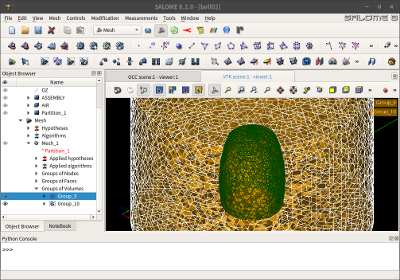

## 1. 개요
* 본편에서는, 신라종(Bell) 형상에 하모닉해석을 실시하여 진동을 발생시키고, 이것에 의해 발생한 음파가 주변의 공기에 어떻게 퍼져나가는지 가시화할 수 있도록 주변 공기 부분에 `Helmholtz Equation`을 추가 적용하여 해석해 본다.
* 따라서, 이전에 사용하던 단일 물체에 더하여, 공기 부분에 해당하는 물체를 하나 더 추가하여 2개의 물체(Bodies)로 구성된 매쉬를 사용하게 된다.
* 아울러 신라종 표면과 공기의 접촉면은 모두 절점(Node)가 공유되도록 하여, 자연스럽게 하모닉거동에 관한 물리량이 전달되도록 설정한다.
* 마니막으로, 단일 샷(Shot)으로 얻어진 결과데이타로, 파라뷰(Paraview)의 애니메이션 기능을 이용하여 동영상화해 본다.

{width=50%}
{width=20%}
{width=20%}
{width=20%}
{width=20%}
{width=50%}

## 2. 다물체 다물리 음향 해석 (하모닉+헬름홀츠)

### (1) 먼저 고려해 볼 사항들
* 하모닉 및 헬름홀츠 방정식은 주파수영역에서 해를 찾는 방식이므로, 시뮬레이션 조건은 `Transient`가 아닌 `Steady state`로 해야만 한다.
* 헬름홀츠 방정식에는 특정한 단일 입력주파수를 넣어줘야 한다.  따라서 여러 개의 입력주파수를 계산하기 위해, 여러개의 sif 파일을 만들어놓고 배치(Batch)작업방식으로 한꺼번에 여러 케이스를 계산시킨다면, 전체 계산시간을 단축시키는 효과를 얻을 수 있을 것이다.
* 주파수영역에서의 거동은 실수부(Real part) 및 허수부(Imagine part)로 나누어 표현되므로, 기존에 생략되어 있던 허수부가 필요한 부분을 보충해서 입력해 줄 필요가 있다.

### (2) 3D CAD 모델링

{width=50%}

### (3) 살로메(Salome) 전처리

{width=50%}

### (4) `case1.sif` 작성
### (5) `case2.sif`, `case3.sif`, `case4.sif` 작성
### (6) 시뮬레이션 계산 실행
### (7) Paraview 후처리

## 7. 맺음말

## Ref

* Paraview 가시화 팁
http://www.rccm.co.jp/icem/pukiwiki/index.php?%E5%8F%AF%E8%A6%96%E5%8C%96-Tips

* Paraview 서버 셋팅
https://www.paraview.org/Wiki/Setting_up_a_ParaView_Server
