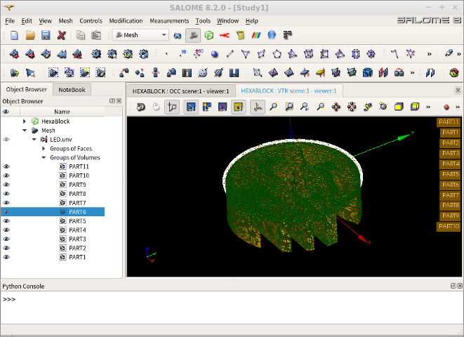

## 1. 개요
* 본 편 부터는, 열전달 현상에 관해 해석을 실시해 보기로 하자.
* 한 편씩 나누어 전도(Conduntion), 대류(Convection), 복사(Radiation) 현상을 각각 시뮬레이션 해 보고, 실무에 적용하기 위해 어떤 준비가 필요한지도 자연스럽게 습득하기로 한다.
* 본 편에서는, 고출력 LED를 발열원으로 한 다물체 열전도 현상을 모델링하여 다루어 보기로 한다.
* 아울러, 보다 편리하게 다물체 모델의 매쉬를 생성할 수 있도록 살로메의 파이썬 스크립트를 간단하게 작성하여 활용해 보는 과정도 함께 해 본다.


## 2. 시스템 모델
* LED 발광소자의 효율(입력된 전기에너지 대비 출력 빛에너지로 변환되는 비율)은 대략 10~30% 정도 수준이다.  이는 기존의 백열램프나 형광등보다 훨씬 좋은 효율이며, 고전압 HID 램프와 비슷한 수준으로 알려져 있다.  빛을 제외한 나머지 에너지는 대부분 발열의 형태로 소산된다.  발생된 열은 대부분 LED 소자와 맞닿은 부분을 거쳐 히트싱크까지 열전도로 전달된다. (히트싱크 이외 부분의 대류 및 복사 열전달은 상대적으로 작기 때문에 무시할 만 하다.)
* LED 발광소자가 비록 고출력이라 하더라도, 최대 1~수W 수준에 불과하다.  따라서 강력한 빛을 얻기 위해서 여러 개의 LED 발광소자를 기판 위에 배치햐여 설계하는 것이 일반적이다.
* LED 발광체는 일반적으로 LED 패키지 조립체로 판매된다.  LED 패키지는 크기와 형태별로 매우 다양한데, 본 예제에서는 5054 규격의 패키지를 상정하기로 한다.  LED 패키지 내부의 발광체에서 발생한 열이 최대한 기판까지 잘 전달될 수 있도록, LED 패키지는 열전달 성능을 고려하여 설계된다.  다만, 제조사와 사양에 따라 같은 규격의 패키지라 하더라도, 패키지 내부의 구조와 재료는 역시 매우 다양하다.  따라서 LED 패키지의 열 문제를 정확하게 다루기 위해서는, 패키지의 정확한 형상과 재료들의 물성을 알아야 할 필요가 있다.  즉 LED 패키지 자체를 설계할 때는 그 자체를 상세하게 모델링하여 열문제를 다룰 수 있을 것이다.
* 그러나, LED 패키지 내부의 설계정보가 없는 사용자의 경우에는, 비록 오차가 있더라도 LED 패키지 모델을 단순화하여 근사적인 모델로 구성하고, 여러 개의 패키지를 사용하여 구성한 기판과 히트싱크 부분의 상태에 관심이 있을 수 있다.  이때는 패키지 모델을 최대한 단순화하여 문제를 다룰 수 있을 것이다.


* 어떤 경우든 간에, 주된 해석의 관심사는 LED 패키지 내부 발광체 부분의 온도, 접합부 온도, T_J)인 경우가 많다.  접합부 온도가 과열되면, 발광체의 에너지 효율이 떨어지거나, 빛의 파장이 변조되어 원하는 파장대의 빛을 더이상 낼 수 없거나, 수명이 단축되거나, 온도가 올라갈수록 더 많은 전류를 끌어당기는 열폭주 현상이 발생하여 LED 드라이빙 회로까지 파괴시키는 경우도 있어 신뢰성 확보에 가장 핵심적인 부분이기 때문이다.
* 따라서 본 예제에서는, 다음과 같은 모델을 수립해 보도록 하자.

|항목             |사양                |비고                                   |
|----------------|-------------------|--------------------------------------|
|LED 발광체(SOURCE)|1.0x1.0x0.015mm    |발열원                                 |
|LED 슬러그(SLUG)  |5x5x1.2mm            |발열원과 기판 사이의 열 전달체의 단순화 모델   |
|기판(PCB)        |FR4 또는 메탈코어 PCB |단순화를 위해 구리 회로 패턴 모델링은 생략    |
|열전도체(TIM)     |써멀그리스 또는 테잎    |기판과 히트싱크 사이의 열전도 조건을 규정     |
|히트싱크(HEATSINK)|알미늄 소재, 냉각핀 적용|냉각핀 부분과 외부 공기 온도 및 열전달 계수 설정으로 조건 설정 가능|

* 위의 모델의 구성요소들 중, LED 발광체와 슬러그를 합친 모델이 바로 LED 패키지 조립체에 해당한다.  LED 패키지 내부의 복잡한 열전달 경로를 슬러그(Slug)라는 하나의 물체로 단순화한 것이다.  또한, LED 패키지와 기판 접합면으로만 열전달이 일어나고, 나머지 표면은 모두 단열(Adiabatic)으로 단순화하여 열전달이 없다고 가정한다.
* LED 패키지와 기판의 접합 부분은, 실제로는 접촉 및 납땜으로 구성되나, 역시 단순화하여 접합면에서의 열저항은 무시한다.
* 기판과 열전도체(TIM)의 접합면 이외 부분은 역시 단열 조건으로 단순화한다.
* 즉 히트싱크 외부 표면에서만 외부 공기로 열전달이 일어나는 것으로 한다.  이렇게 함으로써 순수하게 히트싱크의 방열능력을 평가하기도 수월할 것이다.
* 히트싱크 외부의 공기는 실제로는 대류열전달이 발생하는 부분이지만, 대류열전달 현상을 단순화하여 상수화된 열전달계수와 외부 공기 온도를 설정해서 빠른 근사화 결과를 얻어내고자 한다.
* 아울러, 이러한 단순화 모델을 구성했을 때, 실제 실험결과와 비슷하게 되도록 열전달계수 등의 파라미터를 조정해서 근사화하기가 용이하다.  단순화된 모델인 만큼, 조정해야 할 파라미터의 개수가 적기 때문이다.
* 각 구성 물체들의 물성치는 열전달계수(Heat Transfer Coefficient)가 주어지면 된다.  구체적인 수치는 예제를 따라가면서 확인해 보자.


## 3. 전처리 과정

### (1) 3D 모델링
* LED 패키지의 내부 구조와 재질은 제조사 및 사양에 따라 상당한 차이가 있다.  따라서 정확한 모델링을 위해서는 해석하고자 하는 LED 패키지의 구조 및 재질 등에 관한 기술자료를 정확하게 확보하여 가급적 실제와 가깝게 구성해 주는 것이 가장 정확할 것이다.
* 그러나, LED 패키지의 자세한 기술정보는, 일반 사용자 입장에서는 현실적으로 얻어내기 어렵다.  따라서 여기서는 내부 구조를 간략화하여 근사적인 답을 얻어내는데 목적을 두기로 한다.


### (2) 살로메 스크립트의 간단한 이해
* 살로메는 GUI 상에서 사용자가 작업한 모든 내용들을 파이썬 스크립트로 만들어주는 기능이 있다.  `File - Dump Study` 메뉴가 바로 그것이다.  이 메뉴를 선택하면, 현재까지의 작업내용을 파이썬 스크립트 파일로 저장할 수 있다.
* 반대로, 파이썬 스크립트 파일을 읽어들여 살로메 GUI 상에서 실행하여 재현해 주려면 `File - Load Script` 메뉴를 사용하면 된다.
* 이상의 2가지 메뉴를 이용하여, 살로메 GUI로 일일이 수동으로 해 주던 작업들을 스크립트화하여 편하게 자동화할 수 있게 된다.
* 즉 `Dump Study`로 얻어낸 파이썬 스크립트 파일을 원하는대로 수정한 후, `Load Script`로 살로메 내에서 실행해 주는 방식이다.
* 살로메에서의 파이썬 스크립트는, 살로메가 제공해 주는 전용 메쏘드(함수)들을 사용한다는 것 외에 별다른 특별한 사항은 없다.  일반적인 파이썬 2.7 문법 그대로 작동한다.  만들어진 파이썬 코드는 실제 작업순서 그대로 순차적으로 기술되어 있기 때문에, 굉장히 단순하게 이해할 수 있다.  어렵고 복잡한 프로그래밍으로 볼 필요가 없다.
* 살로메가 제공하는 메쏘드에 관한 정보는, 살로메 홈페이지 사용자 섹션( http://www.salome-platform.org/user-section ) 안의 설명서(Documentation) 등을 참고하면 된다.
* 살로메 GUI 없이, 그냥 터미널 상에서 직접 스크립트를 실행하려면, 살로메 실행명령어 뒤에 `-t` 옵션을 붙여주고 실행하기를 원하는 파이썬 스크립트 파일을 써 주면 된다.  예컨데 아래와 같이 한다.

```bash
$ salome -t ~/.config/salome/step2unv/step2unv.py
```

* 살로메는 내부적으로 서버-클라이언트 모델의 어플리케이션이기 때문에, 작업이 완료되면 메모리상에 남아있는 살로메 서버를 모두 강제적으로 종료시킬 필요가 있을 수 있다.  이때는 다음 명령을 준다.

```bash
$ salome killall
```

* 이와 같이, 살로메 GUI 없이 직접 백그라운드로 살로메를 구동시켜 작업 자동화를 위한 스크립트를 실행할 수 있다.


### (3) 자동 매쉬 생성을 위한 살로메 스크립트 작성
* 본 예제에서는, 프리캐드로 모델링한 복수의 물체로 구성된 STEP 파일을 읽어들여, 각 물체간의 접촉면을 찾아서 그룹화 해 주고, 매쉬 생성 까지 하여 최종적으로 UNV 포멧의 매쉬 파일을 만들어내는 스크립트를 작성해서 활용해 보기로 한다.
* 코드는 아래와 같으며, 몇가지 안 되는 메쏘드만 사용하고 있으며 순차적으로 작성되어 있기 때문에 어렵지 않게 충분히 이해하고 응용할 수 있을 것이다.  명칭은 `step2unv.py`로 한다.

```python

# -*- coding: utf-8 -*-

#################################################
#
#   STEP2UNV for Elmer with Salome
#   V02
#
#   Data: 2017-09-12
#   Modifier : DymaxionKim
#
#   - Salome 8.2
#   - Import single STEP assembly file
#   - Excecute in CUI but not Salome GUI
#   - Only for STEP format
#   - Auto Group for each solids, subshape faces, intersect faces
#
#################################################

import sys
import salome
import os

salome.salome_init()
theStudy = salome.myStudy

import salome_notebook
notebook = salome_notebook.NoteBook(theStudy)

#tolerance = 1e-10	# max tolerance for identification of vertices

#################################################
## User Inputs
#################################################
# WORKING DIRECTORY
#print("\n" * 100)
print("----------------------------------------------------")
print("Input your working directory :")
DIRECTORY = raw_input()
sys.path.insert( 0, DIRECTORY)

# File Name
print("----------------------------------------------------")
print("Input your STEP File Name :")
FILENAME = raw_input()

# Mesh Parameters
print("----------------------------------------------------")
print("----- Mesh Parameters -----")
MinMeshSize = float(raw_input("MinMeshSize[m] : ")) # specify in m
MaxMeshSize = float(raw_input("MaxMeshSize[m] : ")) # specify in m
#MeshSecondOrder = float(raw_input("SetSecondOrder[0,1] : "))
MeshSecondOrder = 1
print("SetFiness ::: 0=VeryCoarse, 1=Coarse, 2=Moderate, 3=Fine, 4=VeryFine, 5=Custom")
MeshFineness = float(raw_input("SetFineness[0~5] : "))
if MeshFineness==5:
	MeshSegPerEdge = float(raw_input("  MeshSegPerEdge[ea] : "))
	MeshSegPerRadius = float(raw_input("  MeshSegPerRadius[ea] : "))
	MeshGrowthRate = float(raw_input("  MeshGrowthRate[0~1] : "))


#################################################
### GEOM component
#################################################
import GEOM
from salome.geom import geomBuilder
import math
import SALOMEDS


# New Study
geompy = geomBuilder.New(theStudy)

# Read STEP File
print("----------------------------------------------------")
print("----- Read STEP file ... ")
PARTS = []
ASSEMBLY = geompy.ImportSTEP(DIRECTORY+"/"+FILENAME, False, True)
PARTS = geompy.ExtractShapes(ASSEMBLY, geompy.ShapeType["SOLID"], True)
PARTITION = geompy.MakePartition(PARTS, [], [], [], geompy.ShapeType["SOLID"], 0, [], 0)
PARTS = geompy.ExtractShapes(PARTITION, geompy.ShapeType["SOLID"], True)


#################################################
# GROUP (VOLUMES of PARTS)
#################################################
GROUP_PARTS = []
ID_PARTS = []
for aPART in range(0,len(PARTS)):
	ID_PARTS.append(geompy.GetSubShapeID(PARTITION, PARTS[aPART]))
for aGROUP in range(0,len(PARTS)):
	GROUP_PARTS.append(geompy.CreateGroup(PARTITION, geompy.ShapeType["SOLID"]))
for aGROUP in range(0,len(PARTS)):
	geompy.AddObject(GROUP_PARTS[aGROUP], ID_PARTS[aGROUP])

# Add to Study
geompy.addToStudy( PARTITION, 'PARTITION' )
for aGROUP in range(0,len(GROUP_PARTS)):
	geompy.addToStudyInFather(PARTITION, GROUP_PARTS[aGROUP], 'PART{0}'.format(aGROUP+1) )


#################################################
# GROUP (FACES of PARTS)
#################################################
GROUP_FACES = []
for aGROUP in range(0,len(GROUP_PARTS)):
	FACES = []
	ID_FACES = []
	FACES = geompy.SubShapeAll(GROUP_PARTS[aGROUP], geompy.ShapeType["FACE"])
	for fGROUP in range(0,len(FACES)):
		ID_FACES.append(geompy.GetSubShapeID(PARTITION, FACES[fGROUP]))
	GROUP_FACES.append(geompy.CreateGroup(PARTITION, geompy.ShapeType["FACE"]))
	geompy.UnionIDs(GROUP_FACES[aGROUP], ID_FACES)

# Add to Study
for aGROUP in range(0,len(GROUP_PARTS)):
	geompy.addToStudyInFather(PARTITION, GROUP_FACES[aGROUP], 'FACE{0}'.format(aGROUP+1) )


#################################################
### SMESH component
#################################################
import  SMESH, SALOMEDS
from salome.smesh import smeshBuilder

# New Study
smesh = smeshBuilder.New(theStudy)

# New Mesh
MESH = smesh.Mesh(PARTITION)

# Parameters
NETGEN_2D3D = MESH.Tetrahedron(algo=smeshBuilder.NETGEN_1D2D3D)
NETGEN_Parameters = NETGEN_2D3D.Parameters()
NETGEN_Parameters.SetMinSize( MinMeshSize )
NETGEN_Parameters.SetMaxSize( MaxMeshSize )
NETGEN_Parameters.SetSecondOrder( int(MeshSecondOrder) )
# SetFiness ::: 0=VeryCoarse, 1=Coarse, 2=Moderate, 3=Fine, 4=VeryFine, 5=Custom
if MeshFineness!=5:
	NETGEN_Parameters.SetFineness( int(MeshFineness) )
if MeshFineness==5:
	NETGEN_Parameters.SetGrowthRate( MeshGrowthRate )
	NETGEN_Parameters.SetNbSegPerEdge( MeshSegPerEdge )
	NETGEN_Parameters.SetNbSegPerRadius( MeshSegPerRadius )
	NETGEN_Parameters.SetUseSurfaceCurvature( 1 ) # 0 or 1
NETGEN_Parameters.SetQuadAllowed( 0 )
NETGEN_Parameters.SetOptimize( 1 )
NETGEN_Parameters.SetFuseEdges( 1 )


#################################################
# GROUP (VOLUMES of PARTS)
#################################################
MGROUP_PARTS = []
for aGROUP in range(0,len(GROUP_PARTS)):
	MGROUP_PARTS.append( MESH.GroupOnGeom(GROUP_PARTS[aGROUP], 'PART{0}'.format(aGROUP+1), SMESH.VOLUME) )


#################################################
# GROUP (FACES of PARTS)
#################################################
MGROUP_FACES = []
for aGROUP in range(0,len(GROUP_PARTS)):
	MGROUP_FACES.append( MESH.GroupOnGeom(GROUP_FACES[aGROUP], 'FACE{0}'.format(aGROUP+1), SMESH.FACE) )


#################################################
# Make MESH
#################################################
print("----------------------------------------------------")
print("----- Mesh Computing ... ")
isDone = MESH.Compute()


#################################################
# GROUP (INTERSECT FACES of PARTS)
#################################################
MGROUP_INTERSECTS = []
for fGROUP in range(0,len(MGROUP_FACES)):
	for fGROUP2 in range(fGROUP+1,len(MGROUP_FACES)):
		if fGROUP!=fGROUP2:
			aCriteria = []
			aCriterion = smesh.GetCriterion(SMESH.FACE,SMESH.FT_BelongToMeshGroup,SMESH.FT_Undefined,MGROUP_FACES[fGROUP],SMESH.FT_Undefined,SMESH.FT_LogicalAND)
			aCriteria.append(aCriterion)
			aCriterion = smesh.GetCriterion(SMESH.FACE,SMESH.FT_BelongToMeshGroup,SMESH.FT_Undefined,MGROUP_FACES[fGROUP2])
			aCriteria.append(aCriterion)
			aFilter = smesh.GetFilterFromCriteria(aCriteria)
			aFilter.SetMesh(MESH.GetMesh())
			info = []
			info = smesh.GetMeshInfo(aFilter)
			if info.values()[10]: # Dictionary Key : Entity_Quad_Triangle
				MGROUP_INTERSECTS.append( MESH.GroupOnFilter( SMESH.FACE, 'INTERSECT{0}'.format(fGROUP+1), aFilter ) )


#################################################
# GROUP (CUT FACES of PARTS)
#################################################
MGROUP_CUTS = []
for fGROUP in range(0,len(MGROUP_FACES)):
	aCriteria = []
	aCriterion = smesh.GetCriterion(SMESH.FACE,SMESH.FT_BelongToMeshGroup,SMESH.FT_Undefined,MGROUP_FACES[fGROUP],SMESH.FT_Undefined,SMESH.FT_LogicalAND)
	aCriteria.append(aCriterion)
	for fGROUP2 in range(0,len(MGROUP_INTERSECTS)):
		aCriterion = smesh.GetCriterion(SMESH.FACE,SMESH.FT_BelongToMeshGroup,SMESH.FT_Undefined,MGROUP_INTERSECTS[fGROUP2],SMESH.FT_LogicalNOT)
		aCriteria.append(aCriterion)
	aFilter = smesh.GetFilterFromCriteria(aCriteria)
	aFilter.SetMesh(MESH.GetMesh())
	info = []
	info = smesh.GetMeshInfo(aFilter)
	if info!=smesh.GetMeshInfo(MGROUP_FACES[fGROUP]) and info.values()[10]:
		MGROUP_CUTS.append( MESH.GroupOnFilter( SMESH.FACE, 'CUT{0}'.format(fGROUP+1), aFilter ) )


#################################################
# Make UNV
#################################################
FILENAME_HEAD = os.path.splitext(FILENAME)[-2]
print("----------------------------------------------------")
print("----- Make UNV ... ")
try:
  MESH.ExportUNV( DIRECTORY+"/"+FILENAME_HEAD+".unv")
except:
  print 'ExportUNV() failed. Invalid file name?'


#################################################
# MESH Info
#################################################
print("----------------------------------------------------")
print "Information about mesh:"
print "Number of nodes       : ", MESH.NbNodes()
print "Number of edges       : ", MESH.NbEdges()
print "Number of faces       : ", MESH.NbFaces()
print "          triangles   : ", MESH.NbTriangles()
print "          quadrangles : ", MESH.NbQuadrangles()
print "          polygons    : ", MESH.NbPolygons()
print "Number of volumes     : ", MESH.NbVolumes()
print "          tetrahedrons: ", MESH.NbTetras()
print "          hexahedrons : ", MESH.NbHexas()
print "          prisms      : ", MESH.NbPrisms()
print "          pyramids    : ", MESH.NbPyramids()
print "          polyhedrons : ", MESH.NbPolyhedrons()
print("----------------------------------------------------")
print("----- FINISHED ! -----")

```

* 이 스크립트를 실행하고 완료 후 세션을 모두 닫아주는 동작을 한꺼번에 해 주기 위해 `step2unv`라는 이름으로 쉘스크립트 파일도 함께 작성하자.  물론 이 파일을 작성한 후 실행권한을 준다.

```bash
#!/bin/bash
###########################################################
# STEP2UNV for Elmer with Salome
# Import, Grouping and Meshing for a STEP File
# 2017.09.12
# by Dymaxion.kim@gmail.com
###########################################################

StartTime=$(date +%s)

salome -t ~/.config/salome/step2unv/step2unv.py
salome killall

EndTime=$(date +%s)
echo "It takes $(($EndTime - $StartTime)) seconds to complete this task."

exit 0
```

* `StartTime`, `EndTime` 변수를 이용하여 전체 실행시간을 측정하여 종료후 프린트되도록 해 주었다.
* 이상 2개의 파일을, 원하는 장소에 배치해 놓고, 어느 곳에서나 실행할 수 있도록 bash 쉘의 설정파일(`.bashrc`)을 편집하여 경로(Path)를 잡아주거나, 또는 심볼릭링크를 이용하여 설정해 준다.  예컨데 `~/.bashrc` 파일을 편집기로 열어서 다음과 같은 식으로 구문을 추가해주면 된다.

```bash
# STEP2UNV for Elmer with Salome
export PATH="/home/osboxes/.config/salome/step2unv:$PATH"
```

* 그리고, 이상의 셋팅 과정을 구체적으로 다음 주소에 기록해 두었으므로, 설치장소의 경로만 수정해서 그대로 따라하면 된다.

```
https://github.com/dymaxionkim/ElmerFEM_Examples/tree/master/20170911_Salome_Script_STEP2UNV
```


### (4) 3D 모델링 데이타로부터 살로메 스크립트를 이용하여 매쉬 생성

* 3D 모델링 데이타는 다음 명령으로 작업 디렉토리를 만들고, 데이타를 다운로드 받자.

```bash
$ mkdir ~/LED
$ cd LED
$ wget https://github.com/dymaxionkim/Elmer_Examples_for_CADG/raw/master/CADG_06_Elmer_Conduction/3.Elmer/LED.stp
```

* `step2unv`살로메 스크립트의 셋팅을 완료하였다면, 어느 경로에서나 자유롭게 다음 명령을 쳐서 스크립트를 실행할 수 있게 된다.  예컨데 아래와 같은 식으로 명령을 주면 된다.

```bash
$ step2unv
```

* 명령을 실행하면, 백그라운드에서 살로메가 실행되면서 스크립트를 시작하게 된다.  살로메 실행과 관련된 약간의 메시지가 나온 후, 다음의 구문이 나온다.

```
----------------------------------------------------
Input your working directory :
```

* 그러면 지시 그대로, STEP 파일이 들어있는 경로를 써 넣어 주고 엔터를 친다. (아래는 예시)

```
/home/osboxes/LED
```

* 그 다음, STEP 파일 이름을 입력하라는 메시지가 나온다.

```
----------------------------------------------------
Input your STEP File Name :
```

* 그러면 지시 그대로, STEP 파일의 이름을 정확하게 써 넣어 주고 엔터를 친다. (아래는 예시)

```
LED.stp
```

* 이제, STEP 파일로부터 매시를 생성하기 위한 파라미터를 입력한다.   매시 사이즈의 단위는 미터[m]이다.  (아래는 예시)

```
----------------------------------------------------
----- Mesh Parameters -----
MinMeshSize[m] : 0
MaxMeshSize[m] : 0.005
SetFiness ::: 0=VeryCoarse, 1=Coarse, 2=Moderate, 3=Fine, 4=VeryFine, 5=Custom
SetFineness[0~5] : 4
```

* 파라미터 입력을 완료하면, 작업이 수행된다.  조건에 따라 소요되는 시간이 다르기 때문에, 다음과 같은 형태의 메시지가 순차적으로 나오는지 확인하자.

```
----------------------------------------------------
----- Read STEP file ...
----------------------------------------------------
----- Mesh Computing ...
----------------------------------------------------
----- Make UNV ...
----------------------------------------------------
Information about mesh:
Number of nodes       :  222542
Number of edges       :  2325
Number of faces       :  35807
          triangles   :  35807
          quadrangles :  0
          polygons    :  0
Number of volumes     :  149805
          tetrahedrons:  149805
          hexahedrons :  0
          prisms      :  0
          pyramids    :  0
          polyhedrons :  0
----------------------------------------------------
----- FINISHED ! -----
```

* `FINISHED !` 라는 메시지가 나오면 이상없이 완료된 것이다.  해당 작업 디렉토리 안에는 `LED.unv` 파일이 생성되어 있을 것이다.


### (5) 생성된 매쉬 파일을 ElmerGrid를 이용하여 엘머용 매쉬 포멧으로 변환

* 생성된 `LED.unv` 파일은, ElmerGUI 상에서 `Open` 메뉴로 직접 읽어들여도 된다.
* 다만, 여기서는 터미널상에서 `ElmerGrid` 명령어를 사용하여 엘머 전용 매시 포멧으로 직접 변환하는 방법을 사용해 보자.
* `ElmerGrid` 명령어를 터미널에 쳐 넣으면, 간단한 설명이 나온다.  대체로 여기에 나오는 설명만으로도 매시 포멧을 변환하는 기능을 활용하는데는 충분한 정보를 얻을 수 있다.
* 설명을 참고해서, 다음과 같은 명령을 수행한다.

```bash
$ ElmerGrid 8 2 LED.unv
$ cd LED
```

* 그러면 `LED`라는 디렉토리가 생기면서 그 안에 엘머 매시 포멧의 파일들이 생성된다.

```
entities.sif
mesh.boundary
mesh.elements
mesh.header
mesh.names
mesh.nodes
```

* 이 파일들은, ElmerGUI에서 unv 파일을 읽어들인 후 `Save Project`로 엘머 매시파일을 저장한 경우와는 약간 다르다.  즉 `entities.sif`, `mesh.names`라는 2개의 파일이 더 만들어져 있다.
* `entities.sif` 파일은, sif 파일을 사용자가 직접 작성하기 쉽도록 Body 및 Boundary Condition 항목들이 미리 작성되어 있다.  나머지 필요한 부분들을 추가해서 작성하여 사용하면 된다.
* `mesh.names` 파일은, unv 파일에서 포함하고 있는 Body 및 Boundary들의 명칭을 Elmer에서의 번호로 일대일 대응시켜 정의해 두고 있다.  ElmerGUI에서는 명칭 정보를 사용할 수 없지만, ElmerGrid를 사용하여 매시변환을 하면 이와 같이 명칭 정보를 그대로 활용할 수 있게 된다.  사용자가 살로메에서 매시 생성 작업을 할 때, Body 및 Boundary 그룹에 적절한 명칭을 미리 정해 주었다면 그대로 활용할 수 있게 되므로 굳이 ElmerGUI의 도움 없이도 sif 파일을 직접 텍스트 에디터로 작성하는데 문제가 없을 것이다.
* 물론, 이렇게 생성된 엘머 매시파일은 당연히 ElmerGUI에서도 읽어들일 수 있다(다만 종종 에러가 발생해서 읽기에 실패할 때도 있다).  엘머 매시 파일을 읽을 때는 `Load Mesh` 메뉴를 사용해서 읽어들이면 된다.


## 4. 해석 실시

### (1) 시뮬레이션 인풋 파일(sif) 작성

* 텍스트 에디터로 `mesh.names`을 열어보면, 다음과 같은 내용이 보인다.

```
! ----- names for bodies -----
$ PART1 = 1
$ PART2 = 2
$ PART3 = 3
$ PART4 = 4
$ PART5 = 5
$ PART6 = 6
$ PART7 = 7
$ PART8 = 8
$ PART9 = 9
$ PART10 = 10
$ PART11 = 11
! ----- names for boundaries -----
$ INTERSECT1 = 23
$ INTERSECT1 = 24
$ INTERSECT3 = 25
$ INTERSECT3 = 26
$ INTERSECT5 = 27
$ INTERSECT5 = 28
$ INTERSECT6 = 29
$ INTERSECT6 = 30
$ INTERSECT8 = 31
$ INTERSECT10 = 32
$ CUT1 = 33
$ CUT2 = 34
$ CUT3 = 35
$ CUT4 = 36
$ CUT5 = 37
$ CUT6 = 38
$ CUT7 = 39
$ CUT8 = 40
$ CUT9 = 41
$ CUT10 = 42
$ CUT11 = 43
$ bnry44 = 44
```

* 각각의 물체(Body)와 경계면(Boundary)의 명칭을 정의한 것이다.  그런데 여기서 나온 명칭들은, `step2unv` 스크립트를 이용하여 자동으로 생성하였기 때문에 명칭만 보아서는 어떤 물체나 경계면인지 알기가 어렵다.  따라서 알기 쉽게 명칭을 바뀌주자.  이를 위해 우선 살로메에서 `LED.unv` 파일을 읽어들여, 각 물체와 경계면이 어느 부분인지 파악해서 바꿔 써 주면 된다.



* 수정된 `mesh.names`의 내용은 아래와 같은 식으로 될 것이다.

```
! ----- names for bodies -----
$ SLUG04 = 1
$ LED04 = 2
$ SLUG03 = 3
$ LED03 = 4
$ TIM = 5
$ PCB = 6
$ HEATSINK = 7
$ SLUG01 = 8
$ LED01 = 9
$ SLUG02 = 10
$ LED02 = 11
! ----- names for boundaries -----
$ SLUG04-LED04 = 23
$ PCB-SLUG04 = 24
$ SLUG03-LED03 = 25
$ PCB-SLUG03 = 26
$ TIM-PCB = 27
$ HEATSINK-TIM = 28
$ PCB-SLUG01 = 29
$ PCB-SLUG02 = 30
$ SLUG01-LED01 = 31
$ SLUG02-LED02 = 32
$ SLUG04_OUT = 33
$ LED04_OUT = 34
$ SLUG03_OUT = 35
$ LED03_OUT = 36
$ TIM_OUT = 37
$ PCB_OUT = 38
$ HEATSINK_OUT = 39
$ SLUG01_OUT = 40
$ LED01_OUT = 41
$ SLUG02_OUT = 42
$ LED02_OUT = 43
```

* 아울러, `entities.sif`에 정의된 각 물체와 경계면의 명칭도 맞추어 변경해 준다.  이때는 ElmerGUI에서 직접 `LED.unv`을 읽어들여 각 경계면의 번호를 파악하는 것도 좋다.
* 그리고 `entities.sif`에 해석 조건들을 부여해서 다음과 같은 내용이 되도록 편집해서 보충하자.

```cpp
Header
  CHECK KEYWORDS Warn
  Mesh DB "." "."
  Include Path ""
  Results Directory "."
End

Simulation
  Max Output Level = 5
  Coordinate System = Cartesian
  Coordinate Mapping(3) = 1 2 3
  Simulation Type = Scanning
  Steady State Max Iterations = 1
  Timestep intervals = 10   ! [sec]
  Timestep sizes = 1   ! [sec]
  Output Intervals = 1
  Timestepping Method = BDF
  BDF Order = 1
  Solver Input File = entities.sif
  Post File = case.vtu
  Use Mesh Names = Logical True   ! Use Salome Group Names
  ! Output File = "case.result"
End

Constants
  $LED_X=0.001   ![m]
  $LED_Y=0.001   ![m]
  $POWER=0.7  ![W]
  $HTC=10.0   ![W/m^2K] Heat Transfer Coefficient
  $AMBIENT=25.0   ![C] External Temperature
End

!------ Equations -----
Solver 1
  Equation = Heat Equation
  Procedure = "HeatSolve" "HeatSolver"
  Variable = Temperature
  Exec Solver = Always
  Stabilize = True
  Bubbles = False
  Lumped Mass Matrix = False
  Optimize Bandwidth = True
  Steady State Convergence Tolerance = 1.0e-5
  Linear System Solver = Iterative
  Linear System Iterative Method = BiCGStab
  Linear System Max Iterations = 500
  Linear System Convergence Tolerance = 1.0e-7
  BiCGstabl polynomial degree = 2
  Linear System Preconditioning = Diagonal
  Linear System ILUT Tolerance = 1.0e-3
  Linear System Abort Not Converged = False
  Linear System Residual Output = 1
  Linear System Precondition Recompute = 1
End

Solver 2
  Equation = Flux and Gradient
  Calculate Flux = True
  Flux Coefficient = "Heat Conductivity"
  Calculate Grad = True
  Target Variable = Temperature
  Procedure = "FluxSolver" "FluxSolver"
  Exec Solver = After Timestep
  Stabilize = True
  Bubbles = False
  Lumped Mass Matrix = False
  Optimize Bandwidth = True
  Steady State Convergence Tolerance = 1.0e-5
  Linear System Solver = Iterative
  Linear System Iterative Method = BiCGStab
  Linear System Max Iterations = 500
  Linear System Convergence Tolerance = 1.0e-7
  BiCGstabl polynomial degree = 2
  Linear System Preconditioning = Diagonal
  Linear System ILUT Tolerance = 1.0e-3
  Linear System Abort Not Converged = False
  Linear System Residual Output = 1
  Linear System Precondition Recompute = 1
End

Equation 1
  Name = "Equation 1"
  Active Solvers(2) = 1 2
End

!------ Materials -----
Material 1
  Name = "(LED) GaN"
  Heat Conductivity = 130
  Heat Capacity = 930.37
  Heat expansion Coefficient = 6.66e-06
  Density = 6100.0
End

Material 2
  Name = "(LED) Si"
  Heat Conductivity = 127.0
  Heat Capacity = 555.8
  Heat expansion Coefficient = 4.68e-6
  Density = 2330.0
End

Material 3
  Name = "(MCPCB) Thermal Grease"
  Heat Conductivity = 3.0
  Heat Capacity = 300.0
  Heat expansion Coefficient = 1.0e-6
  Density = 1000.0
End

Material 4
  Name = "Aluminium"
  Heat Conductivity = 237.0
  Heat Capacity = 897.0
  Heat expansion Coefficient = 23.1e-6
  Density = 2700.0
End

Material 5
  Name = "(PCB) FR4"
  Heat Conductivity = 0.35
  Heat Capacity = 1300.0
  Heat expansion Coefficient = 7e-5
  Density = 1850.0
End

!------ Skeleton for body section -----
Body 1
  Name = SLUG04
  Equation = 1
  Material = 2
End

Body 2
  Name = LED04
  Equation = 1
  Material = 1
End

Body 3
  Name = SLUG03
  Equation = 1
  Material = 2
End

Body 4
  Name = LED03
  Equation = 1
  Material = 1
End

Body 5
  Name = TIM
  Equation = 1
  Material = 3
End

Body 6
  Name = PCB
  Equation = 1
  Material = 5
End

Body 7
  Name = HEATSINK
  Equation = 1
  Material = 4
End

Body 8
  Name = SLUG01
  Equation = 1
  Material = 2
End

Body 9
  Name = LED01
  Equation = 1
  Material = 1
End

Body 10
  Name = SLUG02
  Equation = 1
  Material = 2
End

Body 11
  Name = LED02
  Equation = 1
  Material = 1
End

!------ Skeleton for boundary section -----
Boundary Condition 1
  Name = LED01_OUT
  Heat Flux = $(POWER/(LED_X*LED_Y))  ![W/m^3]
End

Boundary Condition 2
  Name = LED02_OUT
  Heat Flux = $(POWER/(LED_X*LED_Y))  ![W/m^3]
End

Boundary Condition 3
  Name = LED03_OUT
  Heat Flux = $(POWER/(LED_X*LED_Y))  ![W/m^3]
End

Boundary Condition 4
  Name = LED04_OUT
  Heat Flux = $(POWER/(LED_X*LED_Y))  ![W/m^3]
End

Boundary Condition 5
  Name = SLUG01_OUT
End

Boundary Condition 6
  Name = SLUG02_OUT
End

Boundary Condition 7
  Name = SLUG03_OUT
End

Boundary Condition 8
  Name = SLUG04_OUT
End

Boundary Condition 9
  Name = PCB_OUT
End

Boundary Condition 10
  Name = TIM_OUT
End

Boundary Condition 11
  Name = HEATSINK_OUT
  Heat Transfer Coefficient = $HTC ![W/m^2K]
  ! External Temperature = $AMBIENT ![C]
  External Temperature = variable time
    Real
       0 20.0
       1 22.5
       2 25.0
       3 27.5
       4 30.0
       5 32.5
       6 35.0
       7 37.5
       8 40.0
       9 42.5
       10 45.0
    End
End

Boundary Condition 12
  Name = SLUG01-LED01
End

Boundary Condition 13
  Name = SLUG02-LED02
End

Boundary Condition 14
  Name = SLUG03-LED03
End

Boundary Condition 15
  Name = SLUG04-LED04
End

Boundary Condition 16
  Name = PCB-SLUG01
End

Boundary Condition 17
  Name = PCB-SLUG02
End

Boundary Condition 18
  Name = PCB-SLUG03
End

Boundary Condition 19
  Name = PCB-SLUG04
End

Boundary Condition 20
  Name = TIM-PCB
End

Boundary Condition 21
  Name = HEATSINK-TIM
End

```

* 여기에 적용된 물성치들은, 웹검색을 통해 얻어낸 일반적인 물성치들을 적용하였다.
* 스캐닝(Scanning) 조건으로, 10가지 외부온도를 적용했을 경우의 결과를 하나씩 볼 수 있도록 한다.
* 외부와 히트싱크 경계면의 열전달계수(Heat Transfer Coefficient)는, 여기서는 10[W/m^2K]을 부여하였다.  일반적으로 자연대류 상태일 때는 10~25[W/m^2K] 가량을 주고, 냉각팬을 사용한 강제대류일때는 25~250[W/m^2K] 정도까지 올려주면 실제와 유사한 결과를 얻을 수 있다.
* 히트싱크 표면 이외의 다른 모든 물체의 외부 경계면들은 별도의 열전달계수를 부여하지 않았기 때문에, 열전달이 발생하지 않는다.  즉 단열(Adiabatic) 조건이 된다. (아무런 조건도 주지 않은 경계면들의 항목은 삭제해도 상관없다.) 필요하다면 다른 부분들의 외부 경계면들에도 열전달계수와 외부온도를 부여하여 볼 수도 있을 것이다.  다만 여기서는 조건을 단순화하기 위해 히트싱크 외부 경계면만 보기로 한다.


### (2) ElmerSolver 실행

* 다음 명령으로 해석을 실행해 보자. (싱글코어 해석)

```bash
$ ElmerSolver entities.sif
```

* 해석시간 단축을 위해서는, 다음과 같이 매시를 쪼개서 멀티코어로 계산을 시켜도 무방하다. (4 스레드 CPU 자원을 사용할 경우)

```bash
$ ElmerGrid 2 2 ./Partition -metis 4
$ mv ./Partition/partitioning.4 ./partitioning.4
$ rm -r Partition
$ echo "entities.sif" > ELMERSOLVER_STARTINFO
$ mpirun -np 4 ElmerSolver_mpi
```


## 5. 후처리

### (1) 파라뷰로 결과 파일 읽어들이기

* 파라뷰로 결과 파일인 `vtu` 또는 `pvtu`(멀티코어 계산 결과일 경우) 파일을 읽어들인다.
* 파라뷰의 `Next Frame` 버튼을 눌러 10가지 조건별로 순차적으로 변화를 살펴보자.
* `Rescale to custom range` 버튼 등을 이용하여 가시화 범위를 조정하여 히트싱크의 온도분포 등을 확인할 수 있다.
* 히트싱크의 열 분포를 보면, 냉각핀(fins)이 많이 형성된 부위가 아무래도 적은 쪽 보다 냉각이 좀 더 잘 되는 것을 확인해 볼 수 있다.


### (2) 접합부(LED 발광체와 슬러그의 접합면; Junction Temperature) 온도 살펴보기

* 보통 우리가 관심이 있는 부분은, LED 접합부 온도(Junction Temperature)이다.  LED 발광소자가 과열되어 파괴되지 않도록 해야만 필요한 신뢰성과 수명을 보장할 수 있을 것이다.  또 온도에 따라 LED가 쏘아주는 빛의 파장이 변질되는 것도 최소화할 수 있을 것이다.
* 10가지 케이스의 결과를 다음과 같이 정리해 본다.

|case|외부온도(섭씨온도)|접합부 온도(섭씨온도)|
|----|--------------|-----------------|
|0   |20.0          |101.888          |
|1   |22.5          |102.123          |
|2   |25.0          |109.637          |
|3   |27.5          |110.521          |
|4   |30.0          |115.511          |
|5   |32.5          |115.224          |
|6   |35.0          |122.472          |
|7   |37.5          |120.294          |
|8   |40.0          |127.538          |
|9   |42.5          |125.151          |

* 대체로 외부 온도가 올라감에 따라 당연히 접합부 온도도 올라가는 것을 관찰할 수 있다.  0과 9번 케이스를 비교해 보면, 외부 온도가 22.5도씨 상승할 때 접합부 온도는 23.263도씨 상승하는 것으로 나오므로, 거의 1대1 비율로 볼 수 있다.
* 보통 LED 접합부 온도는 80도씨 이하로 유지되는 것이 이상적이고, 내열성이 좋은 소자를 사용할 경우에는 140도씨 수준까지 도달해도 큰 문제 없이 견디는 경우가 있다.  따라서 위 결과는, 접합부 온도가 좀 높은 경우에 해당하므로 개선의 필요성이 있다고 할 수 있다.
* 현재 사용하고 있는 FR-4 재질의 PCB에서 알미늄 소재의 메탈코어 PCB로 변경해서 해석해 보고 결과를 비교해 보면, 접합부 온도가 큰 폭으로 떨어지는 것을 관찰할 수 있을 것이다.  즉 LED 발열원에서 히트싱크에 걸쳐 열전도 경로상의 열전달계수를 최대한 높게 설계하는 것이 일반적으로 효과적이라고 볼 수 있다.


### (3) 열유속 살펴보기

* 한편, 본 해석에서는 `Heat Equation` 솔버 뿐만 아니라 `Flux and Gradient` 솔버를 함께 적용하였다.  이 솔버는, Heat Equation 솔버에서 계산된 결과값인 온도(스칼라값)를 이용하여, 온도가 위치에 따라 변화되는 양상을 보기 쉽도록 벡터화 시켜 주는 기능을 가지고 있다.
* 파라뷰에서 읽어들인 데이타 항목 중에 `temperature flux` 및 `temperature grad` 데이타들이 추가되어 있는 것을 확인할 수 있을 것이다.
* 벡터화된 열유속을 보려면, `temperature flux` 데이타를 볼 수 있도록 컬러링 선택을 해 주고, `Glyph` 필터를 적용해 준다.  이후 Scaling 등의 옵션을 조절해서 보기 좋도록 만들어주면 된다.


### (4) 해석조건의 적절성 판단

* 과연 이렇게 해석한 결과를 신뢰할 수 있을까?  가장 확실한 방법은 동일조건에서의 실제 실험값과 비교하고, 오차가 있으면 경계조건 등을 수정해서 튜닝해 주는 과정을 거치는 것이 확실할 것이다.
* 그러나 실무 환경에서 일일이 실험을 정석대로 진행하기가 곤란할 경우가 많다.  필요한 파라미터를 알지 못할 경우도 있다.  이런 경우에는, 결과값의 오차 허용범위를 크게 잡고 일반적으로 알려진 물성치나 경계조건들을 논문검색 등을 통해 참고하여 적용해 주는 것이 현실적이다.  대신 결과로 얻어진 온도값은 오차범위를 크게 감안해 주고 보수적인 방향에서 접근하는 것이 안전하다고 생각된다.


## 6. 맺음말
* 이상 고출력 LED 관련 열전도 현상을 해석해 보았다. (다물체, 접촉부 접합, 열전도)
* 특히 살로메 스크립트를 이용하여 전처리 과정의 일부를 자동화해 보았고, 엘머 sif 파일을 GUI 없이 직접 텍스트 에디터로 작성해서 실행해 보았다.
* 본 편의 모델링 데이타는 다음 장소에서 다운로드 받으면 된다.

```
https://github.com/dymaxionkim/Elmer_Examples_for_CADG/tree/master/CADG_06_Elmer_Conduction
```

* 실무에서는 LED 뿐만 아니라, 다른 발열 소자들도 많기 때문에 회로의 신뢰성을 높이기 위해 다양하게 응용해 볼 수 있을 것이다.
* 다음 편에서는, 본 편에서 해석한 모델에 주변 공기 부분도 추가하여 대류열전달까지 해석해 보기로 하자.


## 기타 참고 사례

* THERMAL ANALYSIS OF HIGH POWER LED ARRAYS, 2009, 조지아공대, 하민석

> https://smartech.gatech.edu/bitstream/handle/1853/31803/ha_minseok_200912_mast.pdf

* 해외에서의 응용사례를 하나 소개해 보면, CEnOS( https://www.cenos-platform.com/ )라는 라트비아의 엔지니어링 회사가 보인다.  이 회사는, 소수의 엔지니어로 구성되어있고, 오픈소스인 엘머, 살로메, 파라뷰 등을 기반으로 사용자 인터페이스 부분만 약간 개선한 솔루션과 교육을 제공한다.  본 회차에서 소개한 일련의 열해석 과정을 GUI 기반으로 조금은 더 쉽게 할 수 있도록 인도해 준다.  그러나 굳이 이러한 유료 솔루션을 이용하지 않고도, 엘머에 관한 이해도를 조금 더 높에 직접 해결해 보는 것도 가치가 있는 일이라고 생각된다.
