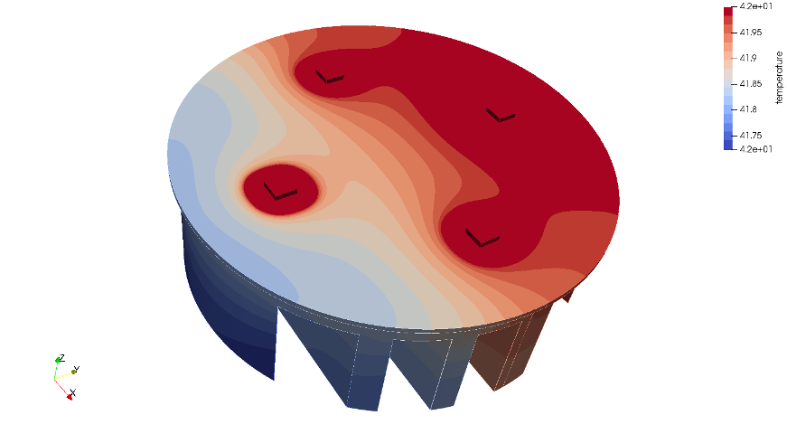
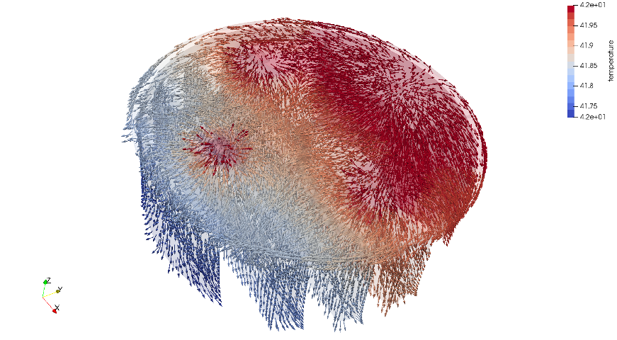

## 1. 개요
* 본편에서는, 지난 상편에서 전처리한 데이타를 가지고, 엘머에서 연산하는 과정과 후처리 과정을 살펴보자.


## 2. 해석 실시

### (1) 시뮬레이션 인풋 파일(sif) 작성

* 텍스트 에디터로 `mesh.names`을 열어보면, 다음과 같은 내용이 보인다.

```
! ----- names for bodies -----
$ PART1 = 1
$ PART2 = 2
$ PART3 = 3
$ PART4 = 4
$ PART5 = 5
$ PART6 = 6
$ PART7 = 7
$ PART8 = 8
$ PART9 = 9
$ PART10 = 10
$ PART11 = 11
! ----- names for boundaries -----
$ INTERSECT1 = 23
$ INTERSECT1 = 24
$ INTERSECT3 = 25
$ INTERSECT3 = 26
$ INTERSECT5 = 27
$ INTERSECT5 = 28
$ INTERSECT6 = 29
$ INTERSECT6 = 30
$ INTERSECT8 = 31
$ INTERSECT10 = 32
$ CUT1 = 33
$ CUT2 = 34
$ CUT3 = 35
$ CUT4 = 36
$ CUT5 = 37
$ CUT6 = 38
$ CUT7 = 39
$ CUT8 = 40
$ CUT9 = 41
$ CUT10 = 42
$ CUT11 = 43
$ bnry44 = 44
```

* 각각의 물체(Body)와 경계면(Boundary)의 명칭을 정의한 것이다.  그런데 여기서 나온 명칭들은, `step2unv` 스크립트를 이용하여 자동으로 생성하였기 때문에 명칭만 보아서는 어떤 물체나 경계면인지 알기가 어렵다.  따라서 알기 쉽게 명칭을 바뀌주자.  이를 위해 우선 살로메에서 `LED.unv` 파일을 읽어들여, 각 물체와 경계면이 어느 부분인지 파악해서 바꿔 써 주면 된다.


* 수정된 `mesh.names`의 내용은 아래와 같은 식으로 될 것이다.

```
! ----- names for bodies -----
$ SLUG04 = 1
$ LED04 = 2
$ SLUG03 = 3
$ LED03 = 4
$ TIM = 5
$ PCB = 6
$ HEATSINK = 7
$ SLUG01 = 8
$ LED01 = 9
$ SLUG02 = 10
$ LED02 = 11
! ----- names for boundaries -----
$ SLUG04-LED04 = 23
$ PCB-SLUG04 = 24
$ SLUG03-LED03 = 25
$ PCB-SLUG03 = 26
$ TIM-PCB = 27
$ HEATSINK-TIM = 28
$ PCB-SLUG01 = 29
$ PCB-SLUG02 = 30
$ SLUG01-LED01 = 31
$ SLUG02-LED02 = 32
$ SLUG04_OUT = 33
$ LED04_OUT = 34
$ SLUG03_OUT = 35
$ LED03_OUT = 36
$ TIM_OUT = 37
$ PCB_OUT = 38
$ HEATSINK_OUT = 39
$ SLUG01_OUT = 40
$ LED01_OUT = 41
$ SLUG02_OUT = 42
$ LED02_OUT = 43
```

* 아울러, `entities.sif`에 정의된 각 물체와 경계면의 명칭도 맞추어 변경해 준다.  이때는 ElmerGUI에서 직접 `LED.unv`을 읽어들여 각 경계면의 번호를 파악하는 것도 좋다.
* 그리고 `entities.sif`에 해석 조건들을 부여해서 다음과 같은 내용이 되도록 편집해서 보충하자.

```cpp
Header
  CHECK KEYWORDS Warn
  Mesh DB "." "."
  Include Path ""
  Results Directory "."
End

Simulation
  Max Output Level = 5
  Coordinate System = Cartesian
  Coordinate Mapping(3) = 1 2 3
  Simulation Type = Scanning
  Steady State Max Iterations = 1
  Timestep intervals = 10   ! [sec]
  Timestep sizes = 1   ! [sec]
  Output Intervals = 1
  Timestepping Method = BDF
  BDF Order = 1
  Solver Input File = entities.sif
  Post File = case.vtu
  Use Mesh Names = Logical True   ! Use Salome Group Names
  ! Output File = "case.result"
End

Constants
  $LED_X=0.001   ![m]
  $LED_Y=0.001   ![m]
  $POWER=0.7  ![W]
  $HTC=10.0   ![W/m^2K] Heat Transfer Coefficient
  $AMBIENT=25.0   ![C] External Temperature
End

!------ Equations -----
Solver 1
  Equation = Heat Equation
  Procedure = "HeatSolve" "HeatSolver"
  Variable = Temperature
  Exec Solver = Always
  Stabilize = True
  Bubbles = False
  Lumped Mass Matrix = False
  Optimize Bandwidth = True
  Steady State Convergence Tolerance = 1.0e-5
  Linear System Solver = Iterative
  Linear System Iterative Method = BiCGStab
  Linear System Max Iterations = 500
  Linear System Convergence Tolerance = 1.0e-7
  BiCGstabl polynomial degree = 2
  Linear System Preconditioning = Diagonal
  Linear System ILUT Tolerance = 1.0e-3
  Linear System Abort Not Converged = False
  Linear System Residual Output = 1
  Linear System Precondition Recompute = 1
End

Solver 2
  Equation = Flux and Gradient
  Calculate Flux = True
  Flux Coefficient = "Heat Conductivity"
  Calculate Grad = True
  Target Variable = Temperature
  Procedure = "FluxSolver" "FluxSolver"
  Exec Solver = After Timestep
  Stabilize = True
  Bubbles = False
  Lumped Mass Matrix = False
  Optimize Bandwidth = True
  Steady State Convergence Tolerance = 1.0e-5
  Linear System Solver = Iterative
  Linear System Iterative Method = BiCGStab
  Linear System Max Iterations = 500
  Linear System Convergence Tolerance = 1.0e-7
  BiCGstabl polynomial degree = 2
  Linear System Preconditioning = Diagonal
  Linear System ILUT Tolerance = 1.0e-3
  Linear System Abort Not Converged = False
  Linear System Residual Output = 1
  Linear System Precondition Recompute = 1
End

Equation 1
  Name = "Equation 1"
  Active Solvers(2) = 1 2
End

!------ Materials -----
Material 1
  Name = "(LED) GaN"
  Heat Conductivity = 130
  Heat Capacity = 930.37
  Heat expansion Coefficient = 6.66e-06
  Density = 6100.0
End

Material 2
  Name = "(LED) Si"
  Heat Conductivity = 127.0
  Heat Capacity = 555.8
  Heat expansion Coefficient = 4.68e-6
  Density = 2330.0
End

Material 3
  Name = "(MCPCB) Thermal Grease"
  Heat Conductivity = 3.0
  Heat Capacity = 300.0
  Heat expansion Coefficient = 1.0e-6
  Density = 1000.0
End

Material 4
  Name = "Aluminium"
  Heat Conductivity = 237.0
  Heat Capacity = 897.0
  Heat expansion Coefficient = 23.1e-6
  Density = 2700.0
End

Material 5
  Name = "(PCB) FR4"
  Heat Conductivity = 0.35
  Heat Capacity = 1300.0
  Heat expansion Coefficient = 7e-5
  Density = 1850.0
End

!------ Skeleton for body section -----
Body 1
  Name = SLUG04
  Equation = 1
  Material = 2
End

Body 2
  Name = LED04
  Equation = 1
  Material = 1
End

Body 3
  Name = SLUG03
  Equation = 1
  Material = 2
End

Body 4
  Name = LED03
  Equation = 1
  Material = 1
End

Body 5
  Name = TIM
  Equation = 1
  Material = 3
End

Body 6
  Name = PCB
  Equation = 1
  Material = 5
End

Body 7
  Name = HEATSINK
  Equation = 1
  Material = 4
End

Body 8
  Name = SLUG01
  Equation = 1
  Material = 2
End

Body 9
  Name = LED01
  Equation = 1
  Material = 1
End

Body 10
  Name = SLUG02
  Equation = 1
  Material = 2
End

Body 11
  Name = LED02
  Equation = 1
  Material = 1
End

!------ Skeleton for boundary section -----
Boundary Condition 1
  Name = LED01_OUT
  Heat Flux = $(POWER/(LED_X*LED_Y))  ![W/m^3]
End

Boundary Condition 2
  Name = LED02_OUT
  Heat Flux = $(POWER/(LED_X*LED_Y))  ![W/m^3]
End

Boundary Condition 3
  Name = LED03_OUT
  Heat Flux = $(POWER/(LED_X*LED_Y))  ![W/m^3]
End

Boundary Condition 4
  Name = LED04_OUT
  Heat Flux = $(POWER/(LED_X*LED_Y))  ![W/m^3]
End

Boundary Condition 5
  Name = SLUG01_OUT
End

Boundary Condition 6
  Name = SLUG02_OUT
End

Boundary Condition 7
  Name = SLUG03_OUT
End

Boundary Condition 8
  Name = SLUG04_OUT
End

Boundary Condition 9
  Name = PCB_OUT
End

Boundary Condition 10
  Name = TIM_OUT
End

Boundary Condition 11
  Name = HEATSINK_OUT
  Heat Transfer Coefficient = $HTC ![W/m^2K]
  ! External Temperature = $AMBIENT ![C]
  External Temperature = variable time
    Real
       0 20.0
       1 22.5
       2 25.0
       3 27.5
       4 30.0
       5 32.5
       6 35.0
       7 37.5
       8 40.0
       9 42.5
       10 45.0
    End
End

Boundary Condition 12
  Name = SLUG01-LED01
End

Boundary Condition 13
  Name = SLUG02-LED02
End

Boundary Condition 14
  Name = SLUG03-LED03
End

Boundary Condition 15
  Name = SLUG04-LED04
End

Boundary Condition 16
  Name = PCB-SLUG01
End

Boundary Condition 17
  Name = PCB-SLUG02
End

Boundary Condition 18
  Name = PCB-SLUG03
End

Boundary Condition 19
  Name = PCB-SLUG04
End

Boundary Condition 20
  Name = TIM-PCB
End

Boundary Condition 21
  Name = HEATSINK-TIM
End

```

* 여기에 적용된 물성치들은, 웹검색을 통해 얻어낸 일반적인 물성치들을 적용하였다.
* 스캐닝(Scanning) 조건으로, 10가지 외부온도를 적용했을 경우의 결과를 하나씩 볼 수 있도록 한다.
* 외부와 히트싱크 경계면의 열전달계수(Heat Transfer Coefficient)는, 여기서는 10[W/m^2K]을 부여하였다.  일반적으로 자연대류 상태일 때는 10~25[W/m^2K] 가량을 주고, 냉각팬을 사용한 강제대류일때는 25~250[W/m^2K] 정도까지 올려주면 실제와 유사한 결과를 얻을 수 있다.
* 히트싱크 표면 이외의 다른 모든 물체의 외부 경계면들은 별도의 열전달계수를 부여하지 않았기 때문에, 열전달이 발생하지 않는다.  즉 단열(Adiabatic) 조건이 된다. (아무런 조건도 주지 않은 경계면들의 항목은 삭제해도 상관없다.) 필요하다면 다른 부분들의 외부 경계면들에도 열전달계수와 외부온도를 부여하여 볼 수도 있을 것이다.  다만 여기서는 조건을 단순화하기 위해 히트싱크 외부 경계면만 보기로 한다.


### (2) ElmerSolver 실행

* 다음 명령으로 해석을 실행해 보자. (싱글코어 해석)

```bash
$ ElmerSolver entities.sif
```

* 해석시간 단축을 위해서는, 다음과 같이 매시를 쪼개서 멀티코어로 계산을 시켜도 무방하다. (4 스레드 CPU 자원을 사용할 경우)

```bash
$ ElmerGrid 2 2 ./Partition -metis 4
$ mv ./Partition/partitioning.4 ./partitioning.4
$ rm -r Partition
$ echo "entities.sif" > ELMERSOLVER_STARTINFO
$ mpirun -np 4 ElmerSolver_mpi
```


## 3. 후처리

### (1) 파라뷰로 결과 파일 읽어들이기

* 파라뷰로 결과 파일인 `vtu` 또는 `pvtu`(멀티코어 계산 결과일 경우) 파일을 읽어들인다.
* 파라뷰의 `Next Frame` 버튼을 눌러 10가지 조건별로 순차적으로 변화를 살펴보자.
* `Rescale to custom range` 버튼 등을 이용하여 가시화 범위를 조정하여 히트싱크의 온도분포 등을 확인할 수 있다.
* 히트싱크의 열 분포를 보면, 냉각핀(fins)이 많이 형성된 부위가 아무래도 적은 쪽 보다 냉각이 좀 더 잘 되는 것을 확인해 볼 수 있다.




### (2) 접합부(LED 발광체와 슬러그의 접합면; Junction Temperature) 온도 살펴보기

* 보통 우리가 관심이 있는 부분은, LED 접합부 온도(Junction Temperature)이다.  LED 발광소자가 과열되어 파괴되지 않도록 해야만 필요한 신뢰성과 수명을 보장할 수 있을 것이다.  또 온도에 따라 LED가 쏘아주는 빛의 파장이 변질되는 것도 최소화할 수 있을 것이다.
* 10가지 케이스의 결과를 다음과 같이 정리해 본다.

|case|외부온도(섭씨온도)|접합부 온도(섭씨온도)|
|----|--------------|-----------------|
|0   |20.0          |101.888          |
|1   |22.5          |102.123          |
|2   |25.0          |109.637          |
|3   |27.5          |110.521          |
|4   |30.0          |115.511          |
|5   |32.5          |115.224          |
|6   |35.0          |122.472          |
|7   |37.5          |120.294          |
|8   |40.0          |127.538          |
|9   |42.5          |125.151          |

* 대체로 외부 온도가 올라감에 따라 당연히 접합부 온도도 올라가는 것을 관찰할 수 있다.  0과 9번 케이스를 비교해 보면, 외부 온도가 22.5도씨 상승할 때 접합부 온도는 23.263도씨 상승하는 것으로 나오므로, 거의 1대1 비율로 볼 수 있다.
* 보통 LED 접합부 온도는 80도씨 이하로 유지되는 것이 이상적이고, 내열성이 좋은 소자를 사용할 경우에는 140도씨 수준까지 도달해도 큰 문제 없이 견디는 경우가 있다.  따라서 위 결과는, 접합부 온도가 좀 높은 경우에 해당하므로 개선의 필요성이 있다고 할 수 있다.
* 현재 사용하고 있는 FR-4 재질의 PCB에서 알미늄 소재의 메탈코어 PCB로 변경해서 해석해 보고 결과를 비교해 보면, 접합부 온도가 큰 폭으로 떨어지는 것을 관찰할 수 있을 것이다.  즉 LED 발열원에서 히트싱크에 걸쳐 열전도 경로상의 열전달계수를 최대한 높게 설계하는 것이 일반적으로 효과적이라고 볼 수 있다.


### (3) 열유속 살펴보기

* 한편, 본 해석에서는 `Heat Equation` 솔버 뿐만 아니라 `Flux and Gradient` 솔버를 함께 적용하였다.  이 솔버는, Heat Equation 솔버에서 계산된 결과값인 온도(스칼라값)를 이용하여, 온도가 위치에 따라 변화되는 양상을 보기 쉽도록 벡터화 시켜 주는 기능을 가지고 있다.
* 파라뷰에서 읽어들인 데이타 항목 중에 `temperature flux` 및 `temperature grad` 데이타들이 추가되어 있는 것을 확인할 수 있을 것이다.
* 벡터화된 열유속을 보려면, `temperature flux` 데이타를 볼 수 있도록 컬러링 선택을 해 주고, `Glyph` 필터를 적용해 준다.  이후 Scaling 등의 옵션을 조절해서 보기 좋도록 만들어주면 된다.




### (4) 해석조건의 적절성 판단

* 과연 이렇게 해석한 결과를 신뢰할 수 있을까?  가장 확실한 방법은 동일조건에서의 실제 실험값과 비교하고, 오차가 있으면 경계조건 등을 수정해서 튜닝해 주는 과정을 거치는 것이 확실할 것이다.
* 그러나 실무 환경에서 일일이 실험을 정석대로 진행하기가 곤란할 경우가 많다.  필요한 파라미터를 알지 못할 경우도 있다.  이런 경우에는, 결과값의 오차 허용범위를 크게 잡고 일반적으로 알려진 물성치나 경계조건들을 논문검색 등을 통해 참고하여 적용해 주는 것이 현실적이다.  대신 결과로 얻어진 온도값은 오차범위를 크게 감안해 주고 보수적인 방향에서 접근하는 것이 안전하다고 생각된다.


## 4. 맺음말
* 이상 고출력 LED 관련 열전도 현상을 해석해 보았다. (다물체, 접촉부 접합, 열전도)
* 특히 상하편으로 나누어 살로메 스크립트를 이용하여 전처리 과정의 일부를 자동화해 보았고, 엘머 sif 파일을 GUI 없이 직접 텍스트 에디터로 작성해서 실행해 보았다.
* 본 편의 모델링 데이타는 다음 장소에서 다운로드 받으면 된다.

```
https://github.com/dymaxionkim/Elmer_Examples_for_CADG/tree/master/CADG_06_Elmer_Conduction
```

* 실무에서는 LED 뿐만 아니라, 다른 발열 소자들도 많기 때문에 회로의 신뢰성을 높이기 위해 다양하게 응용해 볼 수 있을 것이다.
* 다음 편에서는, 본 편에서 해석한 모델에 주변 공기 부분도 추가하여 대류열전달까지 해석해 보기로 하자.


## 기타 참고 사례

* THERMAL ANALYSIS OF HIGH POWER LED ARRAYS, 2009, 조지아공대, 하민석

> https://smartech.gatech.edu/bitstream/handle/1853/31803/ha_minseok_200912_mast.pdf

* test
