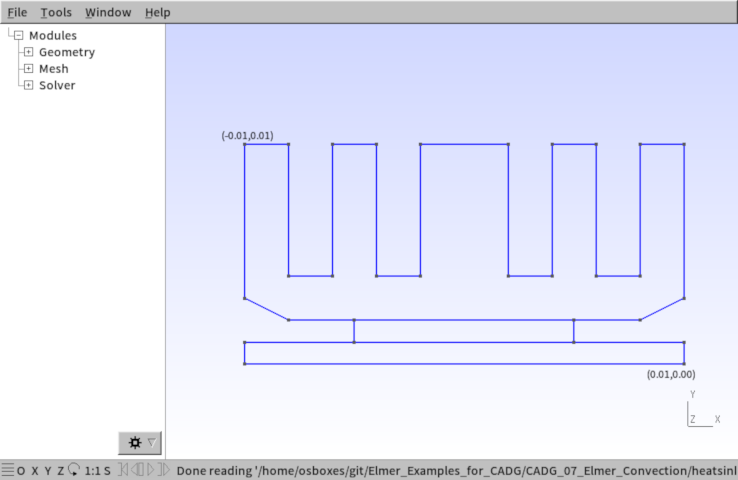
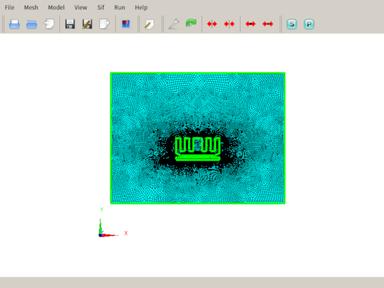
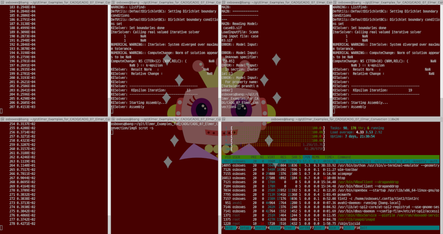
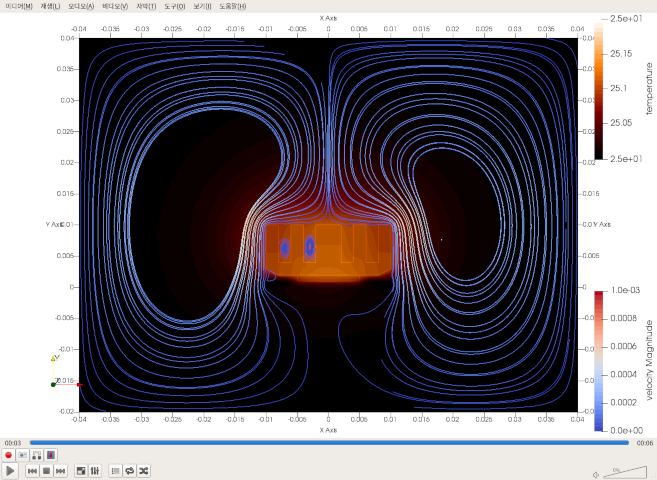
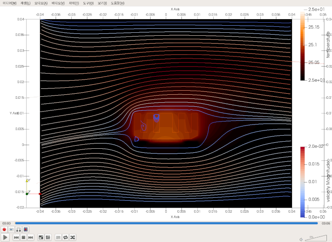
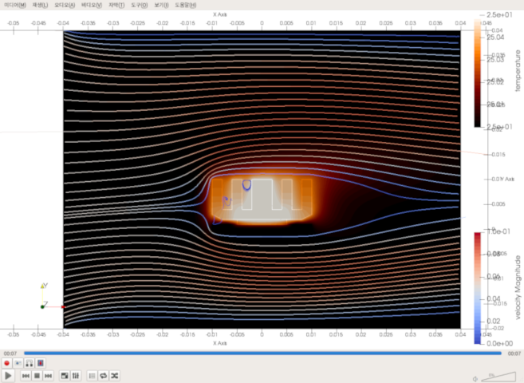

  

## 1. 개요
* 엘머에서 제공하는 유체동역학 해석 방법은 유한요소법(FEM)인데, 이는 다른 전문적인 CFD 소프트웨어들이 주로 채택하는 유한체적법(FVM)보다 단점이 많다고 한다.  몇 가지 한계점이 있는데, 계산효율이 좀 더 좋지 않거나, 조건에 따라 수렴에 실패할 확률이 상대적으로 높다고 한다.  때문에 대체로 가급적 레이놀즈수가 너무 높아지지 않도록 조건을 잡아줄 필요가 있다.  가급적 점성이 높거나, 유속이 느린 경우에는 적합하다.   달리말해, 아음속 또는 초음속 수준의 압축성 유체거동을 해석하거나 하는 등의 극단적인 케이스를 다루기가 꽤 곤란하다는 점이다.  이런 문제를 풀 때는 전문적인 전용 소프트웨어를 사용하는 것이 좋겠다.  오픈소스로도 OpenFOAM, SU2 등의 좋은 코드들이 있으므로 대안이 충분히 있다.
* 또한 기본 패키지에서 제공해 주는 난류모델이 기본적인 것(RANS 모델 ; 난류영역 내부의 운동에너지와 소산률을 근사적으로 추산해서 간단한 모델로 구성하는 방식) 밖에 없다.  k-epsilon 및 k-omega 모델이 그것이고, 이보다 더욱 엄밀한 LES 모델은 별도로 구현하거나 다른 사람이 성공한 예제를 찾아서 따라하는 수 밖에 없다.  난류 경계층 내부의 격렬한 거동을 자세하게 살펴볼 것이 아닌 일반적인 경우라면 k-epsilon 모델로도 충분하다고 생각된다.
* 본 예제에서는 이런 제한사항들을 염두에 두면서, 기본적인 형태의 히트싱크에 공기가 흘러가는 형태를 시뮬레이션해 보고, 이러한 유체거동에 의한 대류열전달 현상을 관찰해 보기로 한다.


## 2. 시스템 모델
* PC급의 컴퓨팅 환경에서는 할당할 수 있는 CPU 자원과 메모리가 제한되기 때문에, 3D 모델로 고분해능의 유체해석(CFD)를 하는데 한계에 부딪힐 때가 많다.  따라서 본 예제에서는, 어느정도의 고분해능을 가지면서 PC에서도 문제를 풀 수 있도록 하기 위해 2D 모델로 구성해 보기로 한다.  다만, 컴퓨팅 자원이 충분하다면 3D 모델로 구성해서 시도해 보는 것도 충분히 의미가 있을 것이다.
* 본 예제에서는, 복수의 냉각핀(fins)이 돌출되어있는 형태의 알미늄 히트싱크 형태를 모델링하고, 공기와의 접촉면에서 열교환이 발생하도록 적절한 열전달계수를 부여한다.  그리고 히트싱크 아래면의 일부(발열원 부분)에서 발열이 일어나도록 경계조건을 부여할 것이다.
* 따라서 열전달 경로는, 발열면 - 히트싱크 내부(열전도) - 히트싱크와 공기의 접촉면(열전도) - 공기(대류열전달) 순서로 일어날 것이다.
* 공기의 대류열전달 모델은, 나비에-스톡스 방정식(Navier-Stokes Eq.)과 열방정식(Heat Eq.)을 동시에 적용한다.  여기에 k-epsilon 난류모델도 추가하여 적용해 본다.
* 아울러, 중력 방향을 설정하고 이에 영향을 받아 부력(buoyancy)이 작용하도록 엘머에서 제공하는 부시네스크 근사모델(Boussinesq approximation)을 적용한다.
* 공기의 흐름은, 자연대류를 관찰하고자 할 경우에는 초기값을 아주 약간의 속도만 주거나 또는 완전히 0으로 주고, 입출구 유동이 없도록 잡아주면 된다.  강제대류의 경우, 입구에 적절한 유체 속도값을 주고 출구의 압력을 0으로 해 주는 것이 기본적인 방법이 될 수 있을 것이다.


## 3. 전처리 과정

### (1) 2D 모델링(Geometry)
* 오픈소스 해석기를 위한 가장 간편한 2D 모델 작성 방법은, GMSH 소프트웨어를 이용하는 것이다.
* GMSH는 기본적인 사용방법만 익히면 상당히 쉽게 원하는 모델을 그리고, 원하는 조건으로 매쉬를 생성하기가 상당히 수월하다.
* 본 예제에서는 GMSH의 사용방법에 대해서 다루지는 않겠다.  다만 유튜브 또는 GMSH 홈페이지에서 따라하기 동영상을 보면 신속하게 개념을 파악하고 습득할 수 있다.
* GMSH 모델은 다음과 같이 구성하기로 한다.




* 이때, `Pysical groups`도 정의해주자. 이것을 정의해 주면, 경계조건 등을 부여할 때 작업이 매우 간편해진다.
* 각 포인트들의 자세한 좌표 등의 정보는 geo 파일을 편집기로 열어서 참조하자.


### (2) 매쉬 작업(Mesh)
* GMSH에서 별다른 설정없이 그대로 매쉬를 생성하고(`2D`), 더 잘게 쪼개준 후(`Refine by splitting`), 사각형 요소망으로 바꿔준다(`Recombine 2D`).


* 만들어진 매쉬는 GMSH 전용 매쉬 포멧으로 저장하자(`Save Mesh`).
* GMSH와 Elmer는 모두 오픈소스이기 때문에, GMSH의 `.msh` 매쉬 포멧은 Elmer에서 그냥 읽어들일 수 있다.


### (3) Elmer에서 읽어들이기
* 터미널상에서 `ElmerGrid` 명령을 사용해서 Elmer 전용 매쉬 포멧으로 직접 변환해도 되지만, 본 예제에서는 ElmerGUI 상에서 모든 전처리과정을 수행해 보기로 한다.
* ElmerGUI를 시작하고, `Open`해서 직접 `.msh` 파일을 불러들인다.
* 매쉬가 이상없이 읽어들여지면, `Save project`를 선택해서 프로젝트를 원하는 장소에 일단 저장한다.




## 4. 해석 조건 설정

### (1) 다음과 같이 해석 조건을 잡고 하나씩 케이스를 만들어보자.

|케이스  |해석모델 |유속[m/s]   |해석시간[s]   |
|--------|---------|------------|--------------|
|case01  |층류     |0           |6             |
|case02  |난류     |0           |6             |
|case03  |난류     |0.001       |6             |
|case04  |난류     |0.01        |6             |
|case05  |난류     |0.05        |6             |
|case06  |난류     |0.05        |60            |

* 이때 공통적으로 다음과 같이 파라미터를 잡기로 한다.

|변수명      |값           |단위    |설명                   |
|------------|-------------|--------|-----------------------|
|SPEED       |유속         |[m/s]   |케이스별 유속값        |
|HEAT        |1000         |[W/m^2] |칩의 단위면적당 발열량 |
|HTC         |250          |[W/m^2] |경계면의 열전달계수    |
|AMBIENT     |25           |[C]     |외부온도               |

* 난류모델은 k-epsilon을 사용하고, 다음 파라미터를 공통으로 적용한다.

|변수명      |값           |단위    |설명                   |
|------------|-------------|--------|-----------------------|
|BLT         |0.008        |[m]     |경계층 두께            |
|KE          |0.003        |        |난류 운동에너지        |
|KDR         |0.0001       |        |난류 소산율            |
|KEclip      |0.000006     |        |유체의 KE Clip 값      |
|KEcmu       |0.09         |        |유체의 KE Cmu 값       |

* k-epsilon 솔버는 기본적으로, 층류영역과 난류영역을 구분한 후, 난류영역 안쪽을 계산하는 구조로 되어 있다.  이때 여기서 설정한 경계층 두께를 기준으로 경계층 형상을 추산해내어 적용한다.

* k-epsilon 모델에서의 난류 운동에너지( KE, $k$ )는 다음과 같은 정의에 따른다.

$$ k = \frac{3}{2} (UI)^2 $$

$$ U : 유체 속도 절대값 (Flow Velocity)  $$

$$ I \equiv \frac{u'}{U} $$

$$ u' : 난류영역내 속도변화량의 절대값 (Root \, mean \, square \, of \, the \, turbulent \, velocity \, fluctuations) $$

* k-epsilon 모델에서의 난류 소산율( KDR, $\epsilon$ )은 다음과 같은 정의에 따른다.

$$ \epsilon = C_{\mu}^{\frac{3}{4}} \frac{k^{\frac{3}{2}}}{l} $$

$$ C_{\mu} : 난류 모델 상수 (Turbulent \, Model \, Constant) $$

* KE clip 값은 KE(운동에너지) 및 KDR(소산율)이 항상 양수(Positive Numbers)가 되어야 하는데, 그 조건을 확실하게 만들어주기 위한 한계 설정치(Limiter)이다.

* KE Cmu 값은, 상기 소산율을 정의하기 위해 사용되는 $C_{\mu}$ 즉 난류 모델 상수를 의미한다.  이 값을 계수로 삼은 k(운동에너지) 및 epsilon(소산율)의 관계식을 통해 난류영역 내부의 점성(Viscosity, $\mu_t$ )을 정의한다.  소스코드를 살펴보면, Elmer의 KESolver에서는 0.09를 standard 모델로 취급하고 있는 것 같다. (Elmer의 소스코드를 살펴보면 0.22일 때는 v2-f 모델로, 0.0845일 때는 rng 모델로 명명하고 있다.)  여기서는 일반적인 Standard 모델의 0.09로 두자.


$$ {\mu}_{t} = {\rho} {C} _ {\mu} {\frac{k^2}{\epsilon}} $$


* 전산유체해석분야는, 전문적인 전공자가 아니면 아무래도 이론을 깊이 이해하기는 어렵기 때문에, 여기서는 대략 이정도 개념만 이해해 두도록 해 보자.  사실 필자도 깊게는 잘 모른다.  본 예제에서는 계산값이 잘 수렴하는지 여부에 초점을 맞추어보자.


### (2) case01 : 층류, 자연대류

* 우선 유체를 담고 있는 4면을 모두 벽면으로 상정해서, 케이스 안에 담겨있는 것으로 한다. (외부와의 물질이동이 없는 경우)
* 벽면은 모두 당연히 No-slip 조건을 준다. (Noslip Wall BC)
* 다만 4면의 벽면에서는 외부와의 열교환은 발생하는 것으로 한다. (외부 온도는 AMBIENT 값을 사용, 벽면에서의 열전달계수는 HTC 값을 사용)

* ElmerGUI 상에서 설정하는 경우로 해 보자.
* `Model - Setup` 메뉴에서 `Result directory = case01`, `Simulation type = Transient`, `Timestep intervals = 600`, `Output intervals = 1`, `Timestep sizes = 0.01`, `Solver input file = case01.sif`로 해 준다.
* `Constants` 카테코리에서 `Free text`에 다음과 같이 변수를 만들어 넣는다.

```
$SPEED = 0.0 ![m/s] Flow Speed
$HEAT = 1000 ![W/m^2] Heat Flux
$HTC = 250 ![W/m^2] Heat Transfer Coefficient
$AMBIENT = 25 ![C] External Temperature
```

* `Model - Equation - add`해서 `Name = FLUID`를 하나 설정해 주고, `Navier-Stokes`, `Result Output`, `Heat Equation`을 `Active` 체크해 준다.  `Apply to bodies`는 `Body Property 1`을 체크해 준다.  즉 이것은 열유체 해석을 하기 위한 것이다.

* `Navier-Stokes` 탭에서 `Convect` 옵션을 체크해 준다.  아울러 `Edit Solver Settings`버튼을 눌러 팝업이 뜨면 `Linear system` 탭에서 `Convergence tol. = 1.0e-5`으로 해 준다(정밀도를 떨어뜨려 계산시간을 단축하기 위한 목적).

* `Result Output` 탭에서 `Edit Solver Settings`버튼을 눌러 팝업이 뜨면 `General` 탭의 `Execute solver` 카테고리에서 `After timestep`을 체크해 준다.  즉 한 번의 타임스텝 계산을 마칠 때 마다 그 결과데이타를 저장하도록 하는 것이다.  `Solver specific options` 탭에서는 `Output format - Vtu`, `Binary Output = On`, `Single Precision = On`, `Output File Name = case` 등으로 설정해 준다.

* `Heat Equation` 탭에서 `Convection = Computed`로 한다.  즉 유체상에서의 대류열전달 현상을 반영하도록 하는 것이다.

* `Model - Equation - add`해서 `Name = SOLID`를 하나 더 만들어 주고, `Result Output`, `Heat Equation`을 `Active` 체크해 준다.  `Apply to bodies`는 `Body Property 2,3,4`를 체크해 준다.  즉 이것은 고체 부분의 열전달 해석을 하기 위한 것이다.  이때, `Heat Equation`의 `Convection = None`으로 해 주는 것이 좋겠다.

* `Model - Material - add` 해서 `Material library` 버튼을 눌러 `Air(room temperature)`를 추가해 주고 `OK` 한다.  같은 방식으로 `Aluminium(generic)`, `Fused Silica(25C)`, `Polycarbonate(generic)`도 추가해 준다.

* 그리고 각 재질(Material)마다 물체(Body)를 다음과 같이 할당해 준다.

|Material                 |Apply to bodies   |Remark     |
|-------------------------|------------------|-----------|
|Air (room temperature)   |Body Property 1   |유체       |
|Aluminium (generic)      |Body Property 2   |히트싱크   |
|Fused Silica (25 C)      |Body Property 3   |발열체(칩) |
|Polycarbonate (generic)  |Body Property 4   |회로기판   |

* 또, `Air (room temperature)`의 경우, `General` 탭에서 `Reference Temperature = $AMBIENT`를 써 준다.  열-유체의 멀티피직스 해석 케이스이기 때문에, 해당 유체(공기)의 기준 온도가 필요하기 때문이다.  `Heat Equation` 탭에서는 `Heat Conductivity Model = None`으로 해 준다.  (`Turbulent Prandtl Number`는 가급적 삭제해 주는 것이 좋겠다.)

* `Model - Body force - add` 해서 `Name = BUOYANCY`로 한다.  즉 유체부분에서 온도가 높아진 부분의 밀도가 낮아질 때 발생하는 부력을 적용하는 것이다.  `Navier-Stokes` 탭에서 `Boussinesq` 옵션을 체크해 주면 된다.  (이것은 여러 부력 모델 중에서 가장 보편적인 Boussinesq 근사모델을 적용한 것이다.)  부력이 작용하는 방향은, `Model - Settup` 메뉴에서 `Constant` 카테고리의 `Gravity` 항목에서 결정된 중력 방향의 반대로 작용하게 된다.  본 예제에서는 -y 방향으로 중력이 작용하도록 디폴트 방향이 잡혀 있기 때문에, 부력은 +y 방향으로 발생할 것이다.  부력이 작용하는 부분(Body)은 `Apply to bodies` 카테고리에서 `Body Property 1`을 체크해서 결정해 준다.

* 이제 `Model - Initial Condition - add` 해서 `Name = FLUID`를 하나 설정해 주고, `Navier-Stokes` 탭에서는 `Velocity 1,2,3` 모두 `0`으로 써 준다.  초기속도를 0으로 주는 것이다.  `Heat Equation` 탭에서는 `Temperature = $AMBIENT`으로 써 줘서 초기온도를 준다.  `Apply to bodies`는 `Body Property 1`을 체크해 주자.

* `Model - Initial Condition - add`해서 `Name = SOLID`를 하나 더 만들어 주고, `Heat Equation` 탭에서 `Temperature = $AMBIENT`으로 써 줘서 초기온도를 준다.  `Apply to bodies`는 `Body Property 2,3,4`로 모두 체크해 주자.

* 이제 `Model - Boundary Condition - add`해서 `TOP`, `BOT`, `LEFT`, `RIGHT`, `HEATSINK`, `HEATSOURCE`의 이름으로 각각 만들자.  각 경계조건은 경계면을 다음과 같이 할당해 준다.

|Boundary Condition       |Apply to boundaries   |Remark                  |
|-------------------------|----------------------|------------------------|
|TOP                      |Boundary 2            |유체의 외곽 상단면      |
|BOT                      |Boundary 1            |유체의 외곽 하단면      |
|LEFT                     |Boundary 4            |유체의 외곽 좌측면      |
|RIGHT                    |Boundary 3            |유체의 외곽 우측면      |
|HEATSINK                 |Boundary 5,8,9        |유체와 고체의 접촉면    |
|HEATSOURCE               |Boundary 7            |발열면                  |


* 경계조건 `TOP`에서, `Navier-Stokes` 탭에서 `Noslip wall BC = On` 해 주고, `Heat Equation` 탭에서 `Heat Transfer Coeff. = $HTC`, `External Temperature = $AMBIENT`로 써 넣어준다.

* 경계조건 `BOT`에서, `Navier-Stokes` 탭에서 `Noslip wall BC = On` 해 주고, `Heat Equation` 탭에서 `Heat Transfer Coeff. = $HTC`, `External Temperature = $AMBIENT`로 써 넣어준다.

* 경계조건 `LEFT`에서, `Navier-Stokes` 탭에서 `Noslip wall BC = On` 해 주고, `Heat Equation` 탭에서 `Heat Transfer Coeff. = $HTC`, `External Temperature = $AMBIENT`로 써 넣어준다.

* 경계조건 `RIGHT`에서, `Navier-Stokes` 탭에서 `Noslip wall BC = On` 해 주고, `Heat Equation` 탭에서 `Heat Transfer Coeff. = $HTC`, `External Temperature = $AMBIENT`로 써 넣어준다.

* 이상 4개의 경계조건을 통해, 유체(공기)의 외벽 4군데를 모두 막아준 것과 같은 효과를 볼 수 있다.

* 경계조건 `HEATSINK`에서, `Navier-Stokes` 탭에서 `Noslip wall BC = On` 해 주고, `Heat Equation` 탭에서 `Heat Transfer Coeff. = $HTC`, `External Temperature = $AMBIENT`로 써 넣어준다.  즉 유체와 고체의 경계면에서의 열전달계수를 설정해 준 것이다.

* 경계조건 `HEATSOURCE`에서, `Heat Equation` 탭에서 `Heat Flux = $HEAT`, `Heat Transfer Coeff. = $HTC`로 써 넣어준다.  즉 발열면에서의 발열량을 설정해 준 것이다.(물론 2D 모델이므로 모델에서 표현되지 않은 두께 부분은 단위유닛으로 정규화하여 환산한 값을 써 주어야 할 것이다.)

* 이상 조건들을 다 설정했으면, `Sif - Generate` 메뉴를 눌러줘서 `case01.sif` 파일을 생성하고, `File - Save project` 메뉴를 눌러서 저장하자.


### (3) case02 : 난류, 자연대류
* case01에서 난류 부분까지 다루도록 k-epsilon equation(KESolver)을 하나 더 추가하고, 그에 필요한 설정을 해 보자.
* `Model - Setup` 메뉴에서 `Result directory = case02`, `Solver input file = case02.sif`로 수정해 준다.
* `Constants` 카테코리에서 `Free text`에 다음과 같이 난류 관련 변수도 추가해 준다.

```
! k-epsilon model
$BLT = 0.008 !Boundary Layer Thickness
$KE = 0.003 !Kinetic Energy
$KDR = 0.0001 !Kinetic Dissipation Rate
$KEclip = 0.000006 ! KE Clip of Material
$KEcmu = 0.09 ! KE Cmu of Material
```

* `Model - Equation`에서 `FLUID`로 들어가서, `K-Epsolon`을 `Active` 체크해 준다.  이것은 k-epsilon 모델의 난류 해석을 해 주는 해석자(Solver)이다.  만일 메뉴에서 이것이 보이지 않는다면, `File - Definitions - Append` 메뉴를 이용해서 추가해 주면 된다.  이제 `Edit Solver Settings`버튼을 눌러 팝업이 뜨면 `Linear system` 탭에서 `Convergence tol. = 1.0e-4`으로 해 준다(정밀도를 떨어뜨려 계산시간을 단축하기 위한 목적).

* `Model - Material`에서 `Air(room temperature)`로 들어간 후, `K-Epsilon` 탭에서 `KE Clip = $KEclip`, `KE Cmu = $KEcmu`로 써 넣어준다.  아울러, `Navier-Stokes` 탭에서는 `Viscousity Model = K-Epsilon`으로 맞춰준다.  현재 이 모델은 비압축성, 비다공질이므로 `Compressibility, Porous Media` 부분은 `None`으로 하거나 또는 다 비워둔다.

* `Model - Initial Condition`에서는 `FLUID`로 들어가서, `K-Epsilon` 탭에서 `Kinetic Energy = $KE`, `Kinetic Dissipation = $KDR`으로 써 줘서 난류 부분의 초기조건을 준다.

* 이제 난류 관련 경계조건을 추가해 주자.  경계조건 `BOT`, `TOP`, `LEFT`, `RIGHT`, `HEATSINK`모두 공히, `K-Epsilon` 탭에서 `Reichardts Wall Law = On`, `Boundary Layer Thickness = $BLT` 해 준다.  라이하르트 벽면 법칙(Reichardts Wall Law)은 RANS 난류모델에서 일반적으로 적용하는 벽면 근방 부위의 모델을 말한다.  현재 적용하는 k-epsilon 난류모델은 가장 기본적인 RANS 모델의 하나이므로 이것을 적용한 것이다.

* 이상의 작업을 통해, 기존 층류모델에서 k-epsilon 난류모델을 추가한 해석을 위한 조건을 설정하였다.  `sif - Generate` 메뉴로 `case02.sif` 파일 내용을 생성하고, `File - Save Project` 메뉴를 선택하여 저장하자.


### (4) case03 : 난류, 약한 강제대류
* LEFT 벽면에서 유체가 유입되고 RIGHT 벽면으로 유출되는 관로유동으로 경계조건을 변경하자.
* 다만, 유체가 공기이기 때문에 아무래도 레이놀즈수가 높게 나올 것이므로 수렴이 잘 안될 지도 모르니, 유속을 매우 느리게 설정해서(0.001[m/s]) 계산이 제대로 되는지 확인부터 해 보자.
* `Model - Setup` 메뉴에서 `Result directory = case03`, `Solver input file = case03.sif`로 수정해 준다.
* `Constants` 카테코리에서 `Free text`에 넣어둔 변수 중에서, 유체 속도 변수를 변경한다.  수렴에 실패할 수도 있기 때문에, 시험삼아 아주 느린 유속을 줘 보는 것이다.

```
$SPEED = 0.001 ![m/s] Flow Speed
```

* `Model - Boundary Condition - LEFT`에 들어가서, 기존의 단순 벽면이었던 경계조건을 유체가 유입되는 입구의 경계조건으로 변경하자.  `Navier-Stokes` 탭에서 `Noslip Wall BC = Off`, `Velocity 1 = $SPEED`로 준다.  난류이기 때문에 입구 부분에서도 관련 상수를 주기 위해 `K-Epsilon` 탭에서 `Kinetic Energy = $KE`, `Kinetic Dissipation = $KDR`로 조건을 주고, `Wall Law` 관련 부분은 다 지워준다.

* `Model - Boundary Condition - RIGHT`에 들어가서, 기존의 단순 벽면이었던 경계조건을 유체가 유출되는 출구의 경계조건으로 변경하자.  `Navier-Stokes` 탭에서 `Noslip Wall BC = Off`, `External Pressure = 0`으로 준다.  출구 쪽에는 굳이 난류 관련 조건을 추가할 필요는 없는 것 같으므로 `K-Epsilon` 탭은 건드리지 않는다.

* 이상의 작업을 통해, 기존 난류 자연대류 모델에서 입출구 유동 조건이 추가된 관로해석을 위한 조건을 설정하였다.  `sif - Generate` 메뉴로 `case03.sif` 파일 내용을 생성하고, `File - Save Project` 메뉴를 선택하여 저장하자.


### (5) case04 : 난류, 중간 강제대류
* case03의 경계조건을 그대로 두고, 유속을 10배로 올려본다. (0.01[m/s])
* `Model - Setup` 메뉴에서 `Result directory = case04`, `Solver input file = case04.sif`로 수정해 준다.
* `Constants` 카테코리에서 `Free text`에 넣어둔 변수 중에서, 유체 속도 변수를 변경한다.  유속을 올려도 수렴에 문제가 없는지 확인하는 것이다.

```
$SPEED = 0.01 ![m/s] Flow Speed
```

* 이상의 작업을 통해, 좀 더 유속을 올린 강제대류 조건을 설정하였다.  `sif - Generate` 메뉴로 `case04.sif` 파일 내용을 생성하고, `File - Save Project` 메뉴를 선택하여 저장하자.


### (6) case05 : 난류, 강한 강제대류
* 역시 같은 경계조건에서, 유속을 더 올려본다. (0.05[m/s])
* 일정수준 이상 유속이 올라가면 계산도중 수렴에 실패하여(NaN) 결과를 얻을 수 없다.  특히 현재는 점성이 낮은 공기(Air)이므로 물(Water)일 경우보다 더욱 수렴하기가 힘들다.
* 이 경우, `Timestep sizes`를 기존의 0.01[s]에서 0.001[s]로 더 짧은 간격으로 계산하도록 해 본다.  그렇게 하면 계산에 성공할 확률이 높아진다.  또 이렇게 할 경우, `Output intervals`를 1에서 10으로 높이면, 기존의 케이스와 동일한 시간간격의 결과데이타를 얻을 수 있게 된다.

* `Model - Setup` 메뉴에서 `Result directory = case05`, `Solver input file = case05.sif`로 수정해 준다.
* `Constants` 카테코리에서 `Free text`에 넣어둔 변수 중에서, 유체 속도 변수를 변경한다.  유속을 올려도 수렴에 문제가 없는지 확인하는 것이다.

```
$SPEED = 0.05 ![m/s] Flow Speed
```

* 아울러, `Timestep Intervals = 600`으로 그대로 두고, `Output Intervals = 5`로 기존의 1보다 더 올린다.  이 수치가 올라간 만큼 보정하기 위하여 `Timestep Sizes = 0.002`으로 기존의 0.01보다 1/5로 줄여준다.  이렇게 하면, 0.002초 간격으로 각 스텝별로 계산이 수행되어 더욱 조밀한 시간간격으로 해석이 되므로 수렴 성공 확률을 더 높일 수 있고, 아울러 기존과 같은 시간 간격으로 결과데이타를 얻어낼 수 있다.

* 이상의 작업을 통해, 좀 더 유속을 올린 강제대류 조건을 설정하였다.  `sif - Generate` 메뉴로 `case05.sif` 파일 내용을 생성하고, `File - Save Project` 메뉴를 선택하여 저장하자.


### (7) case06 : 난류, 강한 강제대류, 1분간
* 이제 case05에서 6초간의 천이상태변화를 계산해 보았는데, 너무 시간이 짧으므로 이것을 10배로 늘려 60초간 살펴보기 위하여 `Timestep intervals = 6000`으로 해서 기존의 600보다 10배로 늘려서 제대로 된 결과를 만들어보자.
* 물론 6000번의 계산이 이루어지므로, 아무리 요소망의 개수가 작은 2D 모델이라 하더라도 상당한 계산시간을 요하게 될 것이다.
* 이상의 작업을 통해, 1분간의 강제대류 천이현상을 계산할 수 있게 된다.  `sif - Generate` 메뉴로 `case06.sif` 파일 내용을 생성하고, `File - Save Project` 메뉴를 선택하여 저장하자.

### 해석조건 설정 완료 확인
* 이상 `case01~06`까지 6가지의 해석 케이스를 생성하였다.
* 자신의 컴퓨터에 복수개의 CPU 스레드 여유가 있다면, 이것들을 한꺼번에 병렬 연산을 시키면 좋을 것이다.
* 아울러 본 해석 케이스는, 2D 모델이기 때문에 요소망의 개수가 그리 많지는 않은 편이기 때문에 메모리 사용량은 그다지 높지 않을 것이다.
* 각 case 파일을 텍스트 에디터로 열어서 내용을 직접 다시 검토해 보고 문제가 없을지 확인한다.


## 5. 계산 실시

* 각 case0*.sif 파일에서, 결과 데이타가 저장되는 디렉토리 명칭을 모두 각각 지정해 주었기 때문에, 이들 디렉토리를 직접 미리 만들어 준다.

```bash
$ mkdir case01
$ mkdir case02
$ mkdir case03
$ mkdir case04
$ mkdir case05
$ mkdir case06
```



* 6가지 케이스를 함께 돌리기 위해, 위 그림처럼 터미널창을 여러개 열어서 각각의 창에서 해석 실시 명령을 내려보았다.  각 창에서 다음과 같은 식으로 명령을 내리면 될 것이다.

```bash
$ ElmerSolver case01.sif
```

* 컴퓨터의 리소스 사용량을 가늠하기 위하여, 남은 창에서는 `htop` 명령을 사용하여 현재의 CPU 사용량과 메모리 사용량 등을 확인해 볼 수도 있겠다.

* 계산에 걸리는 시간은, case01~05는 대략 몇시간 정도면 완료될 수 있겠지만, case06은 10~50배 더 많은 반복계산이 수행될 것이므로 훨씬 오래 걸릴 수가 있다.  저녁에 계산을 실행한 후 다음날 확인해 보면 되겠다.


## 6. 후처리

* 계산 결과는 각각의 디렉토리에 저장되어 있을 것이다.  vtu 포멧으로 저장되었기 때문에 파라뷰(paraview)를 이용하여 데이타를 읽고 가시화한다.  파라뷰의 사용방법에 관한 설명은 생략한다.

* case01은 자연대류에 의해 상자 안에 갖힌 난로처럼 피어오르는(?) 공기의 흐름을 확인할 수 있을 것이다.


* case02는 난류 조건이 추가되기는 했지만 눈에 띄는 차이점이 발견되지는 않는다.  그러나 히트싱크의 온도가 달라졌음을 볼 수 있다.  즉 난류에 의해 히트싱크의 방열 효과가 좀 더 좋게 나타나는 것 같다.



* case03은 약간의 강제 유동이 있기 때문에 유선(Flow line)의 형태가 크게 변화했음을 볼 수 있다.  아울러, 부력(Buoyancy) 조건에 의하여 가열된 유체의 유선이 우상향하는 경향을 보인다.


* case04는 유속이 더 빨라졌기 때문에, 부력이 차지하는 힘이 상대적으로 적어지게 되므로 유선이 좀 더 수평화되는 것을 볼 수 있다.



* case05는 더욱 유속이 빨라졌으므로, 예상대로 유선이 더욱 수평화 되었다.



* case06을 통해 1분간의 변화를 동영상으로 확인해 볼 수도 있겠다.  본 케이스의 결과 동영상은 이곳( https://youtu.be/Upwo-KpaMjk )에서 확인할 수 있다.  결과 데이타 중에서 Temperature 및 Velocity 등을 조합하여 가시화(Visualization) 해 보니, 발열원(Heat Source)에서 공급되는 열에너지에 의하여, 히트싱크 등 고체 부분은 열전도 현상으로 온도가 순차적으로 올라가고, 유체와의 접촉면에서부터 유체 부분은 난류-층류 유동이 기동하면서 동시에 대류열전달 현상이 확인된다.  유체 부분의 온도 분포는 유선의 양상과도 잘 맞아떨어짐도 확인해 볼 수 있었다.


## 7. 맺음말

* 이상 간단하게 열방정식(Heat Equation)과 유체동역학 방정식(Navier-Stokes Equation)을 조합한 다물체 다물리 대류현상을 해석해 보았다.  여기에 추가로 RANS 난류 방정식(k-epsilon Equation)도 추가하여 보았다.
* 본 케이스와 동일한 순서로 3D 모델에서도 적용해 볼 수 있을 것이다.
* 해석 성공 확률을 높이기 위한 가장 기본적인 방법은, 천이해석(Transient)을 실시할 경우에는 Timestep Sizes를 가급적 줄여서 짧게 끊어주고, 매시(Mesh)는 가급적 조밀하게 구성하며, 매시의 형태는 가능한 잘 정돈된 형태를 사용하는 것이다.  가능하다면  벽면(Wall) 부분의 매시는 더욱 조밀하게 해 주면 유리할 것이다.  다만 이렇게 고해상도로 높이게 되면, 메모리 사용량이 많아지고 계산량이 증가하므로 PC급의 컴퓨터에서는 자원이 부족함을 느낄 때가 있다.
* 따라서 PC급에서는 가능한 모델의 형태와 규모를 줄이고 단순화하여 계산량을 줄여주는 쪽이 유리하다고 생각된다.  풀고자 하는 문제의 핵심을 정확히 정의하고 불필요한 부분들을 전부 생략하는 등의 경험적인 테크닉이 요구될 것이다.


## 8. 참고자료
* Elmer KESolver Source Code : https://github.com/ElmerCSC/elmerfem/blob/devel/fem/src/modules/KESolver.F90
* Standard k-epsilon model : https://www.cfd-online.com/Wiki/Standard_k-epsilon_model
* V2-f models : https://www.cfd-online.com/Wiki/V2-f_models
* RNG k-epsilon model : https://www.cfd-online.com/Wiki/RNG_k-epsilon_model
